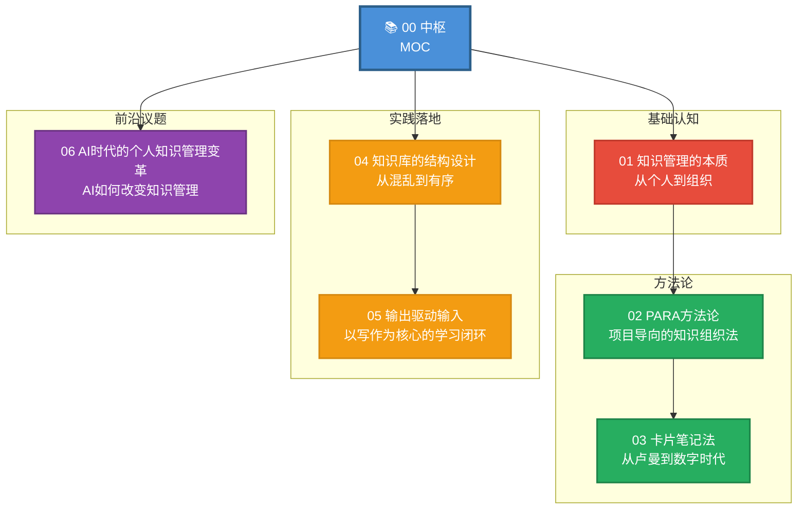
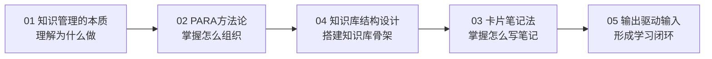
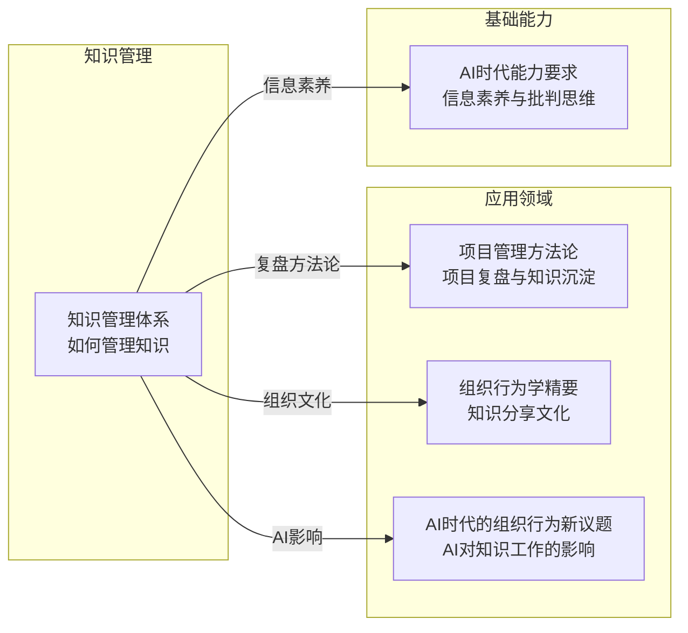

# 知识管理体系 — 知识库中枢

> [!abstract] 这个知识库解决什么问题？
> 知识管理不是"收藏更多文章"，而是"让知识流动起来"。本知识库覆盖从个人知识管理到组织知识管理的完整框架，包括PARA方法论、卡片笔记法、知识库结构设计、输出驱动输入的学习闭环，以及AI时代的知识管理变革。**无论你是个人学习者还是知识工作者，建立系统的知识管理体系，是最好的长期投资。**

---

## 全景图：知识管理的核心领域

---

## 文档索引表

| 编号 | 文档标题 | 核心内容 | 领域 | 优先级 |
|------|----------|----------|------|--------|
| 00 | [[07-学习成长/知识管理体系/00_MOC_知识管理体系中枢]] | 知识库中枢，全景图与导航 | -- | -- |
| 01 | [[07-学习成长/知识管理体系/01_知识管理的本质：从个人到组织]] | 知识管理的定义、价值、演进 | 基础认知 | P0 |
| 02 | [[07-学习成长/知识管理体系/02_PARA方法论：项目导向的知识组织法]] | Tiago Forte的PARA框架详解 | 方法论 | P0 |
| 03 | [[07-学习成长/知识管理体系/03_卡片笔记法：从卢曼到数字时代]] | Zettelkasten方法、原子化笔记 | 方法论 | P0 |
| 04 | [[07-学习成长/知识管理体系/04_知识库的结构设计：从混乱到有序]] | 分类体系、命名规范、链接策略 | 实践落地 | P0 |
| 05 | [[07-学习成长/知识管理体系/05_输出驱动输入：以写作为核心的学习闭环]] | 费曼学习法、写作即思考 | 实践落地 | P1 |
| 06 | [[07-学习成长/知识管理体系/06_AI时代的个人知识管理变革]] | AI如何改变知识管理 | 前沿议题 | P1 |

---

## 两条阅读路径

### 路径一：从零开始建立知识管理系统

> [!tip] 适合：还没有建立个人知识管理体系，想从零开始搭建

1. **先读 [[07-学习成长/知识管理体系/01_知识管理的本质：从个人到组织]]**：理解知识管理的核心价值
2. **再读 [[07-学习成长/知识管理体系/02_PARA方法论：项目导向的知识组织法]]**：掌握"项目→领域→资源→归档"的组织框架
3. **接着读 [[07-学习成长/知识管理体系/04_知识库的结构设计：从混乱到有序]]**：落地知识库的分类和命名规范
4. **接着读 [[07-学习成长/知识管理体系/03_卡片笔记法：从卢曼到数字时代]]**：学习原子化笔记的方法
5. **最后读 [[07-学习成长/知识管理体系/05_输出驱动输入：以写作为核心的学习闭环]]**：形成从输入到输出的完整闭环

### 路径二：按痛点查找

| 你遇到的问题 | 去看这篇 | 重点章节 |
|--------------|----------|----------|
| 收藏了很多文章但从不看 | [[07-学习成长/知识管理体系/01_知识管理的本质：从个人到组织]] | 知识管理的核心挑战 |
| 笔记越记越多，越记越乱 | [[07-学习成长/知识管理体系/02_PARA方法论：项目导向的知识组织法]] | PARA四层结构 |
| 写笔记不知道怎么写才能有用 | [[07-学习成长/知识管理体系/03_卡片笔记法：从卢曼到数字时代]] | 原子化笔记原则 |
| 知识库越来越大，找不到东西 | [[07-学习成长/知识管理体系/04_知识库的结构设计：从混乱到有序]] | 分类体系、链接策略 |
| 学了很多但输出不出来 | [[07-学习成长/知识管理体系/05_输出驱动输入：以写作为核心的学习闭环]] | 费曼技巧、写作闭环 |
| AI如何帮助知识管理 | [[07-学习成长/知识管理体系/06_AI时代的个人知识管理变革]] | AI辅助知识管理 |
| 项目复盘的知识如何沉淀 | [[05-产品与开发/项目管理方法论/07_项目复盘与知识管理：如何让每个项目都增值]] | 复盘经验教训库 |

---

## 核心概念速查

| 概念 | 定义 | 出处 |
|------|------|------|
| **PARA** | 项目(Project)→领域(Area)→资源(Resource)→归档(Archive)的四层知识组织框架 | [[07-学习成长/知识管理体系/02_PARA方法论：项目导向的知识组织法]] |
| **Zettelkasten** | 卢曼的卡片笔记法，强调原子化、链接化、自下而上的知识生长 | [[07-学习成长/知识管理体系/03_卡片笔记法：从卢曼到数字时代]] |
| **原子化笔记** | 每张卡片只记一个观点，笔记之间通过链接形成知识网络 | [[07-学习成长/知识管理体系/03_卡片笔记法：从卢曼到数字时代]] |
| **费曼学习法** | 通过"教别人"来检验自己是否真正理解了一个概念 | [[07-学习成长/知识管理体系/05_输出驱动输入：以写作为核心的学习闭环]] |
| **写作即思考** | 写作不是"把想好的东西写出来"，而是"通过写作来思考" | [[07-学习成长/知识管理体系/05_输出驱动输入：以写作为核心的学习闭环]] |

---

## 与其他知识库的关联

- **[[05-产品与开发/项目管理方法论/00_MOC_项目管理方法论中枢]]**：项目复盘产生的经验教训，是知识管理的重要输入
- **[[03-HR人事/组织行为学精要/00_MOC_组织行为学精要中枢]]**：知识分享文化和学习型组织，是组织行为学的重要议题
- **[[02-AI趋势与素养/AI时代能力要求/00_MOC_AI时代能力要求中枢]]**：信息素养和批判思维是AI时代知识管理的基础能力

---

## 更新日志

| 日期 | 变更内容 |
|------|----------|
| 2026-07-31 | 创建中枢文档，定义知识库框架和全部文档 |

---

> [!quote] 最后一句
> 知识管理的终极目标不是"拥有更多知识"，而是"让知识在需要的时候出现在需要的地方"。**知识不是力量，知识的流动才是。**