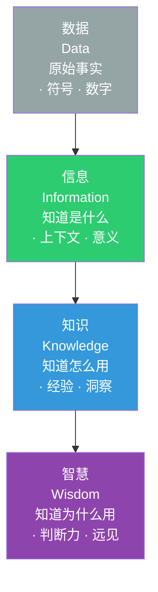
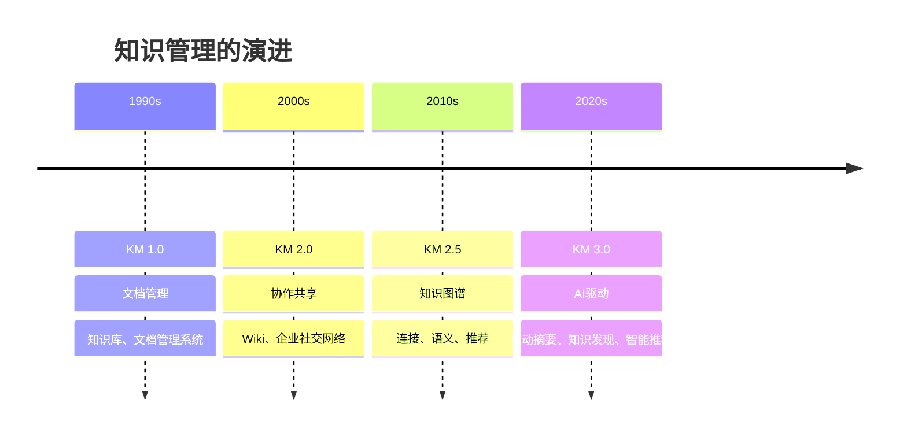

# 知识管理的本质：从个人到组织

> [!abstract] 核心论点
> 我们生活在一个"信息过载"但"知识稀缺"的时代。每天有海量信息涌入，但真正能转化为"知识"——即能够指导行动和决策的洞察——的比例极低。**知识管理的本质不是"管理信息"，而是"将信息转化为知识，将知识转化为行动，将行动转化为结果"。**

---

## 一、DIKW金字塔：从数据到智慧

知识管理领域的经典框架——DIKW金字塔——清晰地展示了"数据→信息→知识→智慧"的转化过程：



> [!important] 知识管理的核心挑战
> 大多数人的知识管理停留在"收集信息"的层面——收藏文章、保存文件、截屏——但这只是DIKW金字塔的底层。**真正的知识管理，是让信息流动起来，通过思考和实践转化为知识，最终形成指导行动的智慧。**

---

## 二、个人知识管理的核心挑战

### 2.1 知识管理的五个核心问题

| 问题 | 现象 | 后果 |
|------|------|------|
| **收藏癖** | 见文章就收藏，但从不回看 | 知识库变成"数字坟墓" |
| **信息过载** | 每天接收大量信息，无法消化 | 焦虑、注意力分散 |
| **知识碎片化** | 知识散落在不同工具、不同文件夹 | 无法形成体系 |
| **学用脱节** | 学了很多，但用不上 | 学习效率低下 |
| **遗忘曲线** | 学过的知识很快忘记 | 重复学习，浪费精力 |

### 2.2 知识管理的三个核心原则

> [!tip] 有效知识管理的三个原则
> 1. **少即是多**：知识管理的重心不是"收集更多"，而是"提炼更少但更有价值的知识"
> 2. **链接重于收藏**：一条孤立的知识几乎没有价值，一条与已有知识建立了链接的知识才有价值
> 3. **输出驱动输入**：只有当你需要"输出"时（写作、分享、解决问题），你才能真正"输入"有价值的知识

---

## 三、组织知识管理的核心挑战

### 3.1 组织知识管理的"冰山模型"

组织中的知识分为显性知识和隐性知识：

```
┌─────────────────────────────────────┐
│       显性知识（20%）                │
│  ┌───────────────────────────────┐  │
│  │  · 文档、流程、规范          │  │
│  │  · 数据库、知识库            │  │
│  │  · 可以"写下来"的知识        │  │
│  └───────────────────────────────┘  │
│       隐性知识（80%）                │
│  ┌───────────────────────────────┐  │
│  │  · 经验、直觉、窍门          │  │
│  │  · 人际关系、信任            │  │
│  │  · 无法"写下来"的知识        │  │
│  └───────────────────────────────┘  │
└─────────────────────────────────────┘
```

> [!warning] 组织知识管理的最大挑战
> 组织知识管理的最大挑战不是"显性知识的管理"，而是"隐性知识的显性化"。
>
> 一个经验丰富的工程师离职，他带走的不是"文档"，而是"经验"——那些"文档里没有写，但遇到问题知道怎么解决"的知识。
>
> **组织知识管理的核心工作，就是建立"隐性知识→显性知识→组织能力"的转化机制。**

### 3.2 知识分享的文化障碍

为什么组织中的知识分享如此困难？

| 障碍 | 描述 | 对策 |
|------|------|------|
| **知识即权力** | "我知道你不知道"是一种权力 | 建立知识分享的激励机制 |
| **时间成本** | "写文档太费时间" | 让知识分享成为工作的一部分 |
| **质量担忧** | "写错了怎么办" | 建立"不完美但分享"的文化 |
| **不知道分享什么** | "我觉得大家都知道" | 建立知识分享的框架和模板 |

关于组织文化对知识分享的影响，详见 [[03-HR人事/组织行为学精要/05_组织文化与变革：如何塑造和改变文化]]。

---

## 四、知识管理的演进：从1.0到3.0



---

## 五、AI时代知识管理的范式转变

> [!tip] AI对知识管理的三个根本性改变
> 1. **从"人找知识"到"知识找人"**：AI可以主动推送你需要的信息，知识的"搜索"范式正在被"推荐"范式取代
> 2. **从"知识库"到"知识引擎"**：知识不再是静态的文档，而是动态的、可交互的、AI可以理解并调用的"知识引擎"
> 3. **从"知识管理"到"知识创造"**：AI可以辅助人类写作、总结、分析，知识管理的重心从"管理已有知识"转向"创造新知识"

关于AI时代知识管理的系统变革，详见 [[07-学习成长/知识管理体系/06_AI时代的个人知识管理变革]]。

---

## 本文档的关联知识

| 关联知识库 | 具体关联文档 | 关联内容 |
|------------|-------------|----------|
| 知识管理体系 | [[07-学习成长/知识管理体系/02_PARA方法论：项目导向的知识组织法]] | 知识组织的具体方法论 |
| 知识管理体系 | [[07-学习成长/知识管理体系/03_卡片笔记法：从卢曼到数字时代]] | 知识内化的核心方法 |
| 知识管理体系 | [[07-学习成长/知识管理体系/06_AI时代的个人知识管理变革]] | AI时代的知识管理新范式 |
| 项目管理方法论 | [[05-产品与开发/项目管理方法论/07_项目复盘与知识管理：如何让每个项目都增值]] | 项目复盘中的知识沉淀 |
| 组织行为学精要 | [[03-HR人事/组织行为学精要/05_组织文化与变革：如何塑造和改变文化]] | 知识分享的组织文化 |