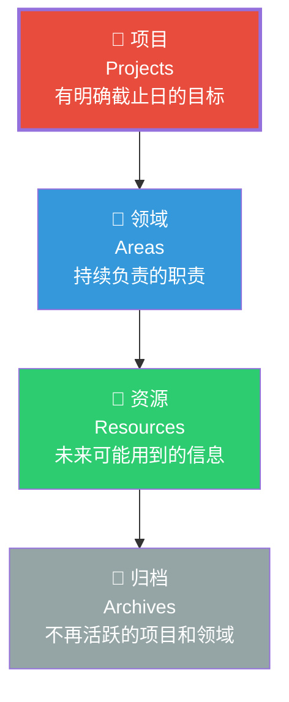
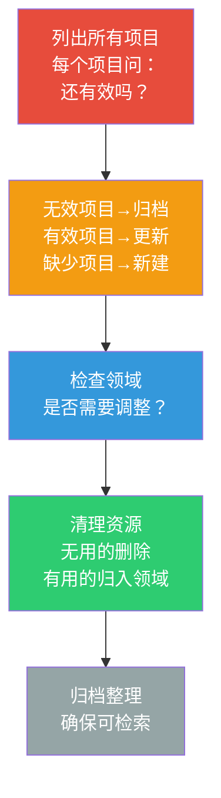

# PARA方法论：项目导向的知识组织法

> [!abstract] 核心论点
> 传统知识管理方法失败的根本原因，是它们试图用"分类"来组织知识——但"分类"是静态的，而"知识"是动态的。Tiago Forte提出的PARA方法论，用"项目"作为知识组织的核心单元，因为**项目是有明确目标的行动，知识只有在服务行动时才有价值。**

---

## 一、PARA的四层结构

PARA将知识组织为四个层级：



### 各层详解

| 层级 | 定义 | 例子 | 关键特征 | 维护频率 |
|------|------|------|---------|---------|
| **项目** | 有明确截止日的目标 | "完成Q3市场分析报告"、"开发App新功能" | 有期限、有明确产出 | 每日 |
| **领域** | 持续负责的职责 | "人力资源管理"、"项目管理能力"、"健康管理" | 没有截止日，需要持续关注 | 每周 |
| **资源** | 未来可能用到的信息 | "机器学习入门资料"、"优秀PPT模板" | 没有明确用途，但可能有用 | 每月 |
| **归档** | 已完成的项目和休眠的领域 | "2023年项目集"、"前公司知识库" | 不再活跃，但需要可检索 | 每季度 |

---

## 二、PARA的核心原则

### 2.1 项目驱动的知识组织

> [!important] PARA的第一原则：项目优先
> **知识不按照"学科"组织，而是按照"项目"组织。** 当你在学习"机器学习"时，不是因为"知识管理体系"的"资源"类中有一个"AI"文件夹，而是因为你有一个"使用AI分析用户行为"的项目。
>
> 项目是知识组织的"锚点"——它回答了"我为什么需要这些知识"和"我什么时候会用这些知识"。

### 2.2 减少分类层级

> [!tip] PARA的极简主义
> 大多数知识管理系统的失败，是因为"分类太多"——你花在"决定放在哪个文件夹"上的时间，比"使用知识"的时间还多。
>
> PARA只有四层，且每层的含义清晰：
> - **项目**：有期限，必须做
> - **领域**：无期限，持续做
> - **资源**：可能有用，但不确定
> - **归档**：不再活跃，但需要保留

---

## 三、PARA的实践流程

### 3.1 每月"PARA清理"



### 3.2 知识从"资源"到"项目"的流动

知识的"价值提升"路径：

```
资源 → 相关领域 → 具体项目 → 归档后的经验
```

| 阶段 | 状态 | 对知识的处理 |
|------|------|-------------|
| **资源** | 可能有用 | 简单保存，标签分类 |
| **领域** | 持续关注 | 整理、提炼、建立关联 |
| **项目** | 正在使用 | 深度加工、输出、实践 |
| **归档** | 已完成 | 结构化存档，方便检索 |

---

## 四、PARA与第二大脑

Tiago Forte的"第二大脑"理念与PARA紧密相关——PARA是第二大脑的"操作系统"。

> [!example] PARA在第二大脑中的应用
> ```
> 第二大脑/
> ├── 01_项目/          # 当前正在做的事
> │   ├── 项目A-完成XX报告
> │   ├── 项目B-学习Python
> │   └── 项目C-搬家准备
> ├── 02_领域/          # 持续负责的职责
> │   ├── 健康管理
> │   ├── 财务管理
> │   └── 专业技能
> ├── 03_资源/          # 未来可能有用
> │   ├── 写作技巧
> │   ├── 工具推荐
> │   └── 灵感收集
> └── 04_归档/          # 已完成的历史
>     ├── 2024年项目
>     └── 旧知识库
> ```

---

## 五、PARA的局限与批判

> [!warning] PARA并非万能
> 1. **过于"项目中心"**：有些知识（如哲学、历史）很难与"项目"关联，强行关联反而奇怪
> 2. **对创造力工作者的限制**：纯粹的"项目驱动"可能限制了"无目的的探索"——而创造力往往来自"无目的的探索"
> 3. **归档的"黑洞"**：归档后的知识往往很难再被检索和使用，PARA的"归档"环节实际上是一个"知识黑洞"
>
> **改进建议**：结合[[07-学习成长/知识管理体系/03_卡片笔记法：从卢曼到数字时代]]的"链接"机制，在归档时建立知识之间的关联，让"归档"不是"终点"而是"休眠"。

---

## 六、PARA与项目管理的结合

PARA中的"项目"与项目管理中的"项目"高度一致——这也是本知识库与[[05-产品与开发/项目管理方法论/00_MOC_项目管理方法论中枢]]的自然衔接点。

| 项目管理概念 | PARA中的对应 | 结合应用 |
|-------------|-------------|---------|
| WBS | 项目下的子任务 | 将项目分解为可管理的笔记 |
| 里程碑 | 项目阶段产出 | 每个里程碑产出知识总结 |
| 复盘 | 归档前的经验提炼 | 项目完成后，将经验提炼为领域知识 |

---

## 本文档的关联知识

| 关联知识库 | 具体关联文档 | 关联内容 |
|------------|-------------|----------|
| 知识管理体系 | [[07-学习成长/知识管理体系/01_知识管理的本质：从个人到组织]] | 知识管理的核心价值 |
| 知识管理体系 | [[07-学习成长/知识管理体系/03_卡片笔记法：从卢曼到数字时代]] | 与PARA互补的笔记方法 |
| 知识管理体系 | [[07-学习成长/知识管理体系/04_知识库的结构设计：从混乱到有序]] | PARA的具体落地实现 |
| 项目管理方法论 | [[05-产品与开发/项目管理方法论/00_MOC_项目管理方法论中枢]] | 项目管理与PARA的衔接 |
| 项目管理方法论 | [[05-产品与开发/项目管理方法论/07_项目复盘与知识管理：如何让每个项目都增值]] | 项目复盘中的知识沉淀 |