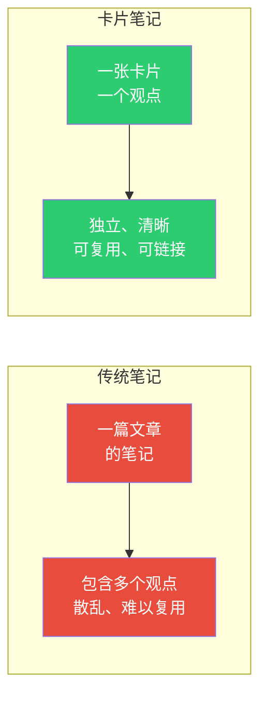
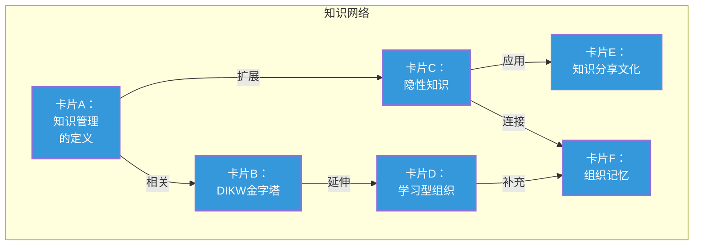
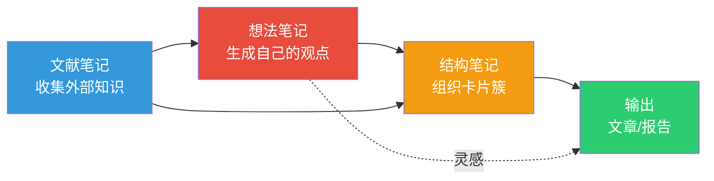

# 卡片笔记法：从卢曼到数字时代

> [!abstract] 核心论点
> 德国社会学家尼克拉斯·卢曼用他发明的"卡片盒笔记法"（Zettelkasten），在30年间出版了70多本专著和400多篇论文。他成功的秘密不是"更努力"，而是**建立了一个"与知识对话"的系统**——每张卡片只记录一个想法，卡片之间通过链接形成知识网络，新的想法从网络中自然涌现。这不是"记笔记的方法"，而是"思考的方法"。

---

## 一、卢曼卡片盒的核心原理

### 1.1 原子化原则

> [!important] 原子化原则
> 每张卡片只记录一个观点。这个观点必须：
> - 用自己的话写（不是照抄）
> - 独立于上下文（即使没有原始来源也能理解）
> - 足够小（可以在一张卡片上写完）
> - 包含来源（方便追溯）

### 1.2 链接原则

卢曼的卡片盒有超过90,000张卡片，链接数量超过25,000个。**链接是卡片盒的"灵魂"**：

### 1.3 自下而上的生长

> [!tip] 卡片盒的"有机生长"
> 卡片盒不预设分类体系。它从一张卡片开始，随着卡片增多，链接自然形成"簇"(cluster)，簇与簇之间形成"网络"。
>
> **分类是"生长"出来的，不是"设计"出来的。** 这与传统知识管理"先分类再填内容"的方式完全不同。
>
> 当某个簇的卡片足够多时，自然就形成了一个"主题"。在这个主题上，你已经有足够的知识来写一篇文章了。

---

## 二、四种卡片类型

### 2.1 卡片类型详解

| 类型 | 用途 | 特征 | 例子 |
|------|------|------|------|
| **文献笔记** | 记录外部信息 | 有来源、用自己的话总结 | "河野英太郎在《不懂年轻人你怎么带团队》中提出..." |
| **想法笔记** | 记录自己的想法 | 可能没有来源、需要验证 | "我突然想到，PARA和Zettelkasten可以结合：用PARA组织文件，用Zettelkasten组织想法" |
| **结构笔记** | 组织卡片簇 | 索引、目录、大纲 | "关于'知识管理'的10张卡片索引" |
| **项目笔记** | 服务特定项目 | 有期限，项目结束后归档 | "XX项目需求分析笔记" |

### 2.2 从卡片到文章

---

## 三、卡片笔记法的数字时代实践

### 3.1 工具选择

在数字时代，有很多工具可以实践卡片笔记法：

| 工具 | 特点 | 适合人群 | 价格 |
|------|------|---------|------|
| **Obsidian** | 双向链接、图谱、本地存储 | 深度知识工作者 | 免费 |
| **Roam Research** | 大纲式、块级引用 | 喜欢结构化思考的人 | 付费 |
| **Notion** | 全能型、数据库 | 需要协作的人 | 免费/付费 |
| **Logseq** | 开源、大纲+卡片 | 隐私敏感者 | 免费 |

> [!tip] 不要纠结于工具
> 工具不重要，方法和习惯才重要。Obsidian的双向链接和知识图谱最适合卡片笔记法的实践，但任何支持"链接"的工具都可以。

### 3.2 数字卡片笔记的实践建议

> [!example] 日常卡片笔记流程
> 1. **阅读时**：遇到有价值的观点，用自己的话写一张卡片（文献笔记）
> 2. **写卡片时**：问自己"这张卡片与其他卡片有什么关联？"——建立链接
> 3. **定期回顾**：当卡片数量增多，开始写"结构笔记"来组织卡片簇
> 4. **发现主题**：当某个主题的卡片足够多时，自然就形成了"可输出的知识"
> 5. **输出**：用结构笔记作为大纲，用卡片作为素材，写一篇文章或报告

---

## 四、卡片笔记与PARA的结合

卡片笔记和PARA不是替代关系，而是互补关系：

| 维度 | PARA | 卡片笔记法 |
|------|------|-----------|
| **组织方式** | 自上而下（项目→领域→资源→归档） | 自下而上（卡片→链接→簇→主题） |
| **核心单元** | 项目 | 卡片 |
| **适用场景** | 知识的外在组织 | 知识的内在思考 |
| **最佳实践** | 用PARA组织文件夹结构 | 用卡片笔记法组织笔记内容和链接 |

> [!tip] 最佳实践组合
> 用PARA来组织你的"知识库文件夹结构"，用卡片笔记法来组织"笔记内容"和"笔记之间的链接"。两者结合，既有了清晰的分类，又有了思想的深度连接。

---

## 五、卡片笔记法的常见误区

> [!warning] 五个常见误区
> 1. **把卡片笔记当成"摘抄"**：抄写不等于思考。卡片笔记的核心是"用自己的话重写"
> 2. **过分追求原子化**：原子化不是"越碎越好"，而是"够用就好"。有时候一个观点需要多张卡片
> 3. **只建链接不维护**：链接不是"一次性"的，需要定期回顾和更新
> 4. **卡片数量崇拜**：不是"卡片越多越好"，而是"有价值链接的卡片越多越好"
> 5. **只输入不输出**：卡片笔记的终极目标是"输出"——写作、分享、创造

---

## 本文档的关联知识

| 关联知识库 | 具体关联文档 | 关联内容 |
|------------|-------------|----------|
| 知识管理体系 | [[07-学习成长/知识管理体系/01_知识管理的本质：从个人到组织]] | 知识管理的基础认知 |
| 知识管理体系 | [[07-学习成长/知识管理体系/02_PARA方法论：项目导向的知识组织法]] | 与卡片笔记互补的组织方法 |
| 知识管理体系 | [[07-学习成长/知识管理体系/04_知识库的结构设计：从混乱到有序]] | 知识库的落地实践 |
| 知识管理体系 | [[07-学习成长/知识管理体系/05_输出驱动输入：以写作为核心的学习闭环]] | 卡片笔记的终极目标是输出 |
| 知识管理体系 | [[07-学习成长/知识管理体系/06_AI时代的个人知识管理变革]] | AI如何改变卡片笔记的实践 |