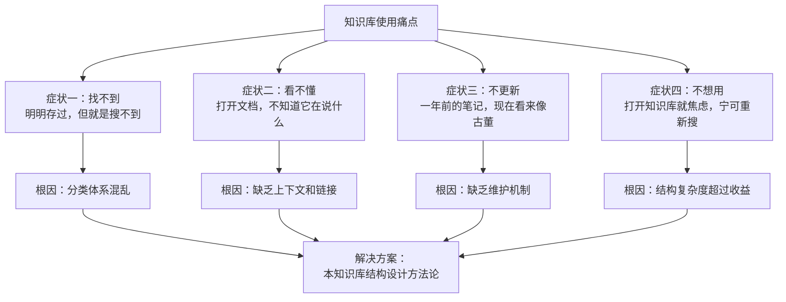
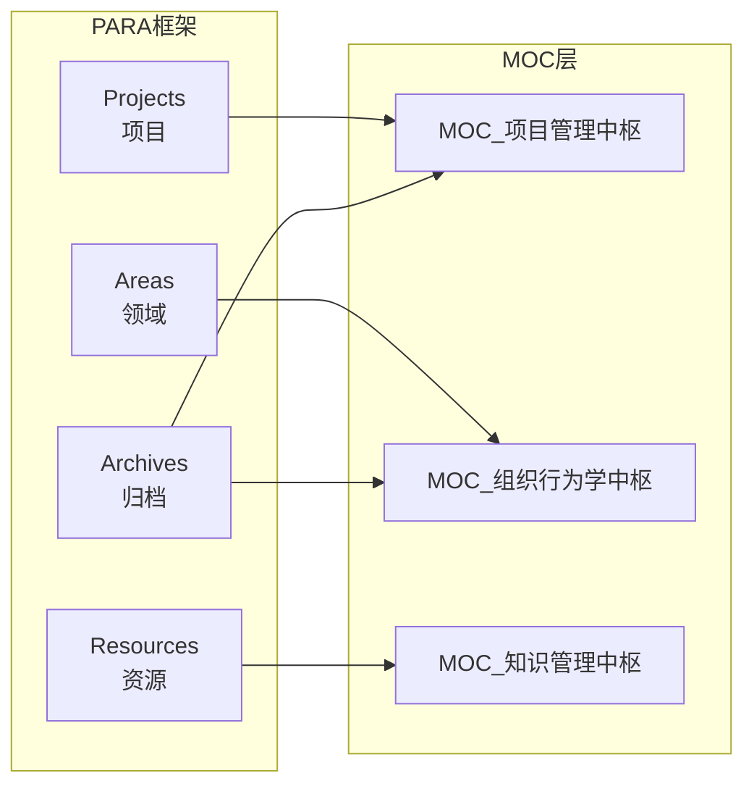
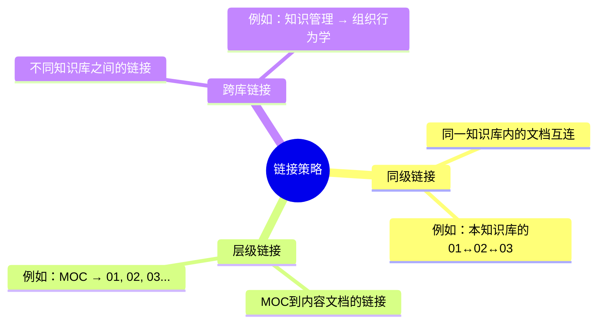
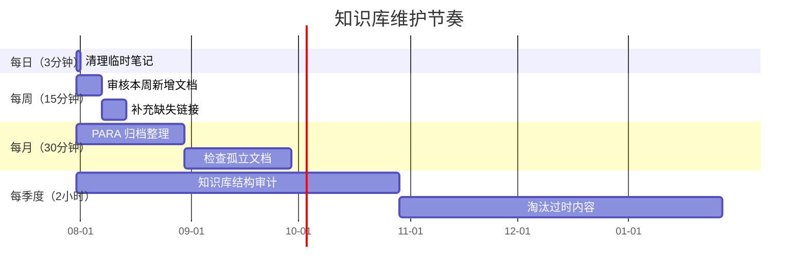

# 知识库的结构设计：从混乱到有序

> [!abstract] 本文要解决的核心问题
> 绝大多数知识库死于"建立时雄心勃勃，三个月后无人问津"。原因不是内容不够好，而是**结构设计不合理**——找不到、看不懂、用不上。本文提供一套可落地的知识库结构设计方法论，从分类体系、命名规范到链接策略，帮你把"知识仓库"变成"知识武器"。

---

## 一、知识库崩溃的四种典型症状

在谈解决方案之前，先诊断一下你的知识库是否已经"生病"：



> [!warning] 一个残酷的真相
> 知识库的**搜索成本**随着文档数量的平方增长。当文档数超过 200 篇时，如果没有良好的结构设计，找一篇文档的时间比重新写一篇还长。这就是为什么"知识库越建越大，使用频率越来越低"。

---

## 二、结构设计的三个核心原则

### 原则一：PARA 变体——MOC 驱动的双层分类

[[07-学习成长/知识管理体系/02_PARA方法论：项目导向的知识组织法|PARA方法论]] 的核心是"项目导向"，但纯 PARA 在知识库场景中有一个致命缺陷：**它没有提供跨文档的导航机制**。因此，我们引入 MOC（Map of Content，内容地图）作为补充：



**双层分类的实际操作**：

| 层级 | 职责 | 例子 | 文件数量 |
|------|------|------|----------|
| **MOC 层** | 导航、索引、阅读路径 | `00_MOC_项目管理方法论中枢.md` | 每个知识库 1 个 |
| **内容层** | 具体的知识内容 | `01_个体行为基础.md` | 每个知识库 5-10 个 |
| **原子笔记层** | 最小的知识单元 | 日常随手记的卡片笔记 | 不限 |

### 原则二：文件夹深度 ≤ 2

> [!tip] 文件夹深度法则
> 知识库的文件夹嵌套深度**永远不要超过 2 层**。超过 2 层，知识库就变成了"俄罗斯套娃"——你永远不知道一个文档藏在哪个角落。

**推荐结构**：

```
知识库根目录/
├── 00_MOC_知识库中枢.md              ← 导航入口
├── 01_主题一名称.md                   ← 内容文档
├── 02_主题二名称.md
├── 03_主题三名称.md
├── Assets/                            ← 附件（图片、PDF等）
└── Templates/                         ← 模板（可选）
```

**不推荐结构**：

```
知识库根目录/
├── 分类A/
│   ├── 子分类A1/
│   │   ├── 子子分类A1a/
│   │   │   └── 文档.md               ← 找到它时已经忘了要干嘛
│   │   └── ...
│   └── ...
└── ...
```

### 原则三：每个文档只在一个"主题桶"中

这是 [[07-学习成长/知识管理体系/03_卡片笔记法：从卢曼到数字时代|卡片笔记法]] 的核心原则——**原子化**。每个文档只属于一个主题，只回答一个问题。如果你发现一个文档同时属于"项目管理"和"组织行为学"，说明它不够原子化，需要拆分成两个文档，然后用双向链接连接。

---

## 三、命名规范：让文件名本身就有信息量

> [!key] 命名规范的核心价值
> 好的命名规范让你**不需要打开文件就知道它是什么**。在 Obsidian 中，文件名就是链接的锚点，好的命名规范直接提升链接的可读性。

### 3.1 文件命名规则

```
[编号]_[主题]_[修饰词].md
```

| 规则 | 说明 | 例子 |
|------|------|------|
| **编号** | 两位数字，用于排序 | `00_`、`01_`、`02_` |
| **主题** | 核心概念，不加编号 | `项目管理方法论` |
| **修饰词** | 子主题或具体内容 | `从理论到实践` |
| **MOC** | 以 `MOC` 开头，用下划线连接 | `00_MOC_项目管理方法论中枢` |

### 3.2 链接命名规范

```markdown
<!-- 推荐：使用别名（alias）作为显示文本 -->
[[07-学习成长/知识管理体系/02_PARA方法论：项目导向的知识组织法|PARA方法论]]

<!-- 也推荐：使用核心概念作为显示文本 -->
[[07-学习成长/知识管理体系/03_卡片笔记法：从卢曼到数字时代|卡片笔记法]]

<!-- 不推荐：直接使用完整文件名 -->
[[07-学习成长/知识管理体系/02_PARA方法论：项目导向的知识组织法]]
```

> [!example] 跨知识库链接示例
> ```markdown
> 本知识库的 MOC 结构与 [[03-HR人事/组织行为学精要/00_MOC_组织行为学精要中枢|组织行为学精要 MOC]] 采用相同的设计原则。
> ```

---

## 四、链接策略：构建知识网络

### 4.1 三种链接类型



### 4.2 链接密度建议

| 文档类型 | 推荐出链数量 | 推荐入链数量 |
|----------|-------------|-------------|
| **MOC** | 5-10 个（指向所有内容文档） | 0-2 个（被其他 MOC 引用） |
| **内容文档** | 3-5 个（上下文连接） | 2-5 个（被其他文档引用） |
| **原子笔记** | 1-3 个（关键概念连接） | 0-3 个 |

### 4.3 链接的"七步检查法"

每次写完一篇文档，用以下 checklist 检查链接质量：

- [ ] 是否链接了 MOC？（每个内容文档都应该能回到 MOC）
- [ ] 是否链接了前驱文档？（引用了前面文档的核心概念）
- [ ] 是否链接了后继文档？（为后续阅读铺路）
- [ ] 是否链接了外部知识库？（至少一个跨库引用）
- [ ] 是否使用了别名？（显示文本应该简洁自然）
- [ ] 是否避免了孤立链接？（不要链接到不存在的文档）
- [ ] 链接文本是否在上下文中自解释？（用户不点开也能猜到内容）

---

## 五、维护机制：让知识库"活"起来

> [!warning] 知识库的"半衰期"
> 一篇知识文档的**半衰期大约是 6 个月**——6 个月后，如果没有人维护，它的价值会衰减一半。知识库不是"一次建成，永久使用"的，而是需要持续维护的"活系统"。

### 5.1 定期维护节奏



### 5.2 维护检查清单

**每周**：
- 检查是否有"孤儿文档"（没有任何链接的文档）
- 补全本周新增文档的 frontmatter 和链接

**每月**：
- 运行 `未链接文件` 检查，将所有需要的链接补上
- 检查 MOC 是否还能反映最新的知识库结构
- 将不再活跃的项目从 Projects 移到 Archives

**每季度**：
- 整体结构审计：文件夹深度是否超标？命名是否一致？
- 内容质量审计：有哪些文档需要更新？有哪些可以删除？
- 链接健康检查：有多少断链？有多少重定向？

---

## 六、结合卡片笔记法的实践流程

[[07-学习成长/知识管理体系/03_卡片笔记法：从卢曼到数字时代|卡片笔记法]] 强调的是"自下而上"的知识生长，而知识库结构设计是"自上而下"的分类框架。二者如何结合？

```mermaid
flowchart TD
    subgraph 日常：卡片笔记（自下而上）
        A["随手记一张卡片"] --> B["打上标签"]
        B --> C["链接到已有卡片"]
        C --> D["纳入临时收件箱"]
    end

    subgraph 定期：结构整理（自上而下）
        D --> E["每周审核：<br/>卡片→放入对应主题桶"]
        E --> F["每月整理：<br/>主题桶→更新MOC"]
        F --> G["每季度审计：<br/>整体结构优化"]
    end

    G --> H["产出：可用的知识库"]
    H -->|"为新卡片提供上下文"| A
```

> [!example] 实践案例
> 某天你读到一篇关于"远程团队信任建设"的文章，随手记了一张卡片笔记：
> ```markdown
> ## 远程团队的信任建设
> 来源：Harvard Business Review, 2026-03
> 核心观点：远程团队的信任不是"自然产生"的，而是需要"刻意设计"的。
> 关键机制：透明度、可预测性、频繁同步。
> 链接：[[03-HR人事/组织行为学精要/07_冲突与谈判：建设性冲突管理]]
> ```
> 每周审核时，你发现这张卡片与"组织行为学"和"项目管理"都相关，于是：
> 1. 在主卡片中补充两个知识库的链接
> 2. 在 MOC 中更新"相关新条目"部分
> 3. 如果卡片足够成熟，扩展为完整的内容文档

---

## 七、从混乱到有序的路线图

> [!key] 核心建议
> 不要追求"一步到位"的完美结构。**从最简单的结构开始，在迭代中优化**。一个"够用但不完美"的知识库，远胜于"一直在规划但从未建成"的知识库。

### 推荐的实施路线

| 阶段 | 时间 | 目标 | 成果 |
|------|------|------|------|
| **第一阶段：初始化** | 第 1 天 | 建立基本结构 | 创建 MOC，定义 3-5 个主题桶 |
| **第二阶段：填充** | 第 1-2 周 | 导入现有知识 | 把已有笔记移到对应主题桶 |
| **第三阶段：链接** | 第 2-4 周 | 建立链接网络 | 每个文档至少有 3 个出链和入链 |
| **第四阶段：优化** | 第 1-3 个月 | 迭代结构 | 根据使用反馈调整分类和命名 |
| **第五阶段：维护** | 持续 | 日常维护 | 每周 15 分钟，每月 30 分钟 |

---

> [!tip] 与其他知识库的关联
> - 本方法论与 [[07-学习成长/知识管理体系/02_PARA方法论：项目导向的知识组织法|PARA方法论]] 互补：PARA 解决"知识怎么分类"，本文解决"知识怎么组织"
> - 本方法论与 [[07-学习成长/知识管理体系/03_卡片笔记法：从卢曼到数字时代|卡片笔记法]] 衔接：卡片笔记提供"知识原料"，本文提供"知识加工厂"
> - 本方法论与 [[05-产品与开发/项目管理方法论/00_MOC_项目管理方法论中枢|项目管理方法论 MOC]] 共享相同的结构设计原则

---

## 更新日志

| 日期 | 变更内容 |
|------|----------|
| 2026-07-31 | 创建文档，完整阐述知识库结构设计方法论 |