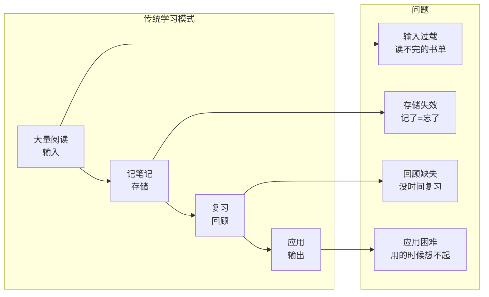
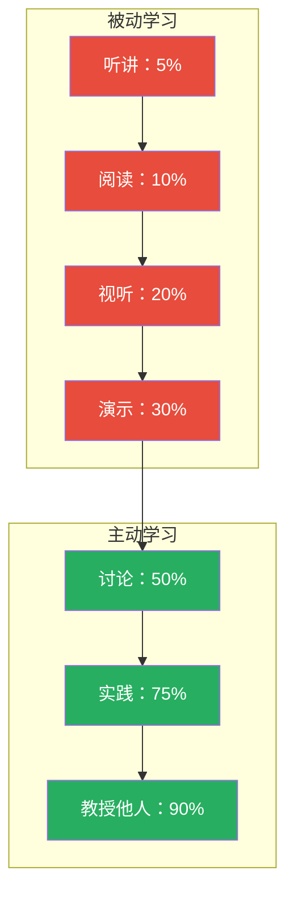
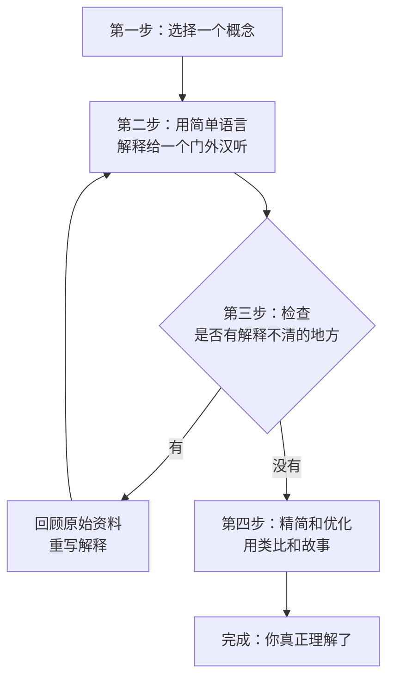
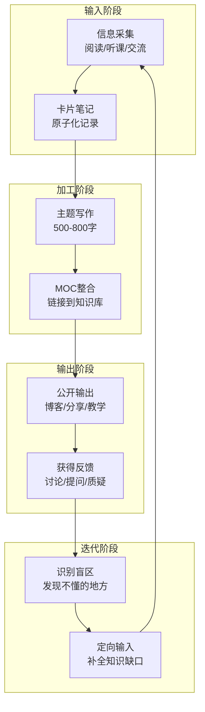
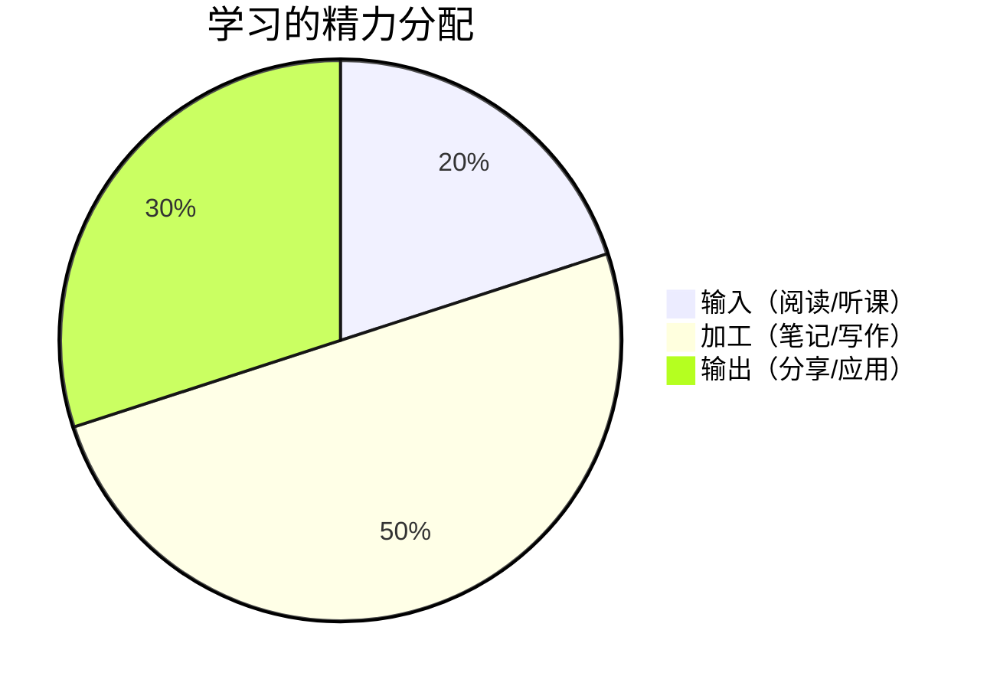
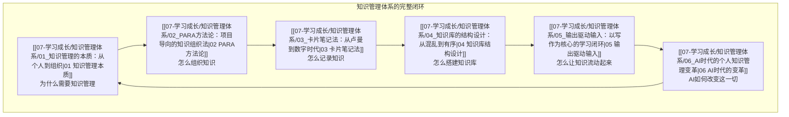

# 输出驱动输入：以写作为核心的学习闭环

> [!abstract] 本文要解决的核心问题
> 为什么你读了那么多书、记了那么多笔记，但真正要用的时候却什么也想不起来？因为**输入和输出之间存在巨大的鸿沟**。本文提出"输出驱动输入"的学习方法论，把写作（输出）作为学习的核心引擎，让每一次输入都服务于明确的输出目标。

---

## 一、学习的基本矛盾：输入 vs 输出的鸿沟



> [!warning] 输入陷阱
> 大多数人把"学习"等同于"输入"。他们以为读了一本书、听完一门课、收藏了一篇文章，就等于"学到了"。但神经科学研究表明：**被动输入的信息，24 小时后的留存率不到 30%**。只有经过主动加工（写作、讨论、教授他人）的信息，才能转化为长期记忆。

### 留存率金字塔



> [!key] 核心洞察
> 学习效果的差异不在于"输入质量"，而在于**输出深度**。最好的学习方式不是"读更多"，而是"写出来、讲出来、用出来"。

---

## 二、费曼学习法：以教代学

费曼学习法由诺贝尔物理学奖得主理查德·费曼提出，被誉为"世界上最好的学习方法"。它的核心思想很简单：**如果你不能简单地解释一个概念，你就没有真正理解它**。

### 费曼学习法的四个步骤



### 在 Obsidian 中的实践

> [!example] 费曼笔记模板
> ```markdown
> # 概念名称
>
> ## 一句话解释
> （用最简单的话说清楚这个概念）
>
> ## 类比
> （用生活中的例子打比方）
>
> ## 我理解不了的边界
> （哪些地方我还解释不清楚？）
>
> ## 实践应用
> （这个概念怎么用到我的工作中？）
>
> ## 相关链接
> - [[相关概念A]]
> - [[相关概念B]]
> ```

[[07-学习成长/知识管理体系/03_卡片笔记法：从卢曼到数字时代|卡片笔记法]] 与费曼学习法天然互补：卡片笔记负责"原子化记录"，费曼学习法负责"深度理解"。一张好的卡片笔记，本质上就是一次费曼学习法的实践。

---

## 三、写作即思考：为什么写作是最好的学习方式

> [!key] 核心论断
> 写作不是"记录思考的结果"，而是**思考本身的过程**。你在写作之前不知道自己真正想的是什么——写作的过程就是理清思路的过程。

### 写作的三个层次

| 层次 | 形式 | 目标 | 频率 | 字数 |
|------|------|------|------|------|
| **L1: 随手笔记** | 卡片笔记、读书记录 | 捕捉灵感 | 每天 | 100-300 字 |
| **L2: 主题笔记** | 知识库文档、MOC | 建立体系 | 每周 | 500-800 字 |
| **L3: 公开输出** | 博客、文章、分享 | 接受反馈 | 每月 | 2000+ 字 |

### 为什么写作是"高杠杆"的学习活动

1. **强制结构化**：写作迫使你把零散的知识点组织成逻辑链条。你无法写出你无法理清的东西。
2. **暴露认知盲区**：写作过程中，你一定会发现"这个地方我其实不太懂"——这就是学习的最佳切入点。
3. **创造可检索的记录**：写下来的东西，未来可以随时检索。大脑中模糊的印象，几年后可能就消失了，但一篇好文章可以反复使用。
4. **产生复利效应**：[[07-学习成长/知识管理体系/04_知识库的结构设计：从混乱到有序|知识库的结构设计]] 中提到的"链接网络"，本质上就是写作复利——每写一篇新文章，旧文章的价值也随之提升。

---

## 四、输出驱动输入：完整的学习闭环

### 4.1 闭环模型



### 4.2 实践原则

**原则一：先定输出目标，再定输入计划**

不要问"这个月我要读什么书"，而是问"这个月我要写什么文章"。先确定输出目标，然后针对性地找输入材料。

> [!tip] 实践建议
> 在你开始阅读一本书之前，花 5 分钟做一件事：
> 1. 写下"读完这本书我要产出什么"（一篇笔记？一篇文章？一个知识库文档？）
> 2. 带着这个目标去读
> 3. 读完后立刻产出，不要等"读完所有章节"——先写你最有感触的部分

**原则二：80/20 法则**



大多数人把 80% 的精力花在输入上，只有 20% 花在输出上。**建议倒过来**：20% 输入，50% 加工（写作），30% 输出（分享和应用）。

**原则三：建立"写作→反馈→迭代"的循环**

写作不是终点，是学习的起点。写完一篇文章后：
1. 分享给同事或朋友，看看他们的反应
2. 记录他们的提问和质疑——这些是你的认知盲区
3. 根据反馈补充知识，更新文章
4. 把更新后的文章放回知识库，链接到相关文档

---

## 五、日常实践：从"输入者"到"输出者"的转变

### 5.1 每日实践：3-3-3 法则

| 时间 | 活动 | 产出 |
|------|------|------|
| **30 分钟输入** | 阅读一篇文章/一个章节 | 标记关键段落 |
| **30 分钟加工** | 写 1-3 张卡片笔记 | 原子化笔记 |
| **30 分钟连接** | 链接到知识库，更新 MOC | 知识网络扩展 |

### 5.2 每周实践：一篇主题写作

每周选择一个主题，写一篇 500-800 字的知识库文档。模板如下：

```markdown
---
title: [主题名称]
date: [当前日期]
tags: [相关标签]
aliases: [常用别名]
related: [相关文档链接]
---

# [主题名称]

> [!abstract] 一句话总结
> [用一句话说清楚这个主题的核心观点]

## 为什么这个主题重要
[背景和动机]

## 核心概念
[2-3 个关键概念，每个用 2-3 句话解释]

## 实践应用
[如何应用到实际工作中]

## 相关链接
- [链接到知识库中的其他文档]
- [链接到外部资源]
```

### 5.3 每月实践：公开输出

每月至少做一次公开输出：

| 形式 | 平台 | 时间投入 | 收获 |
|------|------|----------|------|
| **技术博客** | 个人博客/知乎/公众号 | 3-4 小时 | 建立个人品牌 |
| **内部分享** | 团队分享会 | 1-2 小时 | 即时反馈 |
| **教学相长** | 指导同事/新人 | 30 分钟 | 发现自己不懂的地方 |

---

## 六、常见误区与应对

| 误区 | 表现 | 后果 | 应对策略 |
|------|------|------|----------|
| **完美主义** | 担心写不够好，迟迟不动笔 | 永远不开始 | 先写"烂第一稿"，然后迭代 |
| **输入成瘾** | 不断收集新资料，从不整理 | 信息过载 | 强制"先产出再输入" |
| **孤芳自赏** | 写给自己看，不接受反馈 | 认知盲区 | 定期分享，主动寻求反馈 |
| **结构焦虑** | 花太多时间设计结构，不写内容 | 知识库永远建不起来 | 参照 [[07-学习成长/知识管理体系/04_知识库的结构设计：从混乱到有序]] 的"最小可行结构" |
| **输出恐惧** | 担心被批评，不敢公开输出 | 失去成长机会 | 从小范围分享开始，建立信心 |

> [!tip] 克服完美主义
> 记住海明威的名言："**所有初稿都是垃圾**。"写作不是"一次成型"的，而是"反复修改"的。先写出来，再优化。你的第一篇知识库文档不需要完美，它只需要"存在"。

---

## 七、与知识管理体系的融合

输出驱动输入的学习方法论，与本知识库的其他文档形成了完整的闭环：



> [!key] 一句话总结
> 学习的本质不是"输入更多"，而是**"输出更深"**。每一次写作，都是对知识的"深度加工"——把别人的信息，变成你自己的知识。这是 [[07-学习成长/知识管理体系/01_知识管理的本质：从个人到组织|知识管理]] 的最高境界。

---

## 更新日志

| 日期 | 变更内容 |
|------|----------|
| 2026-07-31 | 创建文档，完整阐述输出驱动输入的学习方法论 |