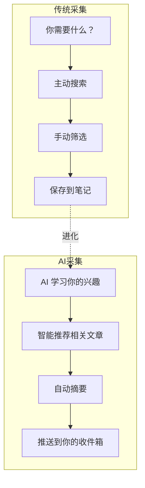
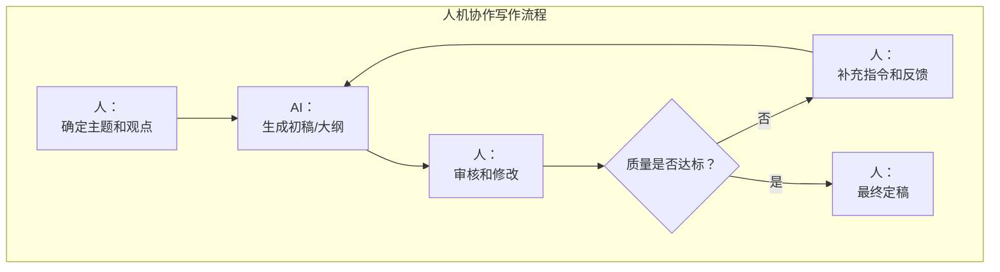
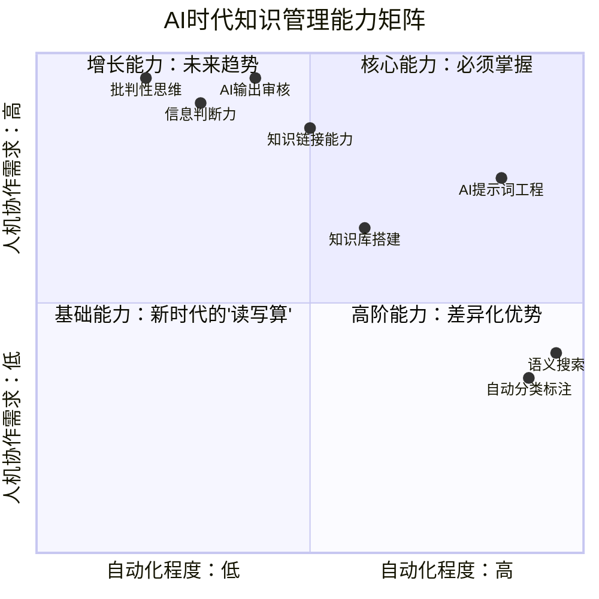
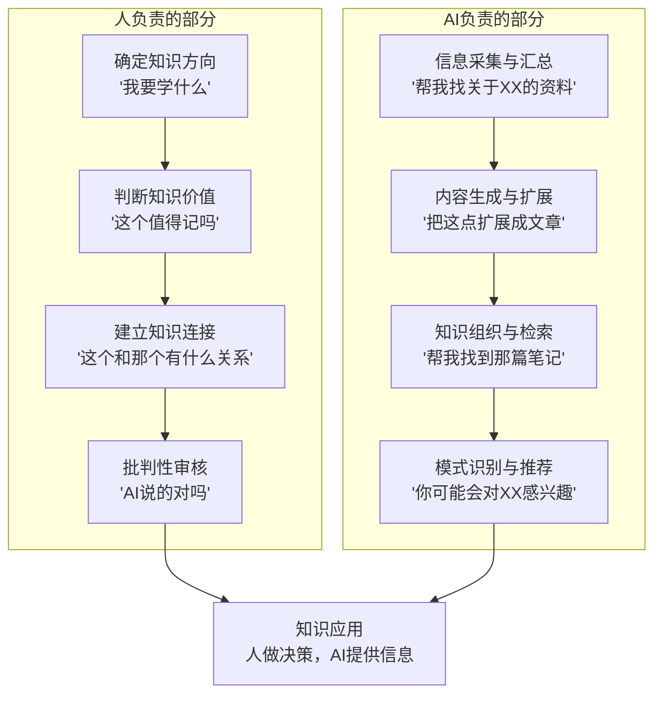
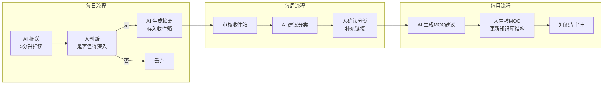
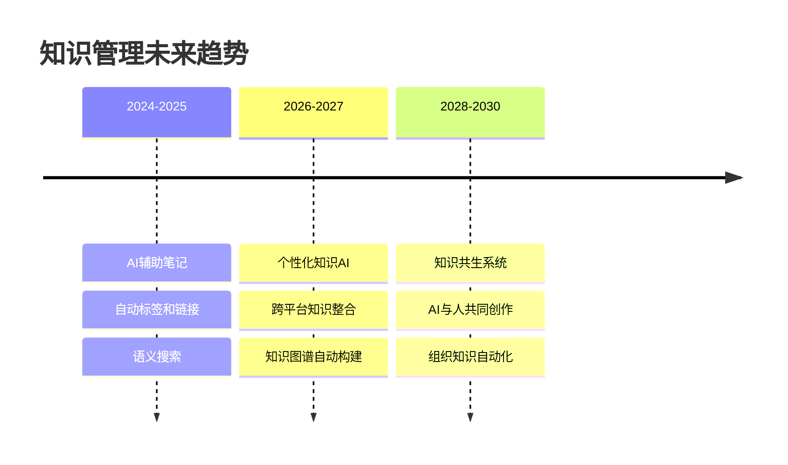

# AI时代的个人知识管理变革

> [!abstract] 本文要解决的核心问题
> AI 正在从根本上改变"知识"的定义——知识不再是"你脑子里记住的东西"，而是"你能调用的信息"。当 AI 可以瞬间检索、总结、生成知识时，个人知识管理的范式需要彻底重构。本文探讨 AI 如何改变知识管理的每个环节，并提出"AI 原生"的知识管理新范式。

---

## 一、知识管理范式的三次跃迁

```mermaid
flowchart LR
    subgraph 范式1.0：前数字时代
        A1["大脑记忆<br/>纸质笔记"]
        A2["特点：<br/>容量有限<br/>检索困难<br/>容易遗忘"]
    end

    subgraph 范式2.0：数字时代
        B1["数字笔记<br/>云端存储"]
        B2["特点：<br/>容量无限<br/>检索方便<br/>但组织混乱"]
    end

    subgraph 范式3.0：AI时代
        C1["AI辅助<br/>智能知识管理"]
        C2["特点：<br/>自动组织<br/>智能检索<br/>知识生成"]
    end

    A1 -->|"计算机普及"| B1
    B1 -->|"AI 突破"| C1
```

> [!key] 范式转变的核心
> 在范式 1.0 中，知识的瓶颈是**存储**（大脑记不住）。在范式 2.0 中，知识的瓶颈是**组织**（记了但找不到）。在范式 3.0 中，知识的瓶颈正在变成**筛选**（信息太多，不知道什么重要）和**判断**（AI 生成的内容是否可靠）。

[[07-学习成长/知识管理体系/01_知识管理的本质：从个人到组织|知识管理的本质]] 没有变——"用信息创造价值"——但 AI 让这个过程的每个环节都发生了质变。

---

## 二、AI 正在改变知识管理的四个环节

### 2.1 采集：从"主动搜索"到"智能推送"



| 维度 | 传统方式 | AI 方式 |
|------|----------|---------|
| **触发方式** | 主动搜索 | 智能推送 + 主动搜索 |
| **筛选效率** | 手动阅读标题/摘要 | AI 自动摘要 + 相关性评分 |
| **信息源管理** | 人工维护 RSS/订阅 | AI 自动发现新信源 |
| **去重** | 手动 | 自动识别重复内容 |

### 2.2 组织：从"手动分类"到"自动聚类"

AI 正在改变 [[07-学习成长/知识管理体系/02_PARA方法论：项目导向的知识组织法|PARA方法论]] 和 [[07-学习成长/知识管理体系/04_知识库的结构设计：从混乱到有序|知识库结构设计]] 的实践方式：

| 传统方式 | AI 增强方式 |
|----------|-------------|
| 手动决定一篇笔记放进哪个文件夹 | AI 自动分析内容，建议分类 |
| 手动创建标签和链接 | AI 自动提取关键词，生成链接建议 |
| 靠记忆回忆"我存过什么" | AI 语义搜索，"帮我找到那篇关于XX的文章" |
| 手动维护 MOC 结构 | AI 自动生成 MOC 草案，人工审核 |

> [!tip] Obsidian 中的 AI 增强实践
> 在 Obsidian 中，你可以使用以下 AI 插件来增强知识管理：
> 1. **Smart Connections**：自动分析笔记内容，推荐相关链接
> 2. **AI Note Tagger**：自动为笔记生成标签
> 3. **Copilot**：在笔记中与 AI 对话，辅助写作和思考

### 2.3 加工：从"人写笔记"到"人机协作写作"

[[07-学习成长/知识管理体系/05_输出驱动输入：以写作为核心的学习闭环|输出驱动输入]] 的方法论在 AI 时代有了新的维度：



**AI 辅助写作的黄金法则**：

> [!warning] 关键提醒
> AI 是"扩写器"，不是"思考器"。**AI 可以把你的 100 字想法扩展成 1000 字的文章，但它不能替你产生那个 100 字的想法。** 思考的核心工作——建立观点、判断价值、连接知识——仍然是人的职责。

| 人负责 | AI 负责 |
|--------|---------|
| 确定观点和论点 | 扩展论据和例子 |
| 判断信息的可靠性 | 收集和汇总信息 |
| 建立知识之间的联系 | 生成总结和摘要 |
| 决定"什么值得写" | 帮助"写得更快更好" |
| 最终的质量控制 | 初稿生成和格式优化 |

### 2.4 检索：从"关键词搜索"到"语义对话"

这是 AI 带来的最革命性变化：

| 传统检索 | AI 检索 |
|----------|---------|
| "输入关键词，返回匹配文档" | "用自然语言提问，AI 理解意图" |
| 需要记住确切的文件名或关键词 | 可以用模糊描述找到内容 |
| 返回整篇文档，需要自己找答案 | 直接给出答案，并标注来源 |
| 无法跨文档综合 | 可以综合多篇文档给出答案 |

> [!example] AI 检索的典型场景
> 你问 AI："我之前记过一篇关于远程团队管理的笔记，里面提到了'信任电池'这个概念，具体内容是什么？"
>
> AI 的回答：
> > 在 [[03-HR人事/组织行为学精要/03_群体行为与团队动力|03 群体行为与团队动力.md]] 中，你记录了"信任电池"的概念：
> > - **定义**：团队成员之间的信任就像一个"电池"，每次协作成功充电，每次失信放电
> > - **关键机制**：信任电池的充放电速度不对称——充电慢，放电快
> > - **管理启示**：管理者需要主动创造"充电"机会，减少"放电"行为
> > - **相关链接**：[[03-HR人事/组织行为学精要/04_领导力理论：从特质到情境到变革|04 领导力理论]] 中的"变革型领导"部分也提到了信任建设

---

## 三、AI 时代知识管理的新能力要求

### 3.1 核心能力模型



### 3.2 新增的关键能力

| 能力 | 说明 | 为什么重要 |
|------|------|------------|
| **提示词工程** | 学会给 AI 写清晰的指令 | 决定了 AI 输出的质量 |
| **AI 输出审核** | 判断 AI 生成内容的质量和准确性 | AI 会"一本正经地胡说八道" |
| **信息判断力** | 在 AI 推荐的信息中筛选出真正有价值的 | AI 推荐不等于重要 |
| **知识链接能力** | 建立 AI 无法建立的"隐性知识"连接 | AI 看不到你的个人经验和直觉 |
| **批判性思考** | 对 AI 的结论保持质疑 | AI 没有"价值观"，只有"统计规律" |

---

## 四、AI 时代知识管理的实践框架

### 4.1 人机分工模型



### 4.2 日常实践流程



> [!tip] 实践建议
> 不要把 AI 当作"知识管理的替代品"，而要把它当作"知识管理的放大器"。AI 不能替你思考，但它可以替你完成 80% 的"苦力活"——搜索、整理、格式化、初稿——让你把精力集中在 20% 真正需要人类智慧的工作上。

---

## 五、风险与挑战

### AI 知识管理的三大风险

```mermaid
flowchart TD
    subgraph 风险一：认知外包
        R1A["过度依赖AI<br/>不再自己思考"] --> R1B["后果：<br/>认知能力退化"]
    end

    subgraph 风险二：信息茧房
        R2A["AI只推荐<br/>你感兴趣的内容"] --> R2B["后果：<br/>视野越来越窄"]
    end

    subgraph 风险三：准确性幻觉
        R3A["AI生成内容<br/>可能不准确"] --> R3B["后果：<br/>知识库污染"]
    end

    R1A -->|"应对"| S1["保持主动思考习惯<br/>定期'无AI写作'"]
    R2A -->|"应对"| S2["主动搜索反方观点<br/>跨领域阅读"]
    R3A -->|"应对"| S3["AI输出必审核<br/>标注来源和置信度"]
```

> [!warning] 最重要的提醒
> AI 知识管理的最大风险不是"AI 不够好"，而是**"你不再自己思考"**。当一切知识都可以即时获取时，你可能会失去"获取知识的过程"中最重要的副产品——**深度思考的习惯**。[[07-学习成长/知识管理体系/01_知识管理的本质：从个人到组织|知识管理的本质]] 不是"存储信息"，而是"培养思考能力"。AI 是工具，不是替代品。

---

## 六、未来展望：知识管理将走向何方



**趋势一：从"知识库"到"知识大脑"**
未来的知识管理系统将不再是"被动的仓库"，而是"主动的智能体"——它会在你需要的时候主动提供信息，在你遗忘的时候提醒你，在你学习的时候推荐最佳路径。

**趋势二：从"个人知识管理"到"人机共生知识网络"**
[[03-HR人事/组织行为学精要/08_AI时代的组织行为新议题|AI时代的组织行为]] 正在重塑知识协作的方式。未来的知识网络将不仅是"人与人"的连接，还包括"人与AI"、"AI与AI"的连接。一个团队的知识管理，将是"团队知识 + AI 知识"的混合体。

**趋势三：从"知识存储"到"知识创造"**
AI 正在把知识管理的重心从"存储和检索"推向"创造和生成"。未来的知识管理者的核心竞争力不是"记得多少"，而是"能否用 AI 创造出新的知识"。

---

## 七、行动建议：现在就开始

> [!key] 一句话总结
> AI 不会取代知识管理，但会用 AI 的知识管理者会取代不会用的。现在就开始行动，不需要等到"完美方案"出现。

### 立即可以做的三件事

1. **选择一个 AI 工具**：安装 Obsidian 的 AI 插件（如 Smart Connections），或者使用 AI 笔记工具（如 Notion AI）
2. **建立"人机协作"的笔记流程**：先自己写 100 字的想法，再让 AI 扩展成 500 字的笔记
3. **设置"AI 审核"环节**：对 AI 生成的每个内容，加一个"人工审核标记"，确保质量

### 参考链接

- 本方法论与 [[05-产品与开发/项目管理方法论/08_AI时代的项目管理变革|AI时代的项目管理变革]] 共享相同的"AI 增强人而非替代人"的核心理念
- [[03-HR人事/组织行为学精要/08_AI时代的组织行为新议题|AI时代的组织行为新议题]] 从个体和团队层面探讨了 AI 的影响，与本知识库形成互补
- [[07-学习成长/知识管理体系/05_输出驱动输入：以写作为核心的学习闭环|输出驱动输入]] 在 AI 时代的实践方式需要重新定义——AI 是"加速器"，但"方向"仍然由人决定

---

## 更新日志

| 日期 | 变更内容 |
|------|----------|
| 2026-07-31 | 创建文档，完整阐述 AI 时代知识管理变革 |