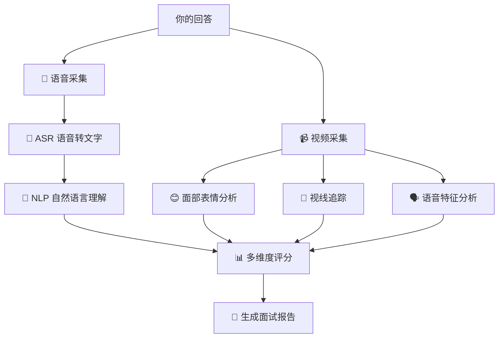

# AI面试·技术篇 — AI 面试系统的技术本质与应对策略

> [!abstract] 知己知彼，百战不殆
> 了解 AI 面试系统背后的技术原理，你就能 ==理解它为什么这样打分、它的弱点在哪、怎么利用它的规则为自己加分==。这篇不是让你学技术，而是让你「看懂对手」。

---

## 一、AI 面试系统的技术架构

### 1.1 ASR（语音识别）— 把你说的话变成文字

| 技术点 | 对考生的影响 |
|---|---|
| 识别准确率 | 普通话标准、发音清晰 → 识别率高 → 文字分析更准确 |
| 噪声处理 | 环境安静 → 识别率高 |
| 方言/口音 | 可能影响识别 → 尽量用标准普通话 |
| 语速适配 | 太快或太慢可能影响断句 → 语速适中 |

> [!tip] 应对策略
> - ==语速适中==（每分钟 180-220 字），比正常说话略慢一点
> - ==发音清晰==，每个字咬清楚
> - ==避免口头禅==（嗯、那个、就是），这些词会被识别为有效内容影响评分
> - ==环境安静==，关闭门窗和可能的噪音源

### 1.2 NLP（自然语言处理）— 理解你在说什么

这是 AI 面试系统最核心的模块。它会做：

| NLP 任务 | 评分维度 | 它对你说的话做什么 |
|---|---|---|
| 关键词提取 | 内容匹配度 | 检查你的回答中是否包含目标关键词 |
| 语义相似度 | 内容相关性 | 判断你的回答与标准答案的相似度 |
| 情感分析 | 态度积极度 | 判断你的回答是正面/负面/中性 |
| 文本结构化 | 逻辑清晰度 | 判断你的回答是否有逻辑结构 |
| 流畅度分析 | 表达流畅度 | 统计填充词、重复词、停顿 |

> [!tip] 应对策略
> - ==植入关键词==：在回答中自然地使用岗位相关的关键词
> - ==结构化表达==：用「第一、第二、第三」或「首先、然后、最后」
> - ==积极正面==：即使是讲挫折，也要落脚在「学到了什么」

### 1.3 面部表情与视线分析 — 它在看你的脸

| 分析维度 | AI 在找什么 | 对考生的影响 |
|---|---|---|
| 微笑频率 | 是否自然微笑 | 适度微笑，不要全程板着脸 |
| 视线方向 | 是否正视摄像头 | 看摄像头，不要看屏幕上的自己 |
| 头部姿态 | 是否自然 | 不要僵硬，自然微动 |
| 表情变化 | 是否丰富但不夸张 | 有自然的表情变化，不要像机器人 |

> [!tip] 应对策略
> - ==看摄像头，不是看屏幕==——这是最容易被忽略但最影响评分的一点
> - ==自然微笑==——不必全程笑，但关键节点（开头、结尾、讲到成就时）微笑
> - ==自然点头==——讲到重点时微微点头，但不要一直点头

### 1.4 语音特征分析 — 它在听你的声音

| 分析维度 | AI 在找什么 |
|---|---|
| 语速 | 稳定、适中 |
| 音量 | 适中、稳定 |
| 音调变化 | 有起伏，不是单调的 |
| 停顿 | 适当停顿，不是长时间停顿 |
| 填充词 | 尽可能少 |

> [!tip] 应对策略
> - ==不要用「背书腔」==——AI 能检测出过于机械的语调
> - ==有自然的停顿==——每段话之间停顿 1-2 秒
> - ==用「对话感」说话==——想象你在和一个真人聊天，而不是答题

---

## 二、主流 AI 面试平台对比

| 平台 | 使用企业 | 特点 | 特殊注意 |
|---|---|---|---|
| 海纳 AI | 字节、美团、京东等 | 题型丰富，有行为题+情景题+游戏化测评 | 重视逻辑结构 |
| 牛客 | 阿里、腾讯、百度等 | 偏技术岗，有在线编程 | 技术岗注意代码规范 |
| 赛码 | 快手、小红书等 | 偏互联网，注重综合素质 | 有性格测评模块 |
| SHL | 外企、四大 | 国际标准，有逻辑推理+情境判断 | 英文界面可能 |
| 智鼎 | 国企、银行 | 偏传统，注重综合素质 | 题量较大 |

> [!tip] 考前必做
> 收到面试通知后，==先确认用的是哪个平台==，然后去该平台找模拟题练习，熟悉界面和操作。

---

## 三、AI 面试的弱点 — 你可以利用的

### 3.1 AI 只看「表面特征」

AI 可以分析你的用词、语速、表情，但它 ==无法真正理解幽默、讽刺、反话==。所以：
- 不要说反话，AI 会当真
- 不要用过于复杂的比喻，AI 可能理解不了
- 直接、清晰、结构化地表达

### 3.2 AI 的评分依赖「关键词匹配」

AI 把你的回答和标准答案做语义匹配。如果你的回答中有大量岗位相关关键词，匹配度就高。
- 研究岗位 JD，提取关键词
- 在回答中自然地融入这些关键词
- 但不要堆砌关键词（AI 能检测到）

### 3.3 AI 偏好「结构化回答」

AI 的 NLP 模型更容易识别有明确结构的文本：
- 用「第一、第二、第三」
- 用 STAR 框架
- 用「首先、然后、最后」

### 3.4 AI 对「沉默」敏感

如果 AI 问完问题后你沉默了超过 5 秒，它会：
- 判断为「缺乏准备」
- 可能自动跳到下一题

> [!tip] 应对
> 即使需要思考，先说「这是一个很好的问题，让我想一想」，然后快速组织思路。

---

## 四、AI 面试的实战 SOP

### 面试前 30 分钟

| 步骤 | 操作 |
|---|---|
| 1 | 检查设备：摄像头、麦克风、网络 |
| 2 | 关闭所有可能弹窗的应用（微信、QQ、邮件） |
| 3 | 整理环境：背景整洁、光线充足、安静 |
| 4 | 调整摄像头：眼睛与摄像头平齐，画面中看到你的头部和肩膀 |
| 5 | 测试平台：提前打开面试链接，确认能正常进入 |

### 面试中

| 步骤 | 操作 |
|---|---|
| 1 | 看摄像头，不是看屏幕 |
| 2 | 每道题听完后，略微停顿 1-2 秒再开始回答 |
| 3 | 回答时结构清晰，用「第一、第二、第三」 |
| 4 | 控制时长：行为题 60-90 秒，自我介绍 60 秒 |
| 5 | 如果卡住了，说「让我重新组织一下」再继续 |
| 6 | 结束时微笑，说「以上是我的回答，谢谢」 |

### 面试后

| 步骤 | 操作 |
|---|---|
| 1 | 立即记录考了什么题 |
| 2 | 复盘做得好的和不好的地方 |
| 3 | 为下一场面试调整 |

---

## 五、常见问题

### Q：AI 面试和真人面试，哪个更难？

> 各有难处。AI 面试的好处是 ==标准统一、没有主观偏见、可以反复练习==；难处是 ==没有互动、不能察言观色、对结构化要求更高==。建议：AI 面试当成「开卷考试」——规则是公开的，就看谁准备得更充分。

### Q：如果 AI 面试时网络断了怎么办？

> 大部分平台有断线重连机制。如果断了，重新进入即可，通常会从断线处继续。如果完全无法重连，立刻联系 HR 说明情况。

### Q：AI 面试可以作弊吗？

> ==不推荐。== 现代 AI 面试系统有多重防作弊机制：视线追踪（检测你是否在看其他屏幕）、面部识别（检测是否有人替考）、语音分析（检测是否在念稿）。作弊被发现 = 直接淘汰，得不偿失。

---

## 关联笔记

- [[AI面试_评分逻辑]] — AI 面试的评分维度和权重
- [[AI面试_行为题题库]] — STAR 法则 + 15 道高频行为题
- [[AI面试_情景题题库]] — CLAIM 法则 + 8 道情景题
- [[AI面试_高频题库_带答案]] — 按岗位分类的高频真题