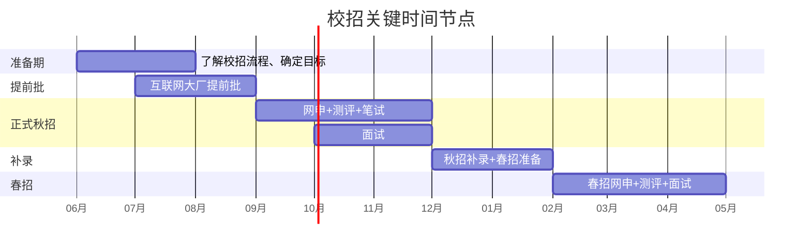

# 备战·时间规划 — 从 0 到拿 Offer 的完整节奏

> [!abstract] 校招不是「复习」，是「备战」
> 校招测评有明确的时间节点和阶段性目标。==不同时间开始，有不同的策略。== 这篇帮你根据剩余时间，选择最合适的备考方案。

---

## 一、校招时间线



| 阶段 | 时间 | 重点 |
|---|---|---|
| 准备期 | 6-7 月 | 了解流程、确定目标公司、开始备考 |
| 提前批 | 7-8 月 | 大厂提前批，要求高但竞争小 |
| 秋招正式 | 9-11 月 | 主战场，80% 的 offer 在这里 |
| 补录+休息 | 12-1 月 | 秋招补录，同时准备春招 |
| 春招 | 2-4 月 | 最后机会，岗位少但竞争也相对小 |

---

## 二、按剩余时间选择策略

### 策略 A：还有 3 个月以上（理想状态）

```
月 1：行测打基础
├── 周 1-2：资料分析（公式+速算）
├── 周 3：判断推理（逻辑+图形）
├── 周 4：言语理解（逻辑填空+片段阅读）

月 2：行测强化 + AI 面试准备
├── 周 1：数量关系（重点题型）
├── 周 2：常识判断（时政+科技）
├── 周 3-4：AI 面试行为题+情景题准备

月 3：综合冲刺
├── 行测套题，每周 2-3 套
├── AI 面试模拟，每周 2-3 次
├── 性格测评考前准备
└── 随时投递，边考边练
```

### 策略 B：还有 1-2 个月

```
周 1-2：行测重点突破
├── 资料分析（背公式+练速算，ROI 最高）
├── 判断推理（图形+逻辑）
├── 言语理解（逻辑填空重点练）
└── 数量关系只学 5 种必做题型

周 3-4：AI 面试 + 行测刷题
├── 行测套题，每周 3 套
├── AI 面试 15 道行为题准备
└── 情景题准备

周 5-6：冲刺
├── 行测套题，每周 3 套
├── AI 面试模拟
└── 性格测评考前看一遍
```

### 策略 C：只有 2-4 周（紧急状态）

```
第 1 周：极限突击
├── 资料分析：背公式+学速算（2 天）
├── 判断推理：图形推理口诀+逻辑判断套路（2 天）
├── 言语理解：逻辑填空技巧+片段阅读找主旨（2 天）
└── 数量关系：只学 5 种必做题型（1 天）

第 2 周：AI 面试
├── 行为题 15 道：写 STAR 框架+口头练习（3 天）
├── 情景题 8 道：写 CLAIM 框架（2 天）
├── 模拟面试 2-3 次（2 天）

第 3-4 周：刷题+面试
├── 行测套题，每天 1 套
├── AI 面试模拟，每天 1 次
├── 性格测评考前看一遍
└── 有笔试/面试通知 → 针对性准备
```

### 策略 D：不到 1 周（死马当活马医）

```
Day 1：资料分析公式+速算
Day 2：判断推理口诀+技巧
Day 3：AI 面试行为题 TOP 10 准备
Day 4：言语理解逻辑填空技巧
Day 5：行测 3 套真题 + 复盘
Day 6：AI 面试模拟 3 次
Day 7：考前休息 + 性格测评看一遍
```

---

## 三、每周时间分配模板

| 时间段 | 周一-周五 | 周六 | 周日 |
|---|---|---|---|
| 上午 9-12 | 行测专项练习 | 行测套题模考 | AI 面试准备 |
| 下午 2-5 | 行测知识点学习 | 套题复盘 | AI 面试模拟 |
| 晚上 7-9 | 常识积累/速算打卡 | 休息 | 本周复盘+下周计划 |

**每天投入时间**：在校生 3-4 小时/天，全职备考 6-8 小时/天

---

## 四、不同模块的优先级

| 优先级 | 模块 | 原因 |
|---|---|---|
| P0 | 资料分析 | 公式少、套路固定、提分最快 |
| P0 | 判断推理 | 图形推理和逻辑判断有速成技巧 |
| P1 | 言语理解 | 题量最大，方法性最强 |
| P1 | AI 面试行为题 | 所有面试必考 |
| P2 | 数量关系（简单题型） | 做对 5 题就够 |
| P2 | AI 面试情景题 | 部分公司考 |
| P3 | 常识判断 | 范围太广，性价比低 |
| P3 | 性格测评 | 考前 1 天准备即可 |

---

## 五、关键里程碑检查

| 时间点 | 检查项 |
|---|---|
| 考前 1 个月 | 行测 5 大题型全部过一遍，知道每个题型考什么 |
| 考前 2 周 | 行测套题正确率 60%+；AI 面试 15 道行为题准备完毕 |
| 考前 1 周 | 行测套题正确率 65%+；AI 面试模拟 3 次以上 |
| 考前 3 天 | 不再学新知识，只刷套题和复盘 |
| 考前 1 天 | 休息，看性格测评，早睡 |
| 考试当天 | 吃早餐，提前到，保持好心态 |

---

## 关联笔记

- [[备战_每日训练计划]] — 每日具体训练安排
- [[备战_模拟与复盘]] — 模拟考试与复盘方法
- [[备战_资源汇总]] — 备考资源合集