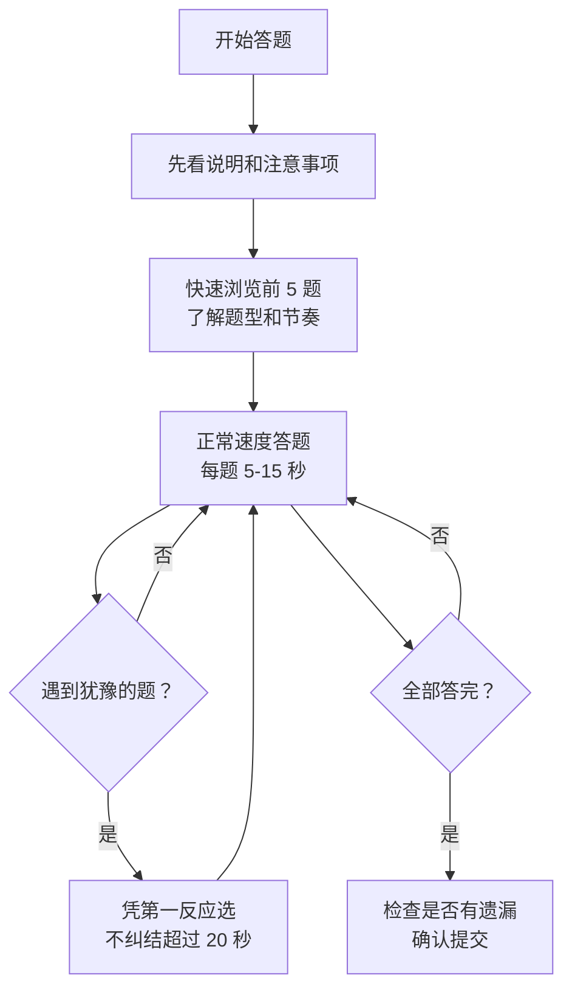

# 性格测评·实战策略 — 答题流程与考前准备

> [!abstract] 怎么用这篇
> 考前 1 天读这篇，了解答题流程和策略，避免临场踩坑。性格测评不需要大量练习，但需要 ==知道规则、了解策略、避开陷阱==。

---

## 一、答题前的准备

### 1.1 了解目标公司

| 准备项 | 怎么查 |
|---|---|
| 用哪家测评系统 | 看笔试通知邮件，或牛客/应届生论坛搜面经 |
| 企业文化 | 公司官网「关于我们」、脉脉、知乎 |
| 岗位偏好 | 参考 [[性格测评_名企偏好]] |

### 1.2 明确自己的「人设」

在答题前，你要清楚自己 ==想展现什么形象==。这不是伪装，而是选择性地突出自己的某些特质。

| 步骤 | 操作 |
|---|---|
| 1 | 回顾 [[性格测评_基本原理]] 中的大五人格维度 |
| 2 | 对照岗位偏好，确定每个维度的目标区间 |
| 3 | 在真实自我的基础上，做 30% 的微调 |

> [!example] 示例：投递产品经理岗
> 你的真实性格：I 型（偏内向），尽责性高，情绪稳定
> 微调方向：
> - 外向性：在「喜欢团队合作」「喜欢交流」类题目上，选择偏同意的选项（真实基础上略高一点）
> - 开放性：在「喜欢尝试新事物」类题目上，选择同意（PM 需要好奇心）
> - 其他维度保持真实

---

## 二、答题策略

### 2.1 核心原则

> [!important] 三条铁律
> 1. ==前后一致==：同一意思的题，选一致的答案（最重要！）
> 2. ==真实为主==：70% 真实 + 30% 微调
> 3. ==速度适中==：每道题 5-15 秒，不快不慢

### 2.2 具体策略

| 策略 | 操作 | 原因 |
|---|---|---|
| **首因策略** | 第一反应最真实，不要反复改 | 反复修改 = 可能在编造 |
| **一致策略** | 记住自己的核心选择，同类题保持一致 | 不一致 = 测谎不过 |
| **适度策略** | 不全选极端，不全选中立 | 极端 = 社会称许，中立 = 回避 |
| **情景策略** | 情景题中，选择最符合职场规范的行为 | 情景题有明确的好坏 |

### 2.3 常见题型应对

**「我喜歡...」类（自我描述）**：

> 策略：==在真实基础上，向岗位偏好微调。==
> 例：投递销售岗 → 「我喜欢和人打交道」→ 选「同意」或「非常同意」

**「我会...」类（行为倾向）**：

> 策略：==选择最符合职场规范的行为。==
> 例：「同事在会议上提出一个错误方案，我会...」→ 选「会后私下沟通」（既维护了关系，又解决了问题）

**「我优先考虑...」类（价值观）**：

> 策略：==选择符合公司价值观的选项。==
> 例：投字节 → 「我更看重结果」；投腾讯 → 「我更看重用户体验」

**迫选题**：

> 策略：==选更接近真实的那个。==
> 迫选题没有「正确答案」，选哪个都会暴露一些偏好。不要猜命题人的意图。

---

## 三、答题流程 SOP

### 每个阶段的操作

| 阶段 | 操作 | 用时 |
|---|---|---|
| 开始前 | 阅读说明，确认题量和时间 | 1 分钟 |
| 前 5 题 | 建立节奏，了解题型 | 每题 10 秒 |
| 中间段 | 保持节奏，不纠结 | 每题 5-10 秒 |
| 后 5 题 | 可能出现疲劳，注意保持一致性 | 每题 10 秒 |
| 提交前 | 确认没有遗漏 | 30 秒 |

---

## 四、避坑指南

### 4.1 绝对不要做的事

| 行为 | 后果 |
|---|---|
| 全选「非常同意」 | 社会称许性过高 → 标记为不诚实 |
| 全选「中立」 | 回避作答 → 标记为无效 |
| 前后矛盾的答案 | 一致性检测失败 → 标记为不诚实 |
| 每道题纠结超过 30 秒 | 反应时间异常 → 标记为编造 |
| 故意选极端 | 极端反应 → 标记为异常 |
| 搜「标准答案」 | 性格测评没有标准答案，搜到的可能是错的 |

### 4.2 容易忽略的细节

| 细节 | 为什么重要 |
|---|---|
| 部分测评有「反向题」 | 同一意思正反各问一遍，看你是不是仔细读题 |
| 测评可能很长（100-200 题） | 后半段容易疲劳而乱选，保持节奏 |
| 测评可能限时 | 不是无限时间，注意总时长 |
| 部分系统不支持回退 | 选完就不能改，每题认真选 |

---

## 五、考前模拟

### 5.1 免费模拟资源

| 资源 | 说明 |
|---|---|
| 16Personalities | 免费 MBTI 测试，了解题型 |
| 大五人格在线测试 | 搜索「Big Five personality test free」 |
| 牛客网 | 有性格测评模拟题 |
| 北森测评 | 部分企业用的系统，有模拟题 |

### 5.2 模拟时注意

| 项目 | 说明 |
|---|---|
| 做 2-3 套模拟 | 了解题型和节奏即可，不要刷太多 |
| 记录答题时间 | 找到自己的节奏 |
| 对比不同模拟结果 | 看结果是否一致，检查自己的核心特质 |

---

## 六、一句话总结

> [!tip] 性格测评 = 了解规则 + 保持真实 + 适度微调
> ==测谎是最大的敌人，一致性是最大的武器。== 考前明确目标公司偏好，答题时保持真实和一致，就能稳定通过。

---

## 关联笔记

- [[性格测评_基本原理]] — 大五人格、测谎机制
- [[性格测评_避坑指南]] — 最重要的：防翻车指南
- [[性格测评_名企偏好]] — 各名企性格测评的偏好
- [[备战_模拟与复盘]] — 模拟与复盘方法