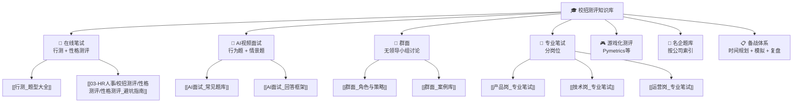
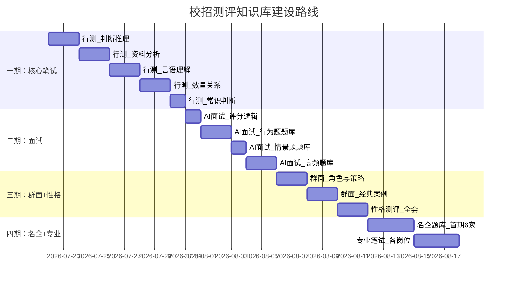

# 校招测评知识库 — 建设方案

> [!abstract] 这个知识库要解决什么问题
> 校招季，每一个环节都可能刷掉 50%-80% 的人：在线笔试（行测）、性格测评、AI 面试、群面、专业笔试……而市面上的资料散落在牛客网、知乎、小红书的各个角落，没有一套**结构化、可检索、可复用的知识体系**。
>
> 本方案设计一个 Obsidian 知识库，覆盖校招测评全链路，让使用者能在任何一个环节快速找到「考什么 — 怎么准备 — 常见坑 — 参考答案」。

---

## 一、知识库总览



| 模块 | 内容量预估 | 重要程度 | 刷人比例 |
|---|---|---|---|
| 🧠 行测 | 5-8 篇笔记 | ⭐⭐⭐⭐⭐ | 60%-80% |
| 🧩 性格测评 | 3-4 篇笔记 | ⭐⭐⭐⭐ | 30%-50%（虚假作答/价值观不符） |
| 🤖 AI 面试 | 5-6 篇笔记 | ⭐⭐⭐⭐⭐ | 50%-70% |
| 👥 群面 | 4-5 篇笔记 | ⭐⭐⭐⭐ | 50%-60% |
| 📝 专业笔试 | 3-5 篇笔记（分岗位） | ⭐⭐⭐ | 岗位相关 |
| 🎮 游戏化测评 | 2-3 篇笔记 | ⭐⭐ | 20%-40%（熟悉规则即可） |
| 🏢 名企题库 | 按需扩展 | ⭐⭐⭐ | 针对性极强 |
| 📋 备战体系 | 3-4 篇笔记 | ⭐⭐⭐⭐ | — |

---

## 二、模块一：行测 — 刷人最多的第一关

### 覆盖题型

| 题型 | 核心考点 | 预计笔记 |
|---|---|---|
| 言语理解 | 选词填空、片段阅读、语句排序、病句辨析 | [[行测_言语理解]] |
| 数量关系 | 数字推理、数学运算、工程/行程/利润/排列组合 | [[行测_数量关系]] |
| 判断推理 | 图形推理、定义判断、类比推理、逻辑判断 | [[行测_判断推理]] |
| 资料分析 | 图表阅读、增长率/比重/倍数计算、速算技巧 | [[行测_资料分析]] |
| 常识判断 | 时政热点、法律常识、经济学常识、文史 | [[行测_常识判断]] |

### 每篇笔记结构模板

```
1. 考情速览（出题频次、限时、题量）
2. 解题方法论（不是题海，是先讲套路）
3. 经典例题 × 5（带分步解析）
4. 速算/秒杀技巧（资料分析专用）
5. 常见陷阱（80% 的人会踩的坑）
6. 推荐练习资源
```

> [!tip] 建设优先级
> ==判断推理 > 资料分析 > 言语理解 > 数量关系 > 常识判断==
> 判断推理提分最快，资料分析分数最稳，常识判断投入产出比最低可放最后。

---

## 三、模块二：性格测评 — 最被低估的关

### 为什么重要

很多人以为「性格测评不刷人」。错。两种情况下直接挂：
1. **虚假作答被识别**——前后矛盾、过度美化自己（测评系统有测谎题）
2. **价值观与企业不匹配**——比如你想去国企却在「最看重的」里选了高风险偏好

### 笔记清单

| 笔记 | 内容 |
|---|---|
| [[性格测评_基本原理]] | 测什么？常见量表：MBTI、DISC、大五人格、Hogan、SHL |
| [[性格测评_避坑指南]] | 测谎题怎么识别？前后一致性怎么保持？过度美化长什么样？ |
| [[性格测评_名企偏好]] | 互联网 vs 国企 vs 外企 vs 快消，分别喜欢什么特质？ |
| [[性格测评_实战策略]] | 时间分配、常见题型拆解、模拟练习方法 |

---

## 四、模块三：AI 面试 — 最让人紧张的关

### 为什么难

- 不是对「人」说话，是对「摄像头」说话——没有表情反馈、没有互动节奏
- 限时准备（通常 30 秒）+ 限时作答（通常 2 分钟）——思考时间极短
- AI 评分看重==结构化程度、关键词覆盖、语速稳定性==，而非「说得感人」

### 笔记清单

| 笔记 | 内容 |
|---|---|
| [[AI面试_评分逻辑]] | AI 怎么打分？关键词匹配、流畅度、表情/眼神分析 |
| [[AI面试_行为题题库]] | 宝洁八大问变体、STAR 原则详解、每类题的万能框架 |
| [[AI面试_情景题题库]] | 「如果遇到 XX 问题你会怎么做」类题目的答题模板 |
| [[AI面试_技术篇]] | 环境准备（光线/麦克风/背景）、语速控制、眼神技巧、AI 模拟工具推荐 |
| [[AI面试_高频题库_带答案]] | 30 道高频题，每题附参考回答框架 |

---

## 五、模块四：群面 — 最不可控的关

### 核心认知

群面不是看谁说得最多，是看谁的角色最清晰、贡献最可感知。==不是 leader 才能过，reporter、time-keeper、idea-contributor 都能过——前提是你把角色执行到位了。==

### 笔记清单

| 笔记 | 内容 |
|---|---|
| [[群面_角色定位]] | Leader / Reporter / Time-keeper / Idea-contributor 四种角色的职责与话术 |
| [[群面_发言框架]] | 如何开场、如何总结、如何推动进度、如何处理分歧 |
| [[群面_经典案例]] | 10 个高频案例（排序题、方案题、辩论题），附分析思路 |
| [[群面_常见翻车]] | 抢话、跑题、沉默、被怼——每种情况怎么救 |
| [[群面_模拟指南]] | 自主组队模拟的方法、复盘 checklist |

---

## 六、模块五：专业笔试（分岗位）

| 岗位 | 笔记 | 核心内容 |
|---|---|---|
| 产品经理 | [[产品岗_笔试]] | 竞品分析框架、需求优先级、PRD 要素、数据分析题 |
| 运营 | [[运营岗_笔试]] | 活动策划模板、用户分层、数据指标体系 |
| 技术 | [[技术岗_笔试]] | LeetCode 经典题、系统设计套路、八股文速查 |
| 市场/快消 | [[市场岗_笔试]] | 品牌定位、营销方案框架、消费者洞察 |
| 金融 | [[金融岗_笔试]] | 估值模型、行业分析方法、宏观指标速查 |

---

## 七、模块六：名企题库（按需扩展）

按公司索引，每家公司一篇笔记，内容：
- 该公司的测评流程（几轮、各轮题型）
- 近两年真题回忆版（牛客网、知乎汇总）
- 该公司性格测评的偏好特质
- 该公司 AI 面试/群面的特色

首期先建：字节、腾讯、阿里、美团、华为、宝洁、四大、快消头部。

---

## 八、模块七：备战体系

| 笔记 | 内容 |
|---|---|
| [[备战_时间规划]] | 从投递到终面，各阶段时间线和准备重点 |
| [[备战_每日训练计划]] | 7 天冲刺 / 30 天系统准备的每日任务表 |
| [[备战_模拟与复盘]] | 如何自己做模拟面试、复盘 checklist |
| [[备战_资源汇总]] | 推荐练习网站、刷题工具、AI 模拟面试工具 |

---

## 九、建设路线图



| 阶段 | 内容 | 产出 | 预计耗时 |
|---|---|---|---|
| 🥇 一期 | 行测 5 类题型全覆盖 | 5 篇笔记 | 9 天 |
| 🥈 二期 | AI 面试题库 + 框架 | 4 篇笔记 | 6 天 |
| 🥉 三期 | 群面 + 性格测评 | 5 篇笔记 | 6 天 |
| 🏅 四期 | 名企题库 + 专业笔试 | 10+ 篇笔记 | 6 天 |

---

## 十、目录结构（Obsidian 文件夹）

```
校招测评/
├── 00_MOC_校招测评中枢.md        ← 本篇，中枢索引
│
├── 行测/
│   ├── 行测_题型大全.md           ← MOC
│   ├── 行测_判断推理.md
│   ├── 行测_资料分析.md
│   ├── 行测_言语理解.md
│   ├── 行测_数量关系.md
│   └── 行测_常识判断.md
│
├── AI面试/
│   ├── AI面试_评分逻辑.md
│   ├── AI面试_行为题题库.md
│   ├── AI面试_情景题题库.md
│   ├── AI面试_高频题库_带答案.md
│   └── AI面试_技术篇.md
│
├── 群面/
│   ├── 群面_角色定位.md
│   ├── 群面_发言框架.md
│   ├── 群面_经典案例.md
│   └── 群面_常见翻车.md
│
├── 性格测评/
│   ├── 性格测评_基本原理.md
│   ├── 性格测评_避坑指南.md
│   ├── 性格测评_名企偏好.md
│   └── 性格测评_实战策略.md
│
├── 专业笔试/
│   ├── 产品岗_笔试.md
│   ├── 运营岗_笔试.md
│   └── 技术岗_笔试.md
│
├── 名企题库/
│   ├── 字节跳动.md
│   ├── 腾讯.md
│   └── ...（按需扩展）
│
└── 备战/
    ├── 备战_时间规划.md
    ├── 备战_每日训练计划.md
    ├── 备战_模拟与复盘.md
    └── 备战_资源汇总.md
```

> 约 30-40 篇笔记，全部用 Obsidian wikilink 互相关联。

---

## 十一、关键决策点（需要你确认）

> [!question] 需要你确认的几个问题

| # | 决策点 | 选项 |
|---|---|---|
| 1 | **首期从哪个模块开始？** | A. 行测（覆盖面最广） B. AI 面试（你的 HR+AI 方向强相关） C. 双线并行 |
| 2 | **名企题库覆盖多少家？** | A. 先做 6 家头部 B. 先做互联网+快消 10 家 C. 后续再定 |
| 3 | **专业笔试覆盖哪些岗位？** | A. 先做产品+运营（贴近你方向） B. 产品+技术（最主流） |
| 4 | **是否需要每篇笔记附带「可直接背的回答模板」？** | A. 是，以实操为导向 B. 先搭框架，模板后续补充 |

---

## 十二、关联笔记

- [[普适_校招测评知识库方案]] — 面向学生的简化版
- [[01-AI技术/AI Agent 工具/AI_Agent_工具全景对比]] — AI 模拟面试工具选型
- [[05-产品与开发/Vibe Coder/05-思想与思维/面试回答_人与AI协作的边界]] — AI 面试环节评分逻辑可参考
