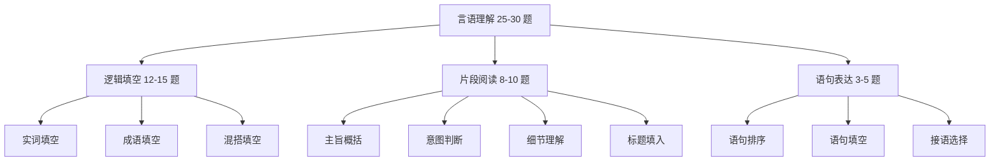

# 行测·言语理解 — 语感不是玄学，是方法论

> [!abstract] 为什么言语理解是「看似简单、实则拉分」
> 言语理解题量最大（25-30 题），很多人凭「语感」做，结果正确率波动极大。其实言语理解 ==有明确的解题逻辑和信号词==，掌握方法后正确率可以稳定在 85%+。

---

## 一、考情速览

| 维度 | 典型数据 |
|---|---|
| 题量 | 25-30 题（行测第一大板块） |
| 建议用时 | 25-30 分钟 |
| 目标正确率 | 80%+ |
| 三大子题型 | 逻辑填空（~50%）、片段阅读（~35%）、语句表达（~15%） |

> [!warning] 北森测评特别提示
> 从北森 714 题真题库抽样看：**片段阅读（主旨+细节）占约 2/3，逻辑填空和标题选择占约 1/3，几乎不考语句排序和语句填空**。这与国考言语理解（排序题占一定比重）不同。备考北森测评时，重点练主旨概括和细节理解，排序题可以放弃。题库见 [[北森测评_题库索引]]。

---

## 二、逻辑填空（选词填空）— 题量最大，最容易提分

> [!important] 核心原则
> 逻辑填空 ≠ 凭语感。==答案一定在上下文中有关键线索。== 你的任务不是「读着顺」，而是「找到逻辑依据」。

### 2.1 解题三步法

**第一步：读空格前后，找逻辑关系**

不要先看选项！先看空格所在的句子，判断句内的逻辑关系：

| 逻辑关系 | 标志词 | 含义 |
|---|---|---|
| 转折 | 但是、然而、却、不过、实际上 | 前后语义相反 |
| 递进 | 甚至、而且、更、还、尤其 | 前后语义相近，程度加深 |
| 并列 | 和、与、同时、也、既…又… | 前后语义相近或一致 |
| 因果 | 因为、所以、因此、导致 | 前后有因果逻辑 |
| 解释说明 | 即、也就是说、换言之、冒号、破折号 | 后文解释前文 |

**第二步：看选项，排除明显不合理的**

根据逻辑关系排除方向相反的选项。

**第三步：代入验证，优选有上下文依据的**

优先选在上下文中能找到对应词或暗示的选项。

> [!example] 例题 1：转折关系
> 表面上他是谦谦君子，_____ 是一个心胸狭隘的小人。
>
> A. 其实  B. 甚至  C. 而且  D. 因此
>
> 分析：「表面上」和「心胸狭隘」是相反关系 → 转折 → 选 A「其实」

> [!example] 例题 2：解释说明
> 这本书的论述 _____：通篇都是空话套话，毫无实质内容。
>
> A. 鞭辟入里  B. 空洞无物  C. 深入浅出  D. 旁征博引
>
> 分析：冒号后解释「空话套话，毫无实质」→ 选 B「空洞无物」

### 2.2 高频成语速记（校招必考 TOP 20）

| 成语 | 含义 | 常混淆词汇 |
|---|---|---|
| 相辅相成 | 互相配合，互相补充 | 相得益彰（更强调效果好） |
| 不可或缺 | 不能缺少 | 至关重要（更强调重要性） |
| 潜移默化 | 不知不觉受到影响 | 耳濡目染（侧重通过看听） |
| 因地制宜 | 根据具体情况制定办法 | 因势利导（顺着趋势引导） |
| 独树一帜 | 自成一家，与众不同 | 标新立异（有刻意求新之意） |
| 根深蒂固 | 根基深厚，不易动摇 | 积重难返（侧重积弊深重） |
| 未雨绸缪 | 事先做好准备 | 防患未然（侧重防止祸患） |
| 一蹴而就 | 一步就成功 | 一挥而就（侧重写作/书画） |
| 举足轻重 | 所处地位重要 | 不可或缺（不能缺少） |
| 大相径庭 | 相差很远，大不相同 | 截然不同（更强调完全相反） |
| 推陈出新 | 去掉旧的，创造新的 | 革故鼎新（更强调变革制度） |
| 方兴未艾 | 事物正在发展，未到止境 | 如日中天（已到顶峰） |
| 屡见不鲜 | 经常见到，不新鲜 | 层出不穷（不断出现新事物） |
| 不言而喻 | 不用说就能明白 | 显而易见（非常明显） |
| 相辅相成 | 互相辅助，互相促成 | 相得益彰（互相配合效果更好） |
| 立竿见影 | 立刻见效 | 行之有效（实行起来有效果） |
| 无可厚非 | 不能过分指责 | 无可非议（没什么可指责的） |
| 举一反三 | 从一件事类推多件事 | 触类旁通（掌握规律后推及其他） |
| 差强人意 | 大体上还能使人满意 | ≠ 让人不满意（常被误用） |
| 首当其冲 | 最先受到攻击/遭遇灾难 | ≠ 冲在最前面（常被误用） |

> [!danger] 最常被误用的成语
> - **差强人意**：大体还能让人满意，≠ 非常差劲
> - **首当其冲**：最先受到攻击，≠ 冲在最前面/首当其任
> - **炙手可热**：权势大、气焰盛（贬义），≠ 很受欢迎
> - **不以为然**：不认为是对的，≠ 不在意
> - **不刊之论**：不能更改的言论（褒义），≠ 不能刊登的言论

### 2.3 实词辨析核心技巧

**看搭配对象**：动词 + 宾语、形容词 + 名词的搭配习惯

| 实词 | 常见搭配 | 不搭配 |
|---|---|---|
| 遏制 | 遏制势头/趋势 | × 遏制感情 |
| 遏止 | 遏止行为/暴行 | — |
| 推脱 | 推脱责任 | — |
| 推托 | 推托有事 | — |
| 必须 | 必须做到 | — |
| 必需 | 必需品 | — |

**看感情色彩**：褒义/贬义/中性

**看语义轻重**：程度深浅

> [!tip] 实词辨析口诀
> ==搭配不同，对象不同，感情不同，轻重不同。== 不确定时，把每个选项带入原句读一遍，看搭配是否自然。

---

## 三、片段阅读 — 读懂不是目的，选对才是

### 3.1 主旨概括题

**设问方式**：主要说明/论述/强调/表达/概括了……

**核心方法**：==找主题句==

| 主题句位置 | 标志 |
|---|---|
| 首句 | 开门见山，直接提出观点 |
| 尾句 | 总结归纳，由分到总 |
| 转折词后 | 但是、然而、却、不过（转折后才是重点） |
| 结论词后 | 因此、所以、可见、总之（结论是重点） |
| 递进词后 | 甚至、更、尤其（递进后是重点） |

**排除法**：
- 过于绝对的选项（全部、所有、一定、绝不）
- 无中生有的选项（文中没提）
- 以偏概全的选项（只是细节不是主旨）
- 偷换概念的选项（换了一个词意思就变了）

> [!example] 例题
> 文段：近年来，人工智能技术发展迅猛，在医疗、教育、金融等领域都有广泛应用。然而，人工智能也带来了隐私泄露、就业替代等问题。因此，我们既要积极拥抱人工智能，也要健全相关法律法规，防范潜在风险。
>
> 主旨是？
> A. 人工智能技术发展迅猛
> B. 人工智能在多个领域有应用
> C. 人工智能带来了隐私泄露问题
> D. 我们应积极拥抱AI并健全法规防范风险
>
> 分析：转折词「然而」+ 结论词「因此」→ 重点在最后一句 → 选 D

### 3.2 意图判断题

**设问方式**：意在说明/想要表达/意在强调……

**与主旨概括的区别**：主旨概括问「说了什么」，意图判断问「想说什么」——意图判断题的答案可能是合理推断，不一定是原文原句。

**核心方法**：
1. 先找主题句（同主旨概括）
2. 如果是问题类文段 → 优选「解决问题」的对策选项
3. 如果是中性叙述 → 优选「点明主旨」的选项

> [!tip] 意图判断口诀
> ==问题类 → 选对策 | 观点类 → 选主旨 | 叙事类 → 选道理==

### 3.3 细节理解题

**设问方式**：下列说法正确/错误的是……、与原文相符/不相符的是……

**核心方法**：==逐一比对，不凭印象==

| 常见错误类型 | 特征 |
|---|---|
| 偷换概念 | 替换了关键词 |
| 无中生有 | 文中没提但选项说了 |
| 范围扩大/缩小 | 原文「部分」→ 选项「全部」 |
| 程度加重/减轻 | 原文「可能」→ 选项「一定」 |
| 因果倒置 | A 导致 B → 选项说 B 导致 A |
| 时态错误 | 原文「将」→ 选项「已经」 |

> [!tip] 做题策略
> 细节理解题耗时最长，但正确率最高。==从选项 D 往前看，逐一比对原文。== 每个选项找出对应的原文句子，找不到就是错的。

### 3.4 标题填入题

**核心方法**：标题 = 主旨的浓缩 + 吸引力

| 文段类型 | 标题风格 |
|---|---|
| 新闻类 | 简洁、吸引人、点明核心事件 |
| 议论文 | 点明论点 |
| 说明文 | 点明说明对象 |
| 散文/故事 | 有意境、有哲理 |

---

## 四、语句表达 — 考逻辑，不考语感

### 4.1 语句排序题

**核心方法**：==首句排除 + 捆绑验证==

**第一步：首句排除**

以下句子 ==不能做首句==：
- 以「代词」开头：这、那、他、她、它、其、这些、那些
- 以「关联词后半段」开头：但是、然而、却、而且、所以、因此
- 以「补充说明」开头：也、还、另外、此外
- 明显是「举例」的句子：比如、例如

**第二步：找捆绑关系**

| 捆绑标志 | 说明 |
|---|---|
| 代词指代 | 「这/那」一定指代前文出现的内容 |
| 关联词搭配 | 虽然…但是、不仅…而且、因为…所以 |
| 时间顺序 | 先…再…然后…最后 |
| 逻辑顺序 | 提出问题 → 分析原因 → 给出对策 |
| 重复词 | 同一话题相邻出现 |

> [!example] 例题
> ① 因此，我们需要加强网络安全建设
> ② 近年来，网络攻击事件频发
> ③ 这不仅造成经济损失，还威胁国家安全
> ④ 给社会和人民带来了严重危害
>
> 排序：② 网络攻击频发 → ③ 不仅…还… → ④ 给社会和人民… → ① 因此需要加强
> 答案：②③④①

### 4.2 语句填空题

**核心方法**：看空格在文段中的位置

| 位置 | 作用 | 策略 |
|---|---|---|
| 段首 | 总起全文 | 选能概括后文内容的 |
| 段中 | 承上启下 | 选同时与前后文都衔接的 |
| 段尾 | 总结全文 | 选能归纳前文、与前文逻辑一致的 |

> [!tip] 关键技巧
> ==看空格前后的「逻辑连接词」和「话题词」==。如果空格后有「因此」，空格应填原因；如果空格前有「然而」，空格应与前文转折。

### 4.3 接语选择题

**设问方式**：接下来最可能讲/论述/讨论的是……

**核心方法**：==重点看尾句，尤其尾句的新话题==

> [!tip] 口诀
> 尾句提出新话题 → 下文展开这个新话题
> 尾句提出问题 → 下文给出对策
> 尾句提出观点 → 下文论证这个观点

**排除**：
- 前文已经详细论述过的内容
- 与尾句话题无关的内容
- 过于宽泛、没有焦点的话题

---

## 五、实战策略

### 5.1 做题顺序与时间分配

| 子题型 | 题量 | 每题用时 | 策略 |
|---|---|---|---|
| 逻辑填空 | 12-15 题 | 40-50 秒 | 找逻辑关系，不凭语感 |
| 片段阅读 | 8-10 题 | 60-80 秒 | 先看问题，再读文段 |
| 语句表达 | 3-5 题 | 60-90 秒 | 排序题先排除首句 |

### 5.2 片段阅读的阅读策略

==先看问题，再读文段==——带着问题读，效率提升 50%。

> [!tip] 阅读节奏
> 1. 看问题（3 秒）：确定是主旨/意图/细节/标题
> 2. 扫读文段（15-20 秒）：找转折词、结论词、主题句
> 3. 看选项（10 秒）：排除明显错误的
> 4. 验证（10 秒）：回到原文确认

### 5.3 常见误区

| 误区 | 后果 | 正确做法 |
|---|---|---|
| 凭语感做逻辑填空 | 正确率波动大 | 必须找逻辑依据 |
| 片段阅读通读全文 | 浪费时间 | 找转折词和结论词 |
| 细节题凭印象选 | 容易被坑 | 逐一比对原文 |
| 纠结两个选项 | 浪费时间 | 选「有原文依据」的那个 |
| 成语不认识就放弃 | 丢分 | 用排除法，不认识的不一定错 |

---

## 六、速记卡片

### 逻辑填空三步法

> 1. 找逻辑关系（转折/递进/并列/因果/解释）
> 2. 排除方向相反的选项
> 3. 选有上下文依据的

### 片段阅读找主旨

> ==转折词后是重点，结论词后是重点，递进词后是重点。==

### 语句排序

> ==代词开头不能做首句，关联词后半段不能做首句。==

### 细节理解

> ==逐一比对，不凭印象。从 D 往前看。==

---

## 七、练习建议

| 阶段 | 目标 | 方法 |
|---|---|---|
| 入门 | 掌握每种题型的解题方法 | 分题型练习，不限时 |
| 提速 | 逻辑填空 40 秒/题，阅读 60 秒/题 | 限时刷套题 |
| 冲刺 | 正确率 80%+ | 真题模考 + 错题复盘 |

**每日训练量**：逻辑填空 15 题 + 片段阅读 10 题 + 语句表达 5 题，限时 30 分钟。

---

## 八、一句话总结

> [!tip] 言语理解 = 逻辑 + 方法
> ==逻辑填空找「逻辑关系」，片段阅读找「主题句」，语句表达用「排除法」。== 放弃「语感做题」，正确率立马上一个台阶。

---

## 关联笔记

- [[行测_判断推理]] — 提分最快的行测板块
- [[行测_资料分析]] — 送分最稳
- [[备战_时间规划]] — 整体备考节奏
- [[备战_每日训练计划]] — 每日训练安排