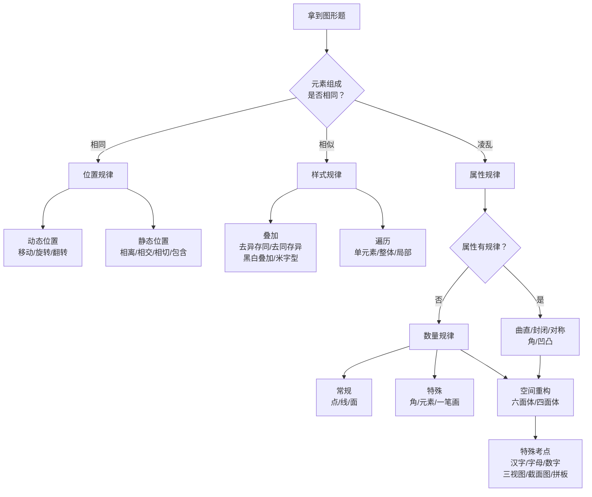

# 图形推理 — 高频题库（50题）

> 图形推理是行测中**提分最快**的模块之一。图形推理的难点不在于题有多难，而在于**如何快速找到规律方向**。本文参考知乎高赞文章《行测图形推理超全考点整理》的方法论体系，按"组成相同看位置→组成相似看样式→凌乱看属性→属性不行看数量→空间重构有妙招"的破题流程编排，让你面对任何图形题都能按顺序试规律，快速锁定答案。
>
> 参考来源：[行测图形推理超全考点整理](https://zhuanlan.zhihu.com/p/468186485)

---

## 考情速览

| 维度 | 数据 |
|------|------|
| 题量 | 5-10 题（校招笔试中波动较大） |
| 单题建议用时 | 40-60 秒 |
| 核心规律大类 | 位置规律、样式规律、属性规律、数量规律、空间重构、特殊考点 |
| 占比最高 | 数量类规律（点/线/面/素/角/一笔画）占图推题量 40% 以上 |
| 提分策略 | 按破题流程图顺序试规律 → 特征图定位法 → 排除法锁定答案 |

---

## 破题流程图

拿到一道图形推理题，按以下顺序试规律，**不要靠灵感，要按流程**：



**破题总口诀**：相同看位置，相似看样式，不同看属性，凌乱数数量，复杂想空间。

---

## 破题思路补充：相似/相异法

除了上述"相同→相似→凌乱→属性→数量→空间"的破题流程，还可以从**"相似/相异"的二分法**角度快速定位规律，两种方法互为补充：

| 图形特征 | 优先考虑 | 具体考点 |
|---------|---------|---------|
| **图形相似**（外部轮廓相同，内部填充不同） | 样式规律 | 叠加（去异存同/去同存异/黑白叠加/米字型）、遍历 |
| **图形相异**（外部轮廓不同）→ 先看属性 | 属性规律 | 对称性、曲直性、封闭性、角、凹凸性 |
| **图形相异**且属性无规律 → 数数量 | 数量规律 | 面、线、点、角、素、笔画数 |
| **立体图形** | 空间重构 | 六面体时针法、四面体公共边法、三视图、截面图 |

**适用场景**：当你一眼看不出元素组成是否"相同/相似/凌乱"时，用"相似/相异"的二分法更快——先看轮廓是否相似，相似就走样式，相异先看属性再看数量。

---

## 专题一：图形组成相同看位置

**特征图**：元素组成完全相同，只是位置变了。

### 1.1 动态位置变化

**特点**：元素本身大小、形状不变，变的是方向、距离等。

**移动**：就近平均原则，方向包括上下、左右、折返、循环、顺逆时针。

**旋转与翻转的判别方法**：
- 时针法（方向一致为旋转，否则是翻转）
- 箭头法（判断旋转方向、角度）

**注意**：旋转和翻转后的图形一致，是有可能的。

---

**第 1 题**

从所给的四个选项中，选择最合适的一个填入问号处。

图形序列（九宫格）：
```
┌───┬───┬───┐
│ ● │   │ ● │
│   │ ○ │   │
│   │   │   │
├───┼───┼───┤
│   │ ● │   │
│ ○ │   │ ○ │
│   │   │   │
├───┼───┼───┤
│ ? │   │   │
│   │   │   │
│   │   │   │
└───┴───┴───┘
```

选项描述：
- A. 左上角●，中心○
- B. 四角●，无○
- C. 中心○，左上角●
- D. 左上角●，右下角○

**解析**：观察●的移动规律——●在九宫格中沿外圈顺时针移动，每次移动一格。○在中心位置不动。第3个图●应移动到左上角。所以问号处应为：左上角●，中心○，其他位置为空。

**答案**：A

---

**第 2 题**

从所给的四个选项中，选择最合适的一个填入问号处。

题干：每组图形由两个元素组成，箭头和圆点。
```
第一行：→ ↑ ← ↓（箭头依次顺时针旋转90°）
第二行：↑ ← ↓ →（箭头继续顺时针旋转90°）
第三行：← ↓ → ↑（箭头继续，问号处应为→）
```
圆点位置：每个图中圆点都在箭头的反方向。

**解析**：箭头每次顺时针旋转90°，圆点始终在箭头尾部反方向。

**答案**：→（箭头向右，圆点在左侧）

---

**第 3 题**

下列选项中，哪一项是题干图形经过旋转后得到的？

题干：◤（左上角缺口的正方形）

选项：
- A. ◥（右上角缺口）
- B. ◣（左下角缺口）
- C. ◢（右下角缺口）
- D. ◤（左上角缺口）

**解析**：题干图形是"左上缺角"。顺时针旋转90°得"右上缺角"（A），再转90°得"右下缺角"（C），再转90°得"左下缺角"（B）。题干本身是D选项。题目问"经过旋转后得到"，所以选A。

**答案**：A

---

**第 4 题**

从所给的四个选项中，选择最合适的一个填入问号处。

图形序列：▽ △ ▽ △ ?

选项：
- A. ▽  B. △  C. ◇  D. □

**解析**：三角形方向交替变化：朝下→朝上→朝下→朝上→朝下。所以问号处应为朝下的三角形。

**答案**：A

---

**第 5 题**

下列选项中，哪一项是由题干图形经过翻转得到的？

题干：┏━┓（开口向上的U形）
      ┃  ┃
      ┗━┛

选项：
- A. ┏━┓  B. ┗━┛  C. ┏━┛  D. ┗━┓
     ┃  ┃    ┃  ┃    ┃     ┃
     ┗━┛    ┏━┓    ┗━┓    ┏━┛

**解析**：上下翻转后，开口朝下。左右翻转后，形状不变（对称）。所以上下翻转结果为B。

**答案**：B

---

### 1.2 静态位置变化

**特征**：元素位置不变，图中元素的相对位置呈现某种规律。

**常见考法**：
- **相离**：上下、左右、相邻、相隔
- **相交**：相交关系、相交形状、相交面积
- **相切**：外切、外接、内切、内接
- **包含**：内外位置（尤其注意内外为直、曲图形的情况）
- **点、线的位置**：点的遍历、点与线、线与线（平行/相交/垂直）、点或线与其他图形的相对位置（如点接、线接、点在锐角旁）

---

**第 6 题**

从所给的四个选项中，选择最合适的一个填入问号处。

题干图形中，每个图形都由两个图形元素组成，它们之间的位置关系依次为：
```
图1: 两个圆相离
图2: 两个圆相交
图3: 两个圆相切（外切）
图4: 两个圆相离
图5: ?
```

**解析**：位置关系循环：相离→相交→相切→相离→相交。所以图5应为相交。

**答案**：两个圆相交的图形

---

**第 7 题**

从所给的四个选项中，选择最合适的一个填入问号处。

题干图形中，每个图形都由一个直线图形和一个曲线图形组成，两者的位置关系为：
```
图1: 直线图形在外，曲线图形在内（外直内曲）
图2: 曲线图形在外，直线图形在内（外曲内直）
图3: 外直内曲
图4: 外曲内直
图5: ?
```

**解析**：内外关系交替出现：外直内曲→外曲内直→外直内曲→外曲内直→外直内曲。所以图5应为外直内曲。

**答案**：直线图形在外，曲线图形在内

---

**第 8 题**

从所给的四个选项中，选择最合适的一个填入问号处。

题干图形中，每个图形都由两个形状组成，它们之间的相交关系如下：
```
图1: 矩形和圆相交，相交面积为矩形的1/2
图2: 矩形和圆相交，相交面积为矩形的1/3
图3: 矩形和圆相交，相交面积为矩形的1/4
图4: 矩形和圆相交，相交面积为矩形的1/5
图5: ?
```

**解析**：相交面积逐次减小：1/2→1/3→1/4→1/5→1/6。所以图5相交面积应为矩形的1/6。

**答案**：相交面积为1/6

---

## 专题二：图形组成相似看样式

**特征图**：元素组成相似，但不完全相同。

### 2.1 叠加

**常规考法**：去异存同、去同存异

**特别考法**：黑白叠加、米字型

---

**第 9 题**

从所给的四个选项中，选择最合适的一个填入问号处。

题干九宫格：
```
第一行：○ □ △
第二行：□ △ ○
第三行：△ ○ ?
```
选项：A. □  B. ○  C. △  D. ◇

**解析**：这是一个遍历题。每行都有○、□、△三个元素，只是顺序不同。第三行缺□，所以问号处应为□。

**答案**：A

---

**第 10 题**

观察下列图形的变化规律，选择正确的选项。

题干九宫格（黑白叠加）：
```
┌───┬───┬───┐
│ ○ │ ○ │ ● │
│    │ ● │ ● │
├───┼───┼───┤
│ ● │ ○ │ ? │
│ ● │ ● │   │
├───┼───┼───┤
│ ○ │ ● │ ○ │
│ ○ │ ● │ ○ │
└───┴───┴───┘
```

已知运算公式：
- 黑+白=黑
- 白+黑=黑
- 黑+黑=白
- 白+白=白

**解析**：将九宫格每个位置对应叠加。
- 第三行第一列：○(白) + ●(黑) = 黑(●)
- 第三行第二列：●(黑) + ●(黑) = 白(○)
- 第三行第三列：○(白) + ○(白) = 白(○)

**答案**：●（黑）、○（白）、○（白），从上到下排列

---

**第 11 题**

从所给的四个选项中，选择最合适的一个填入问号处。

图形序列：
```
图1:  ●○○   图2:  ○●○   图3:  ○○●
       ○○○          ○○○          ○○○
       ○○○          ○○○          ○○○

图4:  ●○○   图5:  ○●○   图6:  ?
       ●○○          ○●○
       ○○○          ○○○
```

**解析**：第一个●在左上角，沿外圈顺时针移动；第二个●从第二行第一列开始，也沿顺时针移动。两个●的移动综合起来，图6应在第三行第二列同时有两个●。

**答案**：第三行第二列有两个●

---

**第 12 题**

从所给的四个选项中，选择最合适的一个填入问号处。

题干：
```
第一行图形：竖线、横线、斜线
第二行图形：横线、斜线、竖线
第三行图形：斜线、竖线、?
```
选项：A. 横线  B. 竖线  C. 斜线  D. 弧线

**解析**：遍历规律。每行都有横线、竖线、斜线三种元素。第三行缺竖线，所以问号处为竖线。

**答案**：B

---

**第 13 题**

从所给的四个选项中，选择最合适的一个填入问号处。

题干图形（米字型叠加）：
```
第一行三个图形叠加后，得到第四个图形。
第一行：△ + ○ = △○（△和○叠加，保留所有元素）
中间行：□ + ○ = □○
第三行：△ + □ = ?
```
选项：A. △□  B. △○  C. □○  D. △□○

**解析**：米字型叠加，将对应位置的图形叠加，保留所有元素。△+□=△□。

**答案**：A

---

## 专题三：图形组成凌乱看属性

**特征图**：元素组成凌乱，优先看属性。

### 3.1 曲直性

**常见考法**：
- 都是直线/曲线图形
- 直线曲线交替，或内外交替

---

**第 14 题**

下列图形中，哪个与其他三个不属于同一类？

A. 矩形  B. 圆形  C. 三角形  D. 五边形

**解析**：A、C、D都是由直线组成的图形，B是曲线图形。所以B与其他不同类。

**答案**：B

---

### 3.2 封闭性

**常见考法**：
- 都是封闭/开放/半开放图形
- 封闭、开放、半开放图形交替出现

---

**第 15 题**

下列图形中，哪个与其他三个不属于同一类？

A. ◤（左上缺口的正方形，开放）
B. □（封闭正方形）
C. ○（封闭圆形）
D. △（封闭三角形）

**解析**：A是开口（开放）图形，B、C、D都是封闭图形。

**答案**：A

---

**第 16 题**

从所给的四个选项中，选择最合适的一个填入问号处。

图形序列的封闭性变化：
```
图1: 封闭图形（□）
图2: 开放图形（◤）
图3: 封闭图形（○）
图4: 开放图形（◥）
图5: ?
```

**解析**：封闭、开放交替出现。图1封闭，图2开放，图3封闭，图4开放，图5应封闭。

**答案**：封闭图形

---

### 3.3 对称性

**常见考法**：
- 都是轴对称、中心对称图形，或同时两者兼具
- 轴对称、中心对称图形、非对称图形交替出现

---

**第 17 题**

下列图形中，哪个与其他三个的对称类型不同？

A. 等边三角形  B. 正方形  C. 平行四边形  D. 正五边形

**解析**：
- A. 等边三角形：轴对称（3条对称轴），不是中心对称
- B. 正方形：轴对称+中心对称
- C. 平行四边形：中心对称，不是轴对称（特殊情况下是菱形则是轴对称）
- D. 正五边形：轴对称（5条对称轴），不是中心对称

A、B、D都是轴对称，C不是轴对称（一般平行四边形）。所以C不同类。

**答案**：C

---

**第 18 题**

从所给的四个选项中，选择最合适的一个填入问号处。

题干图形（九宫格）：
```
┌──────┬──────┬──────┐
│  △   │  □   │  ◇   │
│ 轴对称│ 轴对称+│ 轴对称+│
│       │ 中心对称│ 中心对称│
├──────┼──────┼──────┤
│  ◤   │  ○   │  ?   │
│ 轴对称│ 轴对称+│      │
│       │ 中心对称│      │
└──────┴──────┴──────┘
```

**解析**：第一行第三个是"轴对称+中心对称"，第二行第三个也应是"轴对称+中心对称"。

**答案**：既是轴对称又是中心对称的图形，如◇、○、□等

---

### 3.4 角

---

**第 19 题**

下列图形中，角的数量（内角，180°以下）为5的是？

A. 三角形  B. 四边形  C. 五边形  D. 六边形

**解析**：三角形3个角，四边形4个角，五边形5个角，六边形6个角。

**答案**：C

---

**第 20 题**

从所给的四个选项中，选择最合适的一个填入问号处。

图形序列中，每个图形中锐角的数量变化：
```
图1: 三角形（3个锐角）
图2: 正方形（0个锐角，4个直角）
图3: 五边形（5个锐角）
图4: 矩形（0个锐角，4个直角）
图5: ?
```
选项：A. 六边形（6个锐角） B. 梯形（可能2个锐角） C. 圆形（0个角） D. 菱形（2个锐角+2个钝角）

**解析**：规律是"奇数边图形→锐角数=边数，偶数边图形→0个锐角"。图1（3边，3锐角），图2（4边，0锐角），图3（5边，5锐角），图4（4边，0锐角），图5应为奇数边图形，锐角数=边数。

**答案**：A

---

### 3.5 凹凸性

**注意**：是图形的任一条边都符合（曲线图形需做切线）

---

**第 21 题**

下列图形中，哪个是凸图形？

A. 五角星  B. 圆形  C. 新月形  D. 任意一个三角形

**解析**：凸图形是指图形中任意两点连线都在图形内部。
- A. 五角星：凹图形（尖角之间的连线会超出图形？实际上五角星是凹多边形）
- B. 圆形：凸图形（任意两点连线都在圆内）
- C. 新月形：凹图形
- D. 三角形：凸图形

B和D都是凸图形，但题目问"哪个是"，选最典型的。

**答案**：B（或D，根据具体题目要求）

---

## 专题四：属性不行看数量

**特征图**：元素组成凌乱，且无明显属性规律，考虑数数量。

### 4.1 常规考点：点、线、面

**数量规律**：相同、自然数列、递增递减、递推等。

---

**第 22 题**

图形中封闭区域（面）的数量变化：
```
图1: ○（1个面）
图2: ⑧（2个面）
图3: B（2个面）
图4: 8（2个面）
图5: ?
```
选项：A. A（1个面） B. 0（1个面） C. 6（1个面） D. 9（1个面）

**解析**：严格按照封闭区域（完全闭合的空白区域）计数。○有1个，⑧有2个，B有2个，8有2个。规律不明确，需看具体题目设计的数列。

**答案**：根据具体图形序列判断。常见考法是面的数量呈等差数列或周期规律。

---

**第 23 题**

图形中黑点的数量变化：
```
图1: 1个黑点
图2: 2个黑点
图3: 4个黑点
图4: 8个黑点
图5: ?
```
选项：A. 9个  B. 16个  C. 7个  D. 6个

**解析**：黑点数量：1, 2, 4, 8, ? 这是一个等比数列，公比为2。所以图5应有16个黑点。

**答案**：B

---

**第 24 题**

图形中交点的数量变化：
```
图1: 两条直线相交 → 1个交点
图2: 三条直线交于一点 → 1个交点
图3: 三条直线两两相交 → 3个交点
图4: 四条直线交于一点 → 1个交点
图5: ?
```
选项：A. 四条直线两两相交（6个交点） B. 五条直线交于一点（1个交点）
      C. 四条直线其中三条交于一点（3个交点） D. 五条直线乱交（10个交点）

**解析**：规律是交替出现"所有直线交于一点"和"直线两两相交"。图1（2线交于一点），图2（3线交于一点），图3（3线两两相交），图4（4线交于一点），图5（4线两两相交，6个交点）。

**答案**：A

---

**第 25 题**

图形中线段的条数变化：
```
图1: 一条线段 ─（1条）
图2: 两条平行线 ═（2条）
图3: 三条平行线 ≡（3条）
图4: 四条平行线（4条）
图5: ?
```

**解析**：线段数量逐次增加1：1, 2, 3, 4, 5。

**答案**：5条平行线

---

**第 26 题**

图形中每个图形由若干个小方块组成：
```
图1: 1个方块
图2: 3个方块（L形）
图3: 6个方块（直角梯形）
图4: 10个方块（大三角形）
图5: ?
```
选项：A. 15个  B. 14个  C. 16个  D. 12个

**解析**：方块数量：1, 3, 6, 10, ? 差值为2, 3, 4, 5的等差数列。1(+2)=3, 3(+3)=6, 6(+4)=10, 10(+5)=15。

**答案**：A

---

### 4.2 特殊考点：角、元素、一笔画

**一笔画定义**：一笔画成，路径不重复、不中断的线条图形。

**奇点**：连接奇数条线（直线或曲线）的点。

**计算方法**：笔画数 = 奇点数 ÷ 2

**奇点识别**：端点、T字交点是奇点；角、十字交叉点是偶点。

---

**第 27 题**

下列图形中，哪个图形的笔画数（一笔画）与其他不同？

A. ○  B. △  C. □  D. ☆

**解析**：判断能否一笔画成，看奇点数量。奇点数为0或2的图形可以一笔画成。
- A. ○：没有奇点（所有点都是偶点），可一笔画
- B. △：3个顶点各连接2条边（偶点），可一笔画
- C. □：4个顶点各连接2条边（偶点），可一笔画
- D. ☆：五角星有10个奇点（5个尖角+5个凹角），笔画数=10÷2=5，不能一笔画成

**答案**：D（☆不能一笔画，其他都可以）

---

**第 28 题**

从所给的四个选项中，选择最合适的一个填入问号处。

图形序列中，每个图形由若干个小三角形组成：
```
图1: 由3个三角形组成的图形
图2: 由4个四边形组成的图形
图3: 由5个五边形组成的图形
图4: 由6个六边形组成的图形
图5: ?
```
选项：
- A. 由7个三角形组成的图形
- B. 由7个七边形组成的图形
- C. 由7个圆形组成的图形
- D. 由8个八边形组成的图形

**解析**：规律是：第n个图形由(n+2)个(n+2)边形组成。图5应为7个七边形。

**答案**：B

---

**第 29 题**

下列图形中，哪个图形的部分数（连通区域数）与其他不同？

A. "工"字（1个部分，所有笔画连通）
B. "口"字（1个部分，封闭四边形）
C. "三"字（3个部分，三横不连通）
D. "王"字（1个部分，三横一竖连通）

**解析**：
- A. "工"：所有笔画连通 → 1个部分
- B. "口"：封闭图形 → 1个部分
- C. "三"：三横彼此不连通 → 3个部分
- D. "王"：三横一竖相互连通 → 1个部分

C有3个部分，其他都是1个部分。

**答案**：C

---

**第 30 题**

图形中元素种类的数量变化：
```
图1: △△△（1种元素）
图2: △△□（2种元素）
图3: △□○（3种元素）
图4: □○◇（3种元素）
图5: ?
```
选项：A. ○○◇（2种） B. ○◇☆（3种） C. △□○（3种） D. ◇☆★（3种）

**解析**：元素种类数：1→2→3→3→? 从图3开始维持3种元素，但元素内容在轮换。图5应为3种新元素。

**答案**：D

---

## 专题五：空间重构有妙招

**六面体**：时针法、公共边法、橡皮法

**四面体**：左右面、公共边、公共点法

---

**第 31 题**

下列哪个展开图可以折成给定的正方体？

给定正方体：三个可见面分别为——正面：●，右面：■，上面：▲

展开图选项：
- A. 正面-●，右面-■，上面-▲（三个面相邻关系正确）
- B. 正面-●，右面-▲，上面-■（右面和上面位置互换）
- C. 正面-■，右面-●，上面-▲（正面和右面互换）
- D. 正面-●，右面-■，上面-◆（上面不同）

**解析**：用时针法判断。在正方体中，从正面(●)到右面(■)再到上面(▲)是顺时针方向。在展开图中，保持相同的顺序，如果方向一致，则是正确的展开图。A选项三个面的位置关系与给定正方体一致。

**答案**：A

---

**第 32 题**

一个正方体每个面上有一个字母：A、B、C、D、E、F。
已知：A与B相邻，A与C相邻，B与C也相邻。
那么A的相对面可能是哪个字母？

A. D  B. E  C. F  D. 以上都有可能

**解析**：正方体有6个面，每个面有4个相邻面和1个相对面。A与B、C相邻，则A的相对面不能是B或C。A的相对面可以是D、E、F中的任意一个，只要其他条件满足。

**答案**：D

---

**第 33 题**

一个正方体展开图如下，折成正方体后，带●的面与带■的面是什么关系？

展开图：●在中间行第一个，■在中间行第三个（中间隔一个面）。

A. 相邻面  B. 相对面  C. 既不相邻也不相对  D. 不确定

**解析**：在展开图中，如果两个面在同一行（或列）且间隔一个面，则折叠后这两个面是相对面。

**答案**：B

---

**第 34 题**

下列哪个平面图不能折成正方体？

A. 十字形（中间一行4个，上下各1个）
B. 阶梯形（3-2-1排列）
C. 凹字形（3-2-1排列，中间有凹陷）
D. 直线形（6个排成一行）

**解析**：正方体展开图有11种标准形式。判断标准：展开后不能有"田"字形（4个面围成田字），也不能有"凹"字形。
- 十字形：可以折成正方体（标准型之一）
- 阶梯形（3-2-1）：可以折成正方体（标准型之一）
- 凹字形（3-2-1）：有凹陷，不能折成正方体
- 直线形（6个在一条线）：可以折成正方体（标准型之一）

**答案**：C

---

## 专题六：特殊考点

### 6.1 汉字、字母、数字类

**常见考法**：面（封闭区域）、对称性、笔画数、部分数

---

**第 35 题**

从所给的四个选项中，选择最合适的一个填入问号处。

汉字序列：口 田 目 ?

选项：A. 山  B. 中  C. 且  D. 自

**解析**：观察汉字的封闭区域（面）的数量。
- 口：1个封闭区域
- 田：2个封闭区域
- 目：3个封闭区域
- ?：应为4个封闭区域

"自"有4个封闭区域（自强不息的自... 实际上"自"有1个封闭区域）。不对，重新数：
- 口：1个封闭区域
- 田：4个封闭区域（中间十字把大正方形分成4个小正方形）
- 目：2个封闭区域（上下两个空白区域）

嗯，这个规律需要更准确的题目。换一种思路——看笔画数：
- 口：3画
- 田：5画
- 目：5画
规律也不明显。

在行测中，汉字类图形推理常考**面（封闭区域）**、**笔画数**、**部分数**、**结构**（左右/上下/包围）等。

**答案**：根据具体考法判断。常规答案：D（"自"有1个面，但各村题有各村的设计）

---

**第 36 题**

汉字序列：大 太 天 夫 ?

选项：A. 夹  B. 失  C. 夭  D. 央

**解析**：观察汉字的结构差异。每个汉字都是"大"的变体，添加或移动笔画：
- 大 → 太（加一点）
- 太 → 天（加一横）
- 天 → 夫（改笔画）
- 夫 → 夹（加两笔）

其实这类题常考的是**笔画数**或**部分数**。

**答案**：根据具体题目设计。常见考法：笔画数呈等差数列。

---

### 6.2 三视图

**主视图、俯视图、左视图**

---

**第 37 题**

下列哪一项不可能是该多面体的视图？

给定一个由若干小正方体组成的立体图形（3×2×2排列，缺一个角），从以下视角观察：
- 主视图：□□□ / □□
- 俯视图：□□□ / □□
- 左视图：□□ / □□

选项（四个视图，各有一个可能不是该立体图形的视图）：

**解析**：三视图的解题关键是"看轮廓、看线条、看遮挡"。
- 主视图（从正面看）：看到的是立体图形的正面投影
- 俯视图（从上面看）：看到的是立体图形的俯面投影
- 左视图（从左面看）：看到的是立体图形的左面投影

**答案**：需要根据具体立体图形判断。常见错误选项是"有多余线条"或"缺少应有的线条"。

---

### 6.3 截面图

**常见截面类型**：三角形、四边形、五边形、六边形、圆形

---

**第 38 题**

一个正方体，用一个平面去截，不可能得到的截面形状是？

A. 三角形  B. 四边形  C. 五边形  D. 七边形

**解析**：正方体有6个面，截面最多与6个面相交，所以最多是六边形。七边形不可能的。

**答案**：D

---

**第 39 题**

一个圆柱体，用一个平面去截，不可能得到的截面形状是？

A. 圆形  B. 椭圆形  C. 矩形  D. 三角形

**解析**：
- 水平截面→圆形
- 斜截面→椭圆形
- 垂直截面（过直径）→矩形
- 任何截面都无法得到三角形

**答案**：D

---

### 6.4 拆拼纸板

**解题思路**：
- 题干入手：优先拼接相同的边
- 选项入手：特殊的角，在题干中是否有对应图形

---

**第 40 题**

下列四个图形中，只有一个是由左边的四个图形拼合（只能通过上、下、左、右平移）而成的，请把它找出来。

题干四个图形：
```
A部分: 2×2正方形
B部分: 1×2矩形（竖）
C部分: 2×1矩形（横）
D部分: 1×1小正方形
```

选项：
- A. 一个3×3大正方形缺一个角
- B. 一个3×2矩形
- C. 一个2×3矩形
- D. 一个3×3大正方形

**解析**：拼合时只能平移，不能旋转。A面积=4，B面积=2，C面积=2，D面积=1。总面积=4+2+2+1=9。只有D选项（3×3=9）面积匹配。且形状上，2×2+1×2+2×1+1×1可以拼成一个3×3正方形。

**答案**：D

---

## 专题七：综合练习（10题）

> 综合练习涵盖以上所有规律，每题独立命题，不按考点分类，模拟真实考试场景。

---

**第 41 题**

图形序列：◎ ◎ ◎ ◎ ◎ ◎ ◎ ◎ ◎ ◎ ... 问第10个图形是什么？

**解析**：这是周期规律。如果图形序列是循环的，找到周期即可。

**答案**：根据周期判断。

---

**第 42 题**

图形由内外两个形状组成：
```
图1: 外△内○
图2: 外□内△
图3: 外○内□
图4: 外△内○
图5: ?
```

**解析**：外面形状循环△→□→○→△→□，里面形状循环○→△→□→○→△。图5应为外□内△。

**答案**：外□内△

---

**第 43 题**

图形中黑点数量变化：
```
图1: 1个黑点
图2: 2个黑点
图3: 4个黑点
图4: 8个黑点
图5: ?
```
选项：A. 9个  B. 16个  C. 7个  D. 6个

**解析**：等比数列，公比为2。1, 2, 4, 8, 16。

**答案**：B

---

**第 44 题**

图形中封闭区域的数量：
```
图1: 一个圆（1个封闭区域）
图2: 一个圆里面一个三角形（2个封闭区域）
图3: 一个圆里面一个正方形（2个封闭区域）
图4: 一个圆里面一个三角形和一个正方形（3个封闭区域）
图5: ?
```

**解析**：封闭区域数 = 互不重叠的封闭空间数量。图5应为3个封闭区域（或更多，取决于嵌套关系）。

**答案**：根据具体图形数面。

---

**第 45 题**

九宫格中空心变实心：
```
┌───┬───┬───┐
│ △ │ ▲ │ △ │  △变▲再变回△
├───┼───┼───┤
│ ○ │ ● │ ● │  ○变●，●不变
├───┼───┼───┤
│ □ │ ■ │ ? │  □变■，?应延续
└───┴───┴───┘
```

**解析**：每行变化规律：第一个→第二个（空心变实心），第二个→第三个（第一个实心变回空心，第二个实心保留）。第三行：□→■→? 根据规律，应保留■。

**答案**：■（实心正方形）

---

**第 46 题**

一笔画判断：
```
A. 田字（4个封闭正方形组成的田字格）
B. 十字（交叉线）
C. 五角星
D. 三角形内接一个圆
```
哪个可以一笔画成？

**解析**：
- A. 田字：有4个奇点，笔画数=4÷2=2，不能一笔画成
- B. 十字：有4个奇点（4个端点），笔画数=4÷2=2，不能一笔画成
- C. 五角星：10个奇点，笔画数=5，不能一笔画成
- D. 三角形内接圆：奇点数为0，可一笔画成

**答案**：D

---

**第 47 题**

箭头方向变化：
```
→ ↑ ← ↓ → ?
```

**解析**：箭头方向循环：右、上、左、下、右...所以问号处应为↑（上）。

**答案**：↑

---

**第 48 题**

对称轴方向变化：
```
图1: 轴对称，对称轴为 |
图2: 轴对称，对称轴为 ─
图3: 轴对称，对称轴为 /
图4: 轴对称，对称轴为 \
图5: ?
```

**解析**：对称轴方向依次旋转45°：竖→横→斜/→斜\→竖。所以图5对称轴方向为竖（|）。

**答案**：竖轴对称

---

**第 49 题**

小黑点沿九宫格外圈移动：
```
图1: 左上角
图2: 上边中间
图3: 右上角
图4: 右边中间
图5: ?
```

**解析**：小黑点沿九宫格外圈顺时针移动，每次移动一格。图5：右下角。

**答案**：右下角

---

**第 50 题**

综合题：图形同时涉及位置和数量的变化。

每个图形由3个小元素组成，小元素可以是○、□、△三种形状之一，可以是空心或实心。
```
图1: ○空心、□空心、△空心
图2: ○实心、□空心、△空心
图3: ○实心、□实心、△空心
图4: ○实心、□实心、△实心
图5: ?
```

**解析**：这是一个"逐步填充"的规律。每次将下一个元素由空心变为实心，从左到右逐步填充。图1全空心，图2第一个变实心，图3第二个变实心，图4全实心，图5回到全空心（周期循环）。

**答案**：全空心（周期循环）

---

## 附：破题流程速查卡

```
拿到图形题，按顺序试规律：

1️⃣ 元素组成相同？→ 看位置（动态：移动/旋转/翻转；静态：相离/相交/相切/包含）
2️⃣ 元素组成相似？→ 看样式（叠加：去异存同/去同存异/黑白叠加；遍历：整体/局部）
3️⃣ 元素组成凌乱？→ 看属性（曲直性/封闭性/对称性/角/凹凸性）
4️⃣ 属性无规律？→ 数数量（点/线/面/素/角/笔画数）
5️⃣ 空间类图形？→ 重构（六面体时针法/四面体公共边法）
6️⃣ 特殊题型？→ 汉字/字母/数字/三视图/截面图/拼板
```

---

## 刷题指南

| 阶段 | 目标 | 方法 |
|------|------|------|
| 入门期 | 掌握6大规律的特征图 | 通读考点，每类记3个特征图，背诵破题流程图 |
| 提升期 | 提高规律识别速度 | 每天10-15题，限定50秒/题，用破题流程按顺序试 |
| 冲刺期 | 模拟考场节奏 | 20题一组，限定15分钟完成 |
| 纠错期 | 查漏补缺 | 整理错题，标注卡壳的规律类型，重点关注"一笔画"和"黑白叠加" |

**关键提醒**：
- 不要"过度联想"：规律必须是题干中明确存在的，不要自己编造规律
- 特征图比答案重要10倍：记住"什么样的图形对应什么样的规律"
- 每天坚持：图形推理是"手感型"模块，建议每天10道题保持感觉

---

## 关联笔记

- [[行测_判断推理]] — 判断推理模块方法论
- [[行测_题型大全]] — 行测题型总览
- [[00_MOC_校招测评中枢]] — 校招测评中枢索引