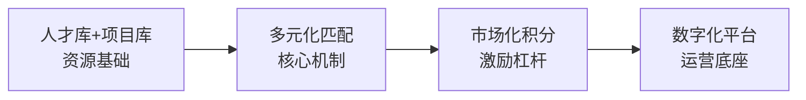

# "人才+项目"优化配置机制

> **来源**：广西电网有限责任公司人事部、党校，基于"八个坚持"人才工作方针

---

## 一、问题背景

### 四大核心痛点

| 痛点 | 具体表现 |
|------|----------|
| **资源配置失衡** | 人才与项目之间供需错配，有人才没项目、有项目找不到人才 |
| **匹配精准度不高** | 缺乏精准的"人才画像"和"项目需求图谱" |
| **团队内生动力不足** | 传统行政指派缺乏市场化激励 |
| **信息不对称** | 人才与项目双方缺乏高效的交互渠道 |

---

## 二、核心机制设计

### 四大核心模块

### 2.1 人才库 + 项目库（供需基础）

- **人才库**：分类分级管理、标签体系、"活水池"机制
- **项目库**：公司/地市/县级/班组四级项目生态，含关键任务和基础管理项目
- 标签体系和信息动态管理

### 2.2 多元化匹配模式（核心机制）

- **揭榜挂帅**：发布项目需求，人才主动揭榜
- **人才邀约**：项目负责人定向邀请匹配人才
- **市场化组队**：双方自由选择
- 流程扁平化：匹配流程节点由 **12个压缩至6个**，实现需求方与人才直接对话

### 2.3 积分制管理（激励杠杆）

> "任务项目化 → 项目价值化 → 价值积分化 → 积分市场化"

**15种积分类别**：
- 创新成果积分、绩效贡献积分、培训发展积分
- 荣誉品牌积分、职业年限积分、文化践行积分
- 等共15类

**积分应用**：
- 职业发展通道
- 薪酬福利挂钩
- 资源分配优先权
- 激励认可（"比亮晒"排名）
- 团队建设

### 2.4 数字化协同平台（运营底座）

- 一体化数字平台，八大功能模块
- 员工数智化全生命周期运营（招聘→绩效→培训→薪酬）
- 人才画像标签系统
- AI在人才数据管理的应用

---

## 三、实践成效

> [!success] 量化成效
> | 指标 | 数据 |
> |------|------|
> | 培养领军拔尖专家 | 超 **2200名** |
> | 新增国家级/省部级人才 | **4人** |
> | 引进高层次人才 | **13人** |
> | 累计参与项目人次 | **1.2万余人次** |
> | 成功匹配任务 | 超 **5000项** |
> | 落聘退出专家 | **82人** |
> | 流程节点压缩 | 12个 → **6个** |

**典型案例**：
- 仅用 **3天** 完成预期7.5天的电站隐患治理
- 实现中国专利奖、国家重点研发项目立项等多项"零突破"
- 成功实践获《人民日报》专题刊发

---

## 四、"一局一特色"案例矩阵

| 单位 | 特色实践 |
|------|----------|
| 百色供电局 | 数据治理"3+3+3"模式 |
| 南宁供电局 | 积分授权 / 市场化激励 / 项目集群化 |
| 桂林供电局 | 揭榜挂帅 / 数字生态 |
| 北海供电局 | 专家积分与人才发展通道挂钩 |
| 来宾供电局 | 实用主义破局 |
| 客服中心 | 跨界组队攻关 |

---

## 相关链接

- [[01-721理论动态创新模型]] —— 理论基础
- [[01-人才发展实战模型研究]] —— 实证验证
- [[04-鲲鹏进阶焕新训战项目]] —— 训战实践案例
