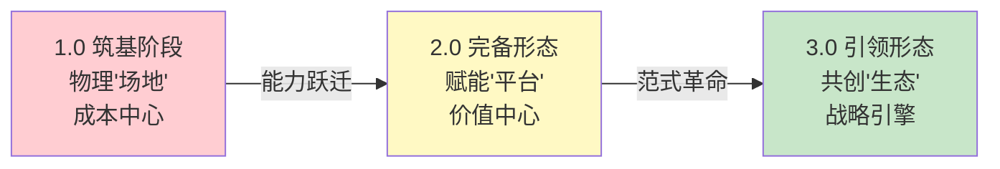

# 进化蓝图：面向"十五五"的电力实训基地能力跃迁三阶段模型

> **系列之二** | 回答：**建到什么水平？**——能力台阶与演进路径

---

## 核心洞见

> 实训基地的形态演进由**组织对人才资源的认知深度**所驱动——从"基础生产要素" → "人力资本" → "创新引擎"的三阶段认知提升。

## 三阶段模型全景

### 八维对比分析

| 维度 | 1.0 筑基阶段 | 2.0 完备形态 | 3.0 引领形态 |
|------|:----------:|:----------:|:----------:|
| **核心身份** | 物理"场地" | 赋能"平台" | 共创"生态" |
| **价值定位** | 成本中心 | 价值中心 | 战略引擎 |
| **培训功能** | 标准化作业 | 实战导向/全场景 | 培训即研发 |
| **运营管理** | 人工驱动 | 流程在线/数据贯通 | 智能决策 |
| **场地建设** | 基础合规 | 功能完备 | 跨界融合 |
| **数智化水平** | 信息孤岛 | 系统集成 | 数字孪生 |
| **外部合作** | 封闭独立 | 开放共享 | 行业枢纽 |
| **文化品牌** | 执行文化 | 学习文化 | 创新生态文化 |

---

## 各阶段详解

### 1.0 筑基阶段：合规保障与成本中心

- **核心目标**：满足合规底线和标准化作业
- **典型特征**：被动响应，以完成任务为驱动
- **管理方式**：人工主导，信息孤岛

### 2.0 完备形态：业务支撑与人才发展平台

- **核心目标**：主动支撑业务需求，成为价值中心
- **典型特征**：培训转向实战导向和全场景演练
- **管理方式**：流程在线、数据贯通

### 3.0 引领形态：战略驱动与员工成才生态

- **核心目标**：突破组织边界，成为行业创新策源地
- **典型特征**：培训即研发、跨界融合
- **管理方式**：智能决策、生态运营

---

## 应用建议

> [!tip] 分步跃迁策略
> 企业应运用三阶段模型进行能力诊断，制定分步跃迁策略：
> 1. 先完成 **当前阶段诊断**（你处于哪个阶段？）
> 2. 明确 **目标阶段**（十五五期间想到达哪个阶段？）
> 3. 制定 **过渡路径**（需要补齐哪些能力短板？）
> 4. 避免资源浪费和能力错配

---

## 相关链接

- [[02-十五五-趋势洞察]] —— 上一篇：趋势洞察
- [[02-十五五-四维需求分析框架]] —— 下一篇：需求分析
- [[02-功能体系构建方法论]] —— 早期版本的功能体系研究
- [[02-培训基地建设总览]] —— 返回总览
