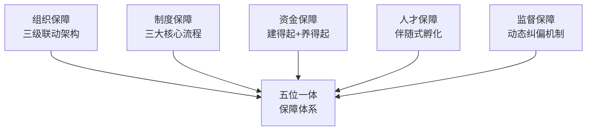

# 护航系统：规划落地的"五位一体"保障体系

> **系列之七（终结篇）** | 回答：**怎么落地？**——从"纸上蓝图"到"价值高地"

---

## 一、落地之殇：蓝图走样的深层症结

规划的宏伟不能自动转化为现实的辉煌。"十四五"许多项目陷入**"形似而神非"**和**"虎头蛇尾"**的困境，根源在于五大断层：

| 断层 | 典型表现 |
|------|----------|
| **组织断层** | 建设团队与运营团队割裂，"建的人不用，用的人不参与建" |
| **制度断层** | 缺乏标准化流程，管理靠人治 |
| **资金断层** | 重建设轻运营，"买得起养不起" |
| **人才断层** | 硬件建好了，找不到合适的人来运营 |
| **监督断层** | 缺乏全过程的动态纠偏机制 |

## 二、"五位一体"保障模型

### 3.1 组织保障：三级联动架构

| 层级 | 角色 | 核心职责 |
|------|------|----------|
| **领导小组** | 决策层 | 资源调配、重大决策 |
| **PMO** | 执行层 | 项目推进、跨部门协调 |
| **运营筹备团队** | 使用前置 | 建设阶段即介入，确保"建成即能用" |

### 3.2 制度保障：三大核心流程

- **进度管控**："红黄绿灯"预警机制
- **采购评审**："技术-商务分离"评标模式
- **变更管控**：分级审批，防止随意变更

### 3.3 资金保障：全生命周期视角

| 阶段 | 策略 |
|------|------|
| 建设期 | "基于交付成果"支付，保留 **5-10%质保金** |
| 运营期 | 专项运维预算 + 小微技改资金 |

### 3.4 人才保障：伴随式孵化

> [!tip] 运营团队 = 供应商跟岗培训同步孵化
> 在基地建设期间，运营团队通过供应商跟岗培训**"伴随式"**成长，实现**"开门即开课"**。

### 3.5 监督保障：PDCA闭环

- 引入**第三方旁站监理**
- 建立**后评价机制**
- 形成PDCA良性循环（Plan-Do-Check-Act）

---

## 相关链接

- [[02-十五五-有效性评价体系]] —— 上一篇：评价体系
- [[02-培训基地建设总览]] —— 返回总览
- [[05-项目总览]] —— 返回知识库首页
