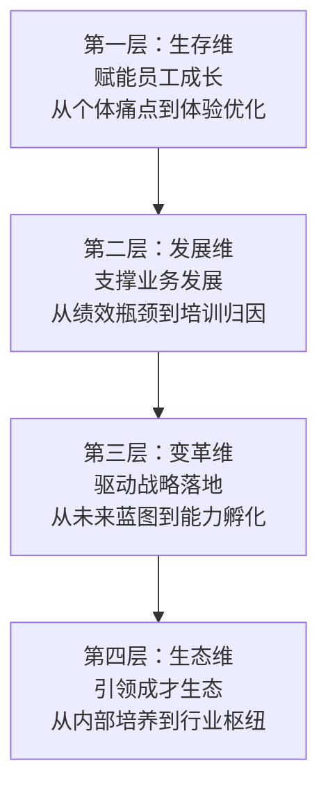

# 精准导航："十五五"实训基地规划的四维需求分析框架

> **系列之三** | 回答：**建什么？**——从"填空题"到"求解题"的需求诊断

---

## 一、时代转折

"十五五"期间基地建设已从**"填空题"**（解决有无）进入**"求解题"**（解决优劣）。精准的需求分析是保障国有资产保值增值的**根本防线**。

## 二、传统需求分析的"三大陷阱"

| 陷阱 | 问题 |
|------|------|
| **经验主义决策** | 拍脑袋决定功能，缺少数据支撑 |
| **盲目对标模仿** | 看别人建什么自己就建什么 |
| **硬件堆砌思维** | 把需求分析等同于设备采购清单 |

## 三、四维金字塔框架

### 第一层：生存维（个体）

- **核心问题**：员工需要什么培训？现有培训有什么痛点？
- **分析工具**：BEI（行为事件访谈）、DACUM（工作分析）、用户旅程地图
- **产出**：个体培训需求清单 → 课程开发工作室、智慧教室等场地规划

### 第二层：发展维（业务）

- **核心问题**：业务绩效差距的培训归因是什么？
- **分析工具**：HPT（人力绩效技术）、根因分析
- **产出**：专业实训区需求 → 高仿真实训区、VR/AR沉浸区等

### 第三层：变革维（战略）

- **核心问题**：公司战略对人才和能力提出了什么新要求？
- **分析工具**：BLM模型（业务领先模型）、战略性人才盘点
- **产出**：新技术实验室、领导力发展中心、创新工场等

### 第四层：生态维（行业）

- **核心问题**：如何跳出组织边界，打造行业枢纽？
- **分析工具**：生态图谱分析、行业标准研究
- **产出**：知识分享空间、行业标准验证实验室、多功能文化展厅

---

## 四、核心理念

> [!important] 以需求为锚，定规划之向
> 将组织的隐性需求显性化、零散问题体系化，为后续可行性分析与方案设计提供最坚实的数据与事实依据。

---

## 相关链接

- [[02-十五五-三阶段演进模型]] —— 上一篇：阶段模型
- [[02-十五五-可行性研判逻辑]] —— 下一篇：可行性分析
- [[03-人才盘点研究]] —— 人才现状诊断工具
- [[02-培训基地建设总览]] —— 返回总览
