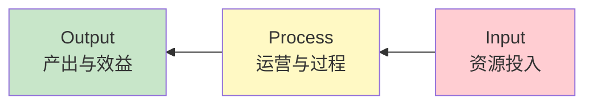

# 价值罗盘：基地有效性评价体系构建与应用

> **系列之六** | 回答：**建好了怎么评？**——效果衡量与持续改进

---

## 一、时代命题

"十五五"基地发展重心从**"规模化增量建设"**转向**"效能化存量运营"**，亟需从"成本消耗中心"向"人才资本高地"转型的评价标尺。

## 二、当前评价的"三大背离"

| 背离 | 问题 |
|------|------|
| **重资产审计轻实战效能** | 关注设备台账，忽略培训实际效果 |
| **重通用模板轻专业差异** | 一刀切评价，忽视各专业特点 |
| **重年终排名轻闭环迭代** | 评完即止，无后续改进行动 |

## 三、O-P-I 逆向评价体系

> [!important] 核心创新：从"IPO线性审计"到"O-P-I逆向战略"
> 先锁定产出 → 再回溯过程 → 最后定义投入，以终为始。

### 指标体系架构

| 一级 | 二级维度 | 三级核心指标 | 量化方法 |
|------|----------|-------------|----------|
| **O-产出与效益** | 人才培养成效 | 培训覆盖率、岗评通过率、人才当量增长 | 比率分析 |
| | 业务运营支持 | 技能短板消除率、绩效改善归因度 | 前后测对比 |
| | 研发创新支撑 | 技术创新成果数、专利孵化数 | 计数统计 |
| | 交流生态平台 | 知识资产沉淀量、对外培训人次 | 计数统计 |
| **P-运营与过程** | 培训实施效率 | 设备利用率、课程更新率 | 比率分析 |
| | 学员满意度 | NPS净推荐值 | 问卷调研 |
| **I-资源投入** | 师资力量 | 内训师/学员比、双师型占比 | 比率分析 |
| | 硬件设施 | 设备完好率、仿真覆盖率 | 巡检统计 |
| | 资金投入 | 生均培训成本、维运费用比 | 财务核算 |

### 权重确定方法

- **德尔菲法**（专家咨询）：多轮匿名征询，收敛共识
- **AHP层次分析法**：构建判断矩阵，科学确定各指标权重

## 四、年度管理闭环

---

## 相关链接

- [[02-十五五-五种范式与定位决策]] —— 上一篇：范式定位
- [[02-十五五-五位一体保障体系]] —— 下一篇：保障体系
- [[02-培训基地建设总览]] —— 返回总览
