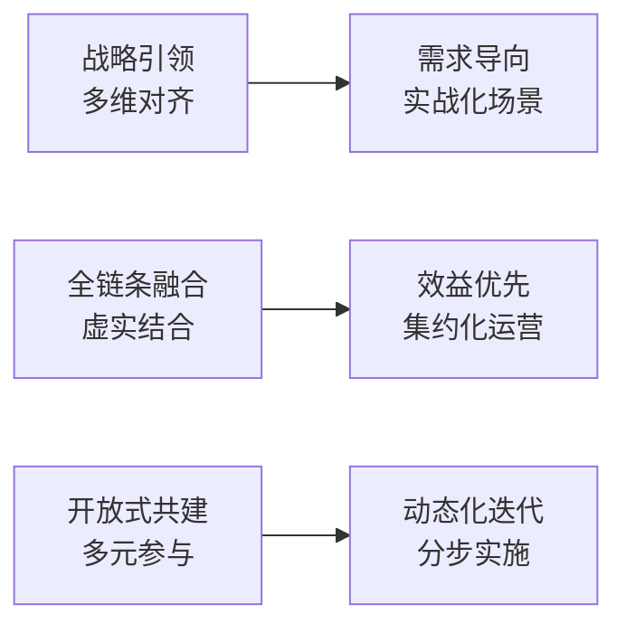

# 赋能新质生产力：电力行业实训基地规划的六大前瞻趋势

> **系列之一** | 回答：**为什么建？**——时代背景与战略方向

---

## 一、战略背景

电力行业正处于"**十四五**"收官与"**十五五**"启动的历史交汇点。实训基地必须打破传统基建思维，以前瞻性视角精准对焦**"新质生产力"**的战略要求。

## 二、五大核心矛盾（破局困境）

| 矛盾 | 问题表现 |
|------|----------|
| **战略定位路径依赖** | 仍以传统基建思维规划基地，未能与公司战略对齐 |
| **要素配置软硬失衡** | 重硬件设备投入，轻课程体系、师资等软实力 |
| **系统集成孤岛效应** | 各专业各自为政，缺乏跨专业协同 |
| **建设管理供需错配** | 建设方与使用方脱节，"建而不用" |
| **运营机制价值悬空** | 建成后缺乏运营机制，投入产出"价值剪刀差"严重 |

## 三、六大创新方向（顶层设计）

### 逐一解读

1. **战略引领（多维对齐）**：基地规划必须向上对齐国家能源战略、公司发展战略、人才规划
2. **需求导向（实战化场景）**：从"有什么建什么"到"需要什么建什么"
3. **全链条融合（虚实结合）**：实体设备 + 虚拟仿真 + 数字孪生
4. **效益优先（集约化运营）**：从成本中心到价值中心
5. **开放式共建（多元参与）**：政校企合作，产教融合
6. **动态化迭代（分步实施）**：渐进式路径，一期基础运维 → 二期新业态仿真 → 三期前瞻功能

## 四、核心结论

> [!important] 从"基建工程"到"战略引擎"
> 实训基地的竞争已从单纯的资源规模竞争转向以"新质生产力"为核心的人才效能竞争。基地必须从被动响应业务的**"基建工程"**升级为主动驱动战略的**"战略引擎"**。

---

## 相关链接

- [[02-十五五-三阶段演进模型]] —— 下一篇：能力跃迁模型
- [[02-培训基地建设总览]] —— 返回总览
- [[03-人才培养外部政策环境]] —— 政策背景
