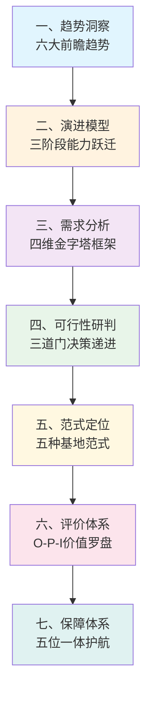

# 培训基地建设规划总览

> "十五五"电力行业实训基地系统规划方法论，从趋势洞察到落地保障的完整闭环。

---

## 方法论全景图

## 七大主题文章

| 序号 | 标题 | 核心命题 | 字数 |
|:----:|------|----------|:----:|
| 一 | [[02-十五五-趋势洞察]] | 为什么建？——时代背景与方向 | ~5,000 |
| 二 | [[02-十五五-三阶段演进模型]] | 建到什么水平？——能力台阶 | ~4,100 |
| 三 | [[02-十五五-四维需求分析框架]] | 建什么？——需求诊断 | ~6,200 |
| 四 | [[02-十五五-可行性研判逻辑]] | 建不建/建多大/怎么建？——投资决策 | ~3,900 |
| 五 | [[02-十五五-五种范式与定位决策]] | 定什么位？——功能取舍 | ~6,700 |
| 六 | [[02-十五五-有效性评价体系]] | 建好了怎么评？——效果衡量 | ~16,100 |
| 七 | [[02-十五五-五位一体保障体系]] | 怎么落地？——执行护航 | ~5,900 |

## 支撑文档

| 文档 | 说明 |
|------|------|
| [[02-功能体系构建方法论]] | 四维价值模型 + 需求-对标-映射-规划四步法 |
| [[02-项目分类体系操作指南]] | 技改/修理/小型基建/网络建设四类项目编制模板 |
| [[02-行业趋势与技术调研]] | 两大电网专业领域趋势 + VR/AI/数字孪生创新技术 |

---

## 核心理论贡献

### 1. 三阶段演进模型
- 1.0 筑基阶段：物理"场地" + 成本中心（合规保障）
- 2.0 完备形态：赋能"平台" + 价值中心（业务支撑）
- 3.0 引领形态：共创"生态" + 战略引擎（创新引领）

### 2. 四维需求分析框架
- 生存维（个体） → 发展维（业务） → 变革维（战略） → 生态维（行业）
- 借鉴马斯洛需求层次理论的金字塔递进结构

### 3. O-P-I逆向评价体系
- Output（产出与效益）→ Process（运营与过程）→ Input（资源投入）
- 打破传统IPO线性审计思维，以终为始

### 4. 设计方法论的工具箱
- VRIO模型、AHP层次分析法、德尔菲法、MoSCoW优先级排序
- BEI/DACUM/用户旅程地图、BLM模型、柯氏四级评估

---

## 相关链接

- [[05-项目总览]] —— 返回知识库首页
- [[03-人才盘点研究]] —— 人才现状诊断（基地规划的前置输入）
- [[03-人才培养外部政策环境]] —— 国家政策背景
