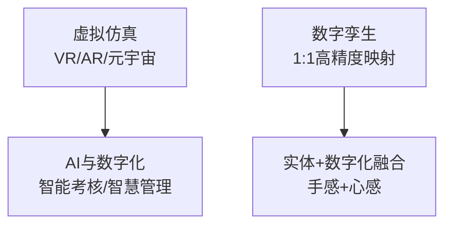

# 电网实训基地建设行业趋势与技术调研

> **行业调研报告**（约7,000字），系统梳理两大电网公司在各专业领域的实训基地建设趋势。

---

## 一、六大专业领域建设趋势

| 专业领域 | 建设趋势 | 代表技术/方向 |
|----------|----------|---------------|
| **变电** | 数字化仿真 | 三维仿真、故障模拟 |
| **输电** | 全业务覆盖 | 无人机巡检、智能运维 |
| **配电** | 双轨并行 | 基础技能 + 自动化不停电作业 |
| **安全与应急** | VR/AR沉浸体验 | 事故模拟、应急演练 |
| **新兴专项** | 多领域拓展 | 直流/调度/营销/网络安全 |
| **复合型** | 资源集约 | 一专多能培养 |

## 二、四大创新技术方向

### 2.1 虚拟仿真技术（VR/AR/元宇宙）

- **核心价值**：零风险实训，可重复演练高危场景
- **应用场景**：安全事故模拟、设备故障排查、应急响应演练

### 2.2 AI与数字化平台

- **"AI考官"**：智能考核评分，减少人工主观偏差
- **智慧校园管理**：设备预约、课程调度、学员画像

### 2.3 数字孪生与高级仿真

- **1:1高精度映射**：将真实设备数字化，在虚拟空间中调试和验证
- **应用场景**：新设备培训、复杂操作预演

### 2.4 实体设备与数字化融合

- **核心理念**：既要"手感"（实体操作的真实触感），又要"心感"（数字化分析的系统思维）
- 二者缺一不可

## 三、现代实训基地四大核心板块

| 板块 | 功能定位 | 典型配置 |
|------|----------|----------|
| **室外综合实训场** | 全流程实战演练 | 杆塔、线路、变电站缩小模型 |
| **室内专业实训室** | 专业深度技能 | 继保、自动化、计量等专用设备 |
| **数字化虚拟实训区** | 安全/效率/成本优化 | VR/AR设备、数字孪生平台 |
| **理论教学与配套** | 知识传授与研讨 | 智慧教室、行动学习研讨室 |

---

## 相关链接

- [[02-十五五-趋势洞察]] —— 战略层面的趋势分析
- [[02-培训基地建设总览]] —— 返回总览
- [[03-人才培养外部政策环境]] —— 国家政策环境
