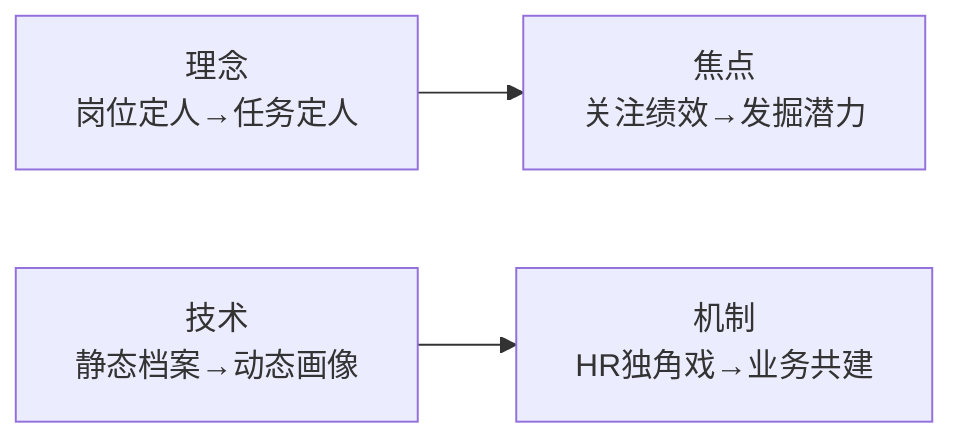

# 人才盘点：从"人才地图"到"发展引擎"

> **约6,700字**，系统研究电网企业人才盘点的方法论、瓶颈与变革趋势。

---

## 一、为什么人才盘点如此重要

> [!important] 战略性工程
> 在"政策性满员"与"结构性缺员"矛盾日益尖锐的背景下，人才盘点已从常规HR工作跃升为**战略性工程**——是向内挖掘、盘活存量的"必答题"。

## 二、六种经典人才盘点方法

| 方法 | 核心逻辑 | 适用场景 |
|------|----------|----------|
| **自上而下战略承接** | 从战略倒推人才需求 | 组织变革期 |
| **胜任力建模** | 构建岗位能力标准 | 标准化岗位 |
| **心理测验法** | 测评个性/动机/价值观 | 管理人才选拔 |
| **360度反馈** | 多视角综合评价 | 发展性反馈 |
| **评价中心技术** | 情景模拟综合测评 | 高潜人才识别 |
| **绩效-潜力九宫格** | 绩效×潜力二维矩阵 | 人才校准会 |

## 三、当下电网企业的四大瓶颈

| 瓶颈 | 问题表现 |
|------|----------|
| **标准固化单一** | 难以精准识才，忽略个体差异 |
| **与业务战略脱节** | 盘点结果无法指导业务人才需求 |
| **重盘点轻应用** | 盘点做完束之高阁，缺乏后续行动 |
| **技术手段落后** | 数据驱动不足，依赖人工经验判断 |

## 四、未来四大变革趋势

| 趋势 | 从 | 到 |
|------|:-----:|:-----:|
| **理念** | 岗位定人 | 任务定人 |
| **焦点** | 关注绩效 | 发掘潜力 |
| **技术** | 静态档案 | 动态画像 |
| **机制** | HR独角戏 | 业务共建 |

---

## 相关链接

- [[05-项目总览]] —— 返回知识库首页
- [[01-人才+项目优化配置机制]] —— 人才库管理实践
- [[02-十五五-四维需求分析框架]] —— 需求分析中的人才维度
