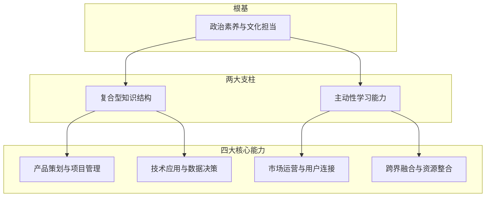

# 新质生产力背景下新型出版人才培养研究

> **专题研究 + 期刊论文双线产出**，历经10+个版本迭代（10.28-11.3），最终形成专题研究版和期刊论文版。

---

## 一、AI时代的出版人才画像：四大转变

| 从 | 到 | 核心能力要求 |
|:---|:---|------|
| "编辑工匠" | **复合型产品经理** | 内容+技术+运营 |
| "经验判断" | **数据决策** | 数据分析驱动选题 |
| "环节思维" | **产品思维** | 全生命周期管理 |
| "单品运作" | **IP运营** | 内容价值最大化 |

## 二、核心能力图谱

## 三、供需失衡的三大困境

| 困境 | 具体表现 |
|------|----------|
| **结构性断层** | 哑铃型人才结构——两头大（资深+新人），中间骨干断层 |
| **培养性惯性** | 培训内容固守传统，滞后于AI工具革新 |
| **机制性错配** | 评价晋升体系短期化单一化，创新人才缺乏成长空间 |

## 四、实践出路：以"IP价值链"为核心的人才生态重构

### 三层系统工程

1. **心智重塑**：从"做书"到"经营IP"，从单兵作战到生态共创
2. **战略蓝图**：三步解码法——
   - 解构IP价值链
   - 定义能力簇
   - 制定建购策略
3. **双轨实践**：
   - **快轨**：跨职能IP特战队（重点项目突破）
   - **慢轨**：全员赋能学习工场（基础能力提升）

### "铁三角"保障体系

| 保障要素 | 核心策略 |
|----------|----------|
| **领导力保障** | 一把手工程，高层引领创新文化 |
| **文化保障** | 从严控到容错，鼓励试错创新 |
| **机制保障** | 双通道晋升 + 价值贡献评价 + 立体激励 |

## 五、引-选-培-育-用-评-留 全链条重塑（期刊版视角）

期刊论文版从七个环节系统诊断并重塑出版人才培养体系：

| 环节 | 变革方向 |
|------|----------|
| **引才** | 跨界导向 + 能力导向 |
| **选才** | 能力导向，打破传统学历壁垒 |
| **培才** | 精准赋能 + 实战导向 |
| **育才** | 轮岗历练 + 项目实战 |
| **用才** | 授权赋能 + 双通道晋升 |
| **评价** | 价值贡献评价，非短期指标 |
| **留才** | 立体激励 + 人文关怀 |

---

## 相关链接

- [[05-项目总览]] —— 返回知识库首页
- [[01-721理论动态创新模型]] —— 人才培养理论支撑
- [[03-人才盘点研究]] —— 人才现状诊断方法
