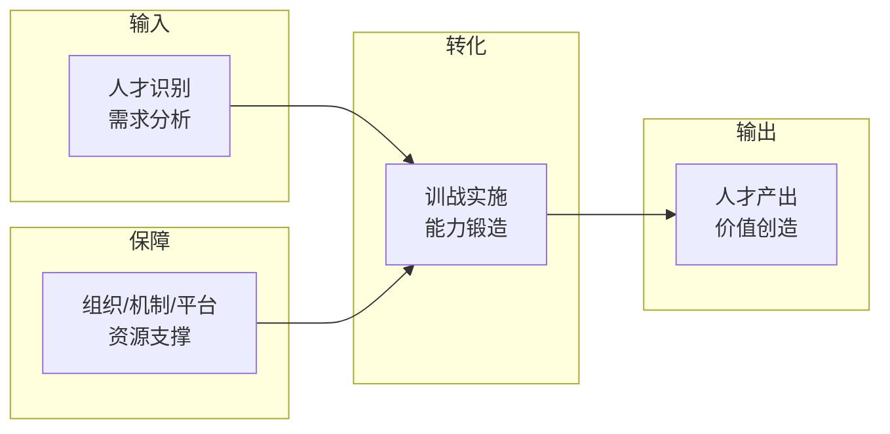

# 基于价值链分析的员工全职业周期训战模式创新研究

> **学术论文**（约6,000字），以海口供电局为案例，运用价值链分析工具解构人才培养全过程。

---

## 一、研究方法

运用**价值链分析工具**解构人才培养全过程：

精准识别了**45个关键影响因素**中的质效瓶颈。

## 二、核心转变

| 从 | 到 |
|:----|:----|
| "一岗一专多能" | **"一链多专高能"** |
| "泛式培养" | **"精准赋能"** |
| "大水漫灌" | **"精准滴灌"** |

## 三、四大"回炉再造"项目

| 项目类型 | 触发条件 | 培训目标 |
|----------|----------|----------|
| **全专业回炉** | 新员工入职 | 基础能力建立 |
| **场景化回炉** | 岗位晋升/轮岗 | 新场景适应 |
| **触发式回炉** | 违规/不合格 | 针对性纠偏 |
| **响应式回炉** | 新技术对标 | 能力更新升级 |

## 四、全价值评价机制

基于**柯氏四级评估**模型：

| 层级 | 评估内容 | 方法 |
|:----:|----------|------|
| L1 反应层 | 学员满意度 | 问卷调研 |
| L2 学习层 | 知识技能掌握 | 考核测试 |
| L3 行为层 | 工作行为改变 | 360度评价 |
| L4 结果层 | 业务绩效改善 | 绩效数据对比 |

## 五、成才生态

基于**马斯洛需求理论**和**员工敬业度模型**，打造四位一体生态：

- 🏛️ 组织生态
- ⚙️ 机制生态
- 📚 资源生态
- 🌟 氛围生态

---

## 相关链接

- [[04-鲲鹏进阶焕新训战项目]] —— 实践案例版
- [[01-721理论动态创新模型]] —— 理论支撑
- [[05-项目总览]] —— 返回知识库首页
