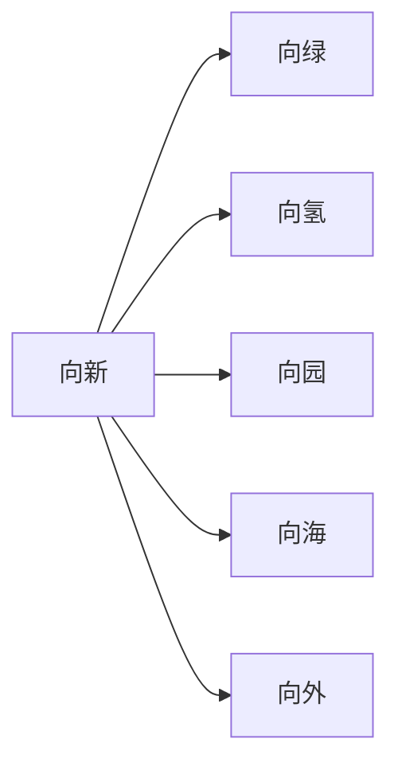

# 广西电网内部环境分析

> **约4,000字**，分析广西电网战略方向、人才培养体系与培训基地硬件支撑条件。

---

## 一、战略解码——"六向"发展策略



- 深化**"四链融合"**：创新链、产业链、资金链、人才链
- 全面布局**人工智能**：DeepSeek模型应用、"大瓦特"平台培训

## 二、体系构建——现代化人才培养路径

### 三大支柱

| 支柱 | 核心内容 |
|------|----------|
| **战略引领的人才规划** | "三同步"原则：战略同步、业务同步、人才同步 |
| **产教融合协同育人** | 三种培养模式 + "四通"机制 |
| **战新产业重点培养** | 新能源、数字化等方向 |

### "三类群体"安全生产能力提升

针对不同群体的安全生产专项培训方案。

## 三、平台支撑——"2+14+N"基地布局

> **省-地-县三级培训基地体系**

```
2  → 省级核心基地
14 → 地市级基地
N  → 县级供电所营配训练场地
```

- 以专业认证为抓手推动基地共建共享
- 规范县级供电所营配训练场地标准化建设

---

## 四、子文件夹支撑材料（未完整展开）

| 板块 | 关键文件 |
|------|----------|
| **业务发展相关** | 2025年新兴业务工作方案、AI发展建设研讨会纪要 |
| **人才培养相关** | 产教融合协同育人方案、战略性新兴产业人才发展行动计划、安全生产能力提升方案 |
| **培训基地建设** | 基地类资源共建共享方案、培训功能建设指导意见、营配训练场地建设指导意见 |

---

## 相关链接

- [[02-培训基地建设总览]] —— 基地规划方法论
- [[03-人才培养外部政策环境]] —— 外部政策对标
- [[05-项目总览]] —— 返回知识库首页
