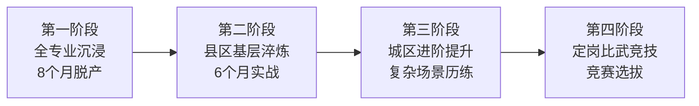

# 海口供电局"鲲鹏"进阶焕新训战项目

> **重塑新员工人才培养新范式**，以价值链分析为诊断工具，构建"启航→远航→领航"五年成才路径。

---

## 一、三大痛点诊断

| 痛点 | 问题表现 |
|------|----------|
| **普适化集训精准度弱** | 一刀切培训，忽视个体差异 |
| **传统教学实战效果不强** | 课堂与现场脱节，学用分离 |
| **跨专业协同难度大** | 专业培养"画地为牢"，难以培养复合型人才 |

## 二、理论依据

- **价值链分析工具**：系统性诊断新员工培养全过程的瓶颈
- **Goldstein模型**：培训需求分析三层次
- **学习金字塔模型**：强调"做中学"的实战效果
- **行动式学习**：在真实项目中解决问题

## 三、"四阶段递进式"培养路径

| 阶段 | 时长 | 核心内容 | 培养目标 |
|------|:----:|----------|----------|
| **全专业沉浸** | 8个月 | 全专业脱产培训 | 知识广度 |
| **县区基层淬炼** | 6个月 | 一线实战 | 动手能力 |
| **城区进阶提升** | 持续 | 复杂场景历练 | 独立担当 |
| **定岗比武竞技** | 循环 | 竞赛选拔 | 成果检验 |

## 四、十大创新手段

| 维度 | 创新点 |
|------|--------|
| 回炉时间 | 精准诊断再培训时机 |
| 回炉方式 | 线上线下混合 |
| 回炉员工 | 按需个性化定制 |
| 回炉关爱 | 导师全程陪伴 |
| 再学形式 | 行动式学习 |
| 再学内容 | 价值链导向 |
| 再学资源 | 数字化平台 |
| 再造能力 | 实战化锻造 |
| 再造目标 | 一链多专高能 |
| 再造评价 | 柯氏四级评估 |

## 五、成效数据

> [!success] 量化成效
> | 指标 | 数据 |
> |------|------|
> | 岗评通过率 | **100%** |
> | 频停线路跳闸同比降低 | **55%** |
> | 配网自愈覆盖率 | 0 → **87.31%** |
> | 累计晋升职称等级 | **107人** |
> | 新增专家 | **14人**（领军级零突破） |
> | 开发数字员工小程序 | **34个** |

## 六、六大保障体系

1. 组织保障：领导小组 + PMO + 运营团队
2. 机制保障：全过程积分管理
3. 资源保障：课程体系 + 师资体系
4. 平台保障：数字化学习平台
5. 文化保障："比学赶超"竞争氛围
6. 评价保障：柯氏四级评估 + 全价值多维评价

---

## 相关链接

- [[04-价值链分析与训战模式]] —— 理论基础（学术论文版）
- [[01-721理论动态创新模型]] —— 721理论支撑
- [[01-人才+项目优化配置机制]] —— 同体系下的项目实践
- [[05-项目总览]] —— 返回知识库首页
