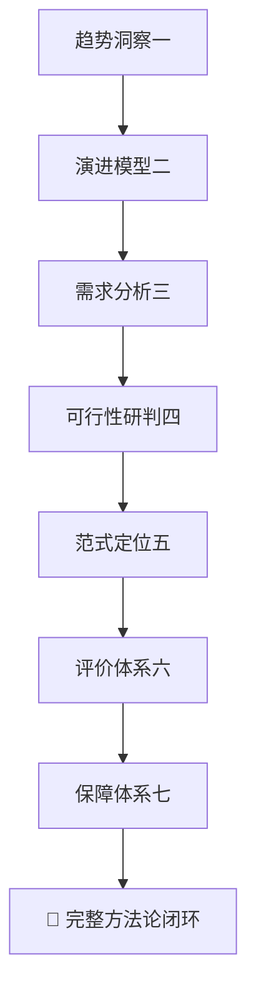
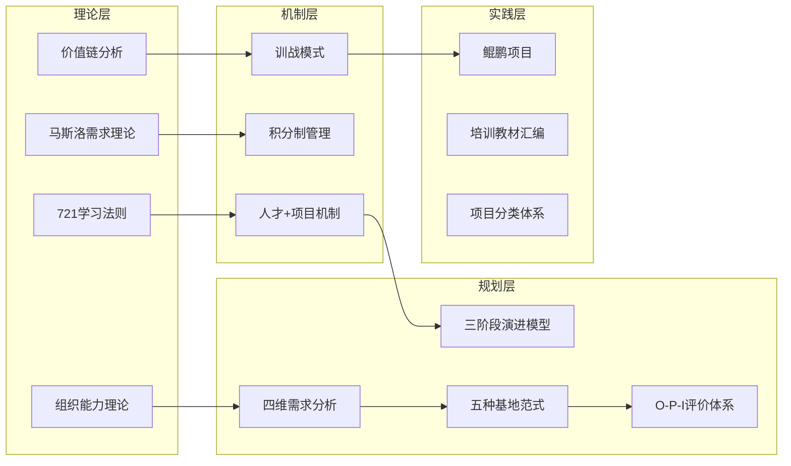

# 电网公司项目知识库

> **项目概述**：本知识库涵盖2025年8月至11月在广西电网公司实习期间的全部研究产出，聚焦**电力行业培训基地建设规划**与**"721"理论在电网专家人才培养中的应用**两大核心主题。

---

## 📚 知识库导航

### 一、[[01-721理论动态创新模型|721理论与人才+项目]]

> "721"学习法则（70%实践 + 20%交流 + 10%培训）在电网专家人才培养中的理论创新与实践应用

| 文档 | 说明 |
|------|------|
| [[01-721理论动态创新模型]] | 721法则的理论内涵与动态权重创新（6:2:2 / 6:3:1 / 5:4:1） |
| [[01-721理论行业实践案例汇编]] | 华润、华为、金融企业等多行业721落地案例 |
| [[01-人才+项目优化配置机制]] | 广西电网"人才库+项目库+积分制"三位一体机制 |
| [[01-人才发展实战模型研究]] | 基于921份问卷+127人访谈的实证学术论文 |

### 二、[[02-培训基地建设总览|培训基地建设规划]]

> "十五五"电力行业实训基地系统规划方法论，7篇系列文章构成完整闭环

| 文档 | 说明 |
|------|------|
| [[02-培训基地建设总览]] | 培训基地建设规划主题总览 |
| [[02-十五五-趋势洞察]] | 赋能新质生产力：电力行业实训基地规划的六大前瞻趋势 |
| [[02-十五五-三阶段演进模型]] | 进化蓝图：1.0筑基 → 2.0完备 → 3.0引领的能力跃迁模型 |
| [[02-十五五-四维需求分析框架]] | 精准导航：生存维→发展维→变革维→生态维的金字塔分析框架 |
| [[02-十五五-可行性研判逻辑]] | 蓝图变现："建不建→建多大→怎么建"三道门决策递进 |
| [[02-十五五-五种范式与定位决策]] | 功能重构：基础型/专业型/综合型/创新研发型/生态引领型 |
| [[02-十五五-有效性评价体系]] | 价值罗盘：O-P-I逆向评价指标体系（Output-Process-Input） |
| [[02-十五五-五位一体保障体系]] | 护航系统：组织/制度/资金/人才/监督五大保障 |
| [[02-功能体系构建方法论]] | 电力行业实训基地功能体系构建的四维价值模型与四步法 |
| [[02-项目分类体系操作指南]] | 技改/修理/小型基建/网络建设四类项目的编制指南 |
| [[02-行业趋势与技术调研]] | 两大电网专业领域建设趋势 + VR/AI/数字孪生创新技术 |

### 三、[[03-人才盘点与战略|人才盘点与战略]]

> 人才盘点方法研究、出版行业新型人才培养、国家政策环境分析

| 文档 | 说明 |
|------|------|
| [[03-人才盘点研究]] | 电网企业人才盘点方法论：六种经典方法 + 四大变革趋势 |
| [[03-出版人才研究]] | 新质生产力背景下出版行业新型人才培养的困境与出路 |
| [[03-人才培养外部政策环境]] | 国家产教融合、东盟战略、组合式激励等八大政策维度 |

### 四、[[04-鲲鹏进阶焕新训战项目|案例与实践]]

> 海口供电局"鲲鹏"项目等一线实践案例

| 文档 | 说明 |
|------|------|
| [[04-鲲鹏进阶焕新训战项目]] | 海口供电局新员工"启航→远航→领航"五年成才路径 |
| [[04-价值链分析与训战模式]] | 基于价值链分析的全职业周期"回炉再造"训战模式 |
| [[04-内部环境分析-广西电网]] | 广西电网战略解码、人才培养体系与培训基地硬件支撑 |

### 五、[[06-支撑材料索引|支撑材料索引]]

> Excel模型、PDF政策文件、案例附件等非Word文档的索引目录

---

## 🔑 核心发现速览

### "721"理论核心创新

> [!important] 动态权重模型
> "721"比例非固定常量，应根据人才发展阶段动态调整：
> - **年轻专家** 6:2:2（夯实基础，培训权重提升至20%）
> - **中级专家** 6:3:1（深化实践，协作交流加强至30%）
> - **顶级专家** 5:4:1（跨界创新，跨领域交流提升至40%）

### 培训基地规划核心框架

### 实证研究成果

> [!success] 广西电网"人才+项目"改革成效
> - 培养领军拔尖专家超 **2200名**，新增国家级/省部级人才 **4人**
> - 累计成功匹配任务超 **5000项**，82名专家落聘退出
> - 典型项目作业时间缩短 **60%**，北海局高技能人才占比从54.4%升至 **84.65%**
> - 基于 **921份**有效问卷（α=0.94, KMO=0.93）+ **127名**专家深度访谈

---

## 📂 项目文件概览

| 统计项 | 数量 |
|--------|------|
| 总文件数 | ~613个 |
| 覆盖时间 | 2025年8月-11月（约4个月） |
| 日期文件夹 | 60+个 |
| 核心DOCX文档 | ~100+个 |
| PPT演示文稿 | ~90个（~600+页） |
| Excel模型 | 34个 |
| PDF政策/论文 | 50+个 |

---

## 🔗 知识图谱

