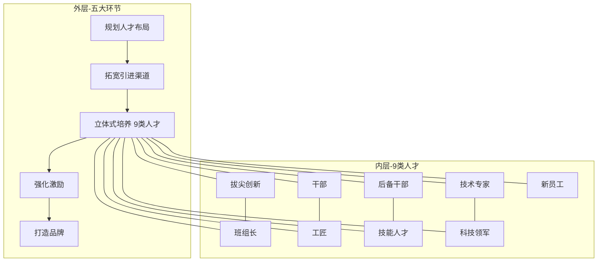

# 面试深挖 · 第六章 —— 构建全周期人才培养模式

> 面试致命问题："9类人才就是你拍脑袋分的吗？为什么不是6类或12类？"
> 本章的核心战场：**证明你的分类不是随意排列，背后有一套严格的逻辑框架。**

---

## 一、先理解这章的野心

传统的人才培养方案是按"模块"写的——先讲培训需求分析，再讲课程体系，再讲师资，再讲评估。看起来系统，实际上什么问题都没解决，因为**它不对应任何具体的人**。

第六章的野心是：**把人才培养从"功能视角"扭转为"人的视角"**。不是问"我们有什么培训资源"，而是问"这群人到底卡在哪里"。为此，我把整章架构成了五个串联环节 + 九类差异化人才的双层结构。

---

## 二、三个设计决策的深度拆解

### 决策一：为什么不是"选育用留"，而是"规划→引进→培养→激励→品牌"？

**"选育用留"的问题在哪？**

选育用留是中国HR最熟悉的四字口诀，但它有一个致命缺陷：它是**HR执行者的视角**，不是**人才本人的视角**。

| 模型 | 视角 | 隐含假设 | 会带来什么偏差 |
|:---|:---|:---|:---|
| 选育用留 | HR执行者 | "我们怎么处理这个人" | 把人才当作被加工的对象 |
| 规划→引进→培养→激励→品牌 | 人才全生命周期 | "这个人怎么在企业里成长和发光" | 把人才当作价值创造的主体 |

**为什么加"规划"作为起手式？**

绝大多数企业的人才培养是"胃痛医胃"——缺干部就办干部培训班，缺技术专家就搞技术比武。看起来忙，实际上没有解决任何结构性问题。

我加"规划"作为起手式的核心观点是：**人才管理的第一步不是选谁，是想清楚你到底需要谁**。这个先后顺序如果弄反了，后面所有的动作都是战术勤奋掩盖战略懒惰。

> [!tip] 面试话术
> "我在设计这章结构时做了一个故意的'反常'——没有用HR最熟悉的选育用留模型，而是用规划→引进→培养→激励→品牌五环节。核心区别在于：选育用留是从HR视角看'我怎么处理这个人'，而我想要的是从人才全生命周期看'一个人怎么在企业里不断成长和价值放大'。这个视角转换决定了整章的基调。"

**为什么加"品牌"作为收尾？**

传统人才管理到"留"就结束了。但"留"是一个被动动作——我不走是因为没别的地方去。真正的终局是企业成为"人才磁场"——我不走是因为这里是最好的地方，外面的人想来。

> "品牌"这节的核心张力是从'被动留人'到'主动吸引力建设'。我把品牌放在最后一节不是在凑数，是在表达一个判断：人才管理的终局不是'留住了多少人'，而是'有多少人想进来'。这个判断是我写完全章后重新审视结构时加进去的——我回头看原来的草稿，发现到激励就戛然而止，缺少一个'然后呢'的升华。"

---

### 决策二：9类人才的分法——背后是一套矩阵逻辑

面试官问"为什么是9类不是6类或12类"时，你不能说"我就想到了这些"。9类人才是基于一个2×3矩阵交叉得出的：

|  | **管理序列** | **技术序列** |
|:---|:---|:---|
| **成熟层**（需要突破天花板） | 干部队伍 | 科技领军 |
| | 后备干部 | 技术专家 |
| **成长期**（需要加速锻造） | 班组长 | 拔尖创新 |
| | | 工匠 |
| | | 技能人才 |
| **入口层**（需要融入组织） | — | 新员工 |

**这个矩阵不是随便画的——它背后有一个核心诊断逻辑：**

> **不同人才的核心痛点不在同一维度。**

- **成熟层的问题在"天花板"**：干部上不去、技术专家评到头了——他们的瓶颈不在技能，而在**评价机制**（怎么区分"好"和"卓越"）和**突破空间**（有没有新的挑战性任务给他们）
- **成长期的问题在"加速器"**：班组长会干活但不会带人、拔尖人才有潜力但没方向——他们的瓶颈在**培养手段**（怎么用项目实战代替课堂培训）和**导师资源**（有没有人指点他们）
- **入口层的问题在"融入效率"**：新员工学的和干的对不上——他们的瓶颈在**从知识到能力的转化速度**

这就是为什么你在每类人才的方案里看到完全不同的侧重点——不是因为写的时候随意发挥，而是**分类时就已经锚定了每类的核心问题域**。

> [!tip] 面试话术
> "9类不是凑数。我用的分类逻辑是管理/技术 × 成熟/成长/入口的三层分类矩阵。核心判断是：不同层的人才问题维度不同——成熟层的问题是评价机制，成长期的问题是培养手段，入口层的问题是融入效率。所以你看到我每类人才的方案重点完全不同，这不是写的时候临时发挥的，是分类时就锚定好的问题域。"

---

### 决策三："诊断→方案→路径"三段式——是模板，更是武器

面试官可能质疑："每类人才都用同样三段式，会不会太模板化？"

**我的回应：三段式不是偷懒，是刻意。**

这本教材的读者不是学者——他们的日常是处理离职率、培训班报名人数、领导交办的各种材料。给他们的工具，越"模板化"越好用。就像一个医生面对不同病人，检查流程都是"问诊→检查→开方"三步，变化的只是具体内容。

三段式的真正价值在于**可复制性**：

1. **诊断**：行业标准 + 客户现状对比 → 找到差距
2. **方案**：差距 → 解决策略（理论最优解）
3. **路径**：解决策略 × 客户约束条件 → 第一步行动（现实可行解）

我希望客户读完第六章后，未来遇到第10类、第11类人才问题时——比如"新能源运维人才"、"东盟外派人才"——能自己套用"诊断→方案→路径"框架去做初步分析，而不是第一反应叫咨询公司。

> "三段式是我故意设计的。这本教材的读者是企业HR，不是学者。给他们看太复杂的东西，第一天就弃了。三段式的价值不在于新颖，在于可复制——我今天教你怎么诊断干部、设计方案、规划路径，明天你遇到新能源运维人才这个新物种，你能自己套用框架去分析。咨询的价值不是给答案，是给'生产答案的方法'。"

---

## 三、9类人才深水区：挑四类最值得展开的

### 🎯 科技领军人才——"高原无高峰"

**最大洞察：瓶颈不在资源，在评价机制。**

电力企业不缺技术专家——一个省公司动辄几十个高级工程师。但他们缺"能定义行业技术方向"的领军人才。

我诊断出的根因非常具体：**现有评价体系只能区分"好"和"差"（你能不能把活干好），无法区分"好"和"卓越"（你能不能开创一个新方向）**。

这意味着什么？意味着一群很优秀的技术专家在评价体系里看起来是一样的——都是"优秀"或"称职"。那个真正有开创性但暂时没有显性成果的人，现行体系识别不出来。久而久之，他要么被同化成平庸，要么离开。

> 我的方案核心不是加预算——核心是**重构评价维度**：引入"行业影响力"（在专业领域的话语权）和"技术前瞻性"（对未来技术方向的判断力）两个定性指标。这个思路借鉴了学术界"终身教职"制度的设计逻辑——评价真正创新型人才需要更长的时间窗口和更定性的判断标准。

**面试可以主动抛出的思考**：

> "这个方案最大的争议在实操层面——定性的东西怎么考核？谁来考核？我当时没有给完美答案，而是给了客户一个试点建议：先在2-3个专业方向小范围试行'同行评议+成果追溯'评价，跑通之后再推广。咨询方案的信心不在于不给任何余地，而在于你能识别出方案的边界在哪。"

---

### 🎯 班组长——最被低估的战略岗位

**最大洞察：班组长是"承重墙"，但培养投入严重不足。**

很多企业认为班组长就是"大号员工"——会干活、能带队就行。但我的分析是：班组长是组织里唯一的**"高频决策 + 高频执行"交汇点**。上面所有战略意图最终都通过班组长转化为一线行动，下面所有一线问题最先被班组长感知。

如果班组长在"说人话"上卡住了——能把上级的文件翻译成工人听得懂的话——那整个组织的执行力就断在这一层。

> 为什么这节我写得特别具体？因为跟客户访谈时发现一个典型场景：某供电局的班组长说"我每天要填8张表，但我不知道这些表对谁有用"。这不是态度问题，是能力结构问题——他把执行理解为"完成任务"而不是"创造价值"。所以我的方案核心不是教他们更多的技能，是**重构他们对"班组长"这个角色的认知**——从"执行者"到"现场决策者"。

---

### 🎯 干部队伍——"选得准"比"培得好"更关键

**最大洞察：干部培养的最大瓶颈不在培养端，在识别端。**

很多企业花大价钱做干部培训——领导力课程、MBA、挂职锻炼。但效果有限，因为**真正适合当干部的人，是在被培训之前就已经具备某些特质的**。培养能补齐知识和技能，但很难改变一个人的决策气质和担当意愿。

所以我的干部培养方案做了一个反常动作：**把50%的篇幅花在"识别"上**——怎么从技术专家里识别出有管理潜质的人？怎么从业绩好的人里区分出"能力强"和"能带队"？

> "这节最不'政治正确'的一句话是：干部的培养投入，70%应该花在识别环节，只有30%花在培养环节。但这个比例我在教材里没有写出来——因为对国企客户来说，'识别'意味着'选择'，'选择'意味着'有人被淘汰'，这是一个敏感话题。"

---

### 🎯 新员工——为什么放在最后

**新员工不是"最不重要"，而是"最不急"。**

三点逻辑：
1. **紧迫度排序**：干部、技术专家、技能人才的培养如果出问题，企业当下就运转不下去。新员工是"明天的问题"，优先级在后。
2. **全书呼应**：海口供电局"鲲鹏"项目的完整案例在其他章节已经展开，这一节重点是方法论提炼而非案例重述。
3. **结构性思考**：新员工放在最后是一个"开放性结尾"——你们把前面8类存量人才的问题解决好了，新员工的起点自然就高。

---

## 四、面试自我反思

### "如果重写第六章"

> 我会在每类人才的方案结尾加一个"**反模式**"板块——直接告诉读者"以下做法看起来很正确，实际上在坑你的团队"。

举例：
- 技能人才的反模式：**考证驱动**。培训做了很多，证书拿了不少，但实际工作绩效没变化。因为培训设计是围绕"考试通过率"而非"能力提升率"。
- 后备干部的反模式：**名额摊派**。每个部门出几个后备，结果是"大家都出，等于没出"——真正有潜力的人被稀释在平均主义里。
- 新员工的反模式：**速成心态**。三个月就要独立上岗，结果基础没打牢，五年后发现技术天花板极低。

> "反模式的价值不只是'别做这个'——它是在训练读者的职业判断力。一个合格的TD从业者，不只是能分辨好坏方案，还要能在'看似好的方案'里看出陷阱。"

### "自己不太满意的地方"

> 第四节（激励）和第五节（品牌）相对薄了。因为项目周期到尾声，客观时间不够。如果重写，我会把激励那一节从"工具大全"升级为"**9类人才的激励策略对比矩阵**"——科技领军人才要的激励（学术自由度、行业话语权）和班组长要的激励（晋升通道、即时认可）完全不同，捆在一起讲激励就太笼统了。

---

## 核心概念速记

| 概念 | 解释 |
|:---|------|
| **五环节 vs 选育用留** | 视角转换：从HR怎么处理人 → 人怎么在企业里成长和发光 |
| **管理/技术 × 成熟/成长/入口** | 9类人才的分类矩阵逻辑 |
| **不同层问题域不同** | 成熟层=评价机制，成长期=培养手段，入口层=融入效率 |
| **三段式框架** | 诊断→方案→路径，给客户一个能自我迭代的分析工具 |
| **高原无高峰** | 科技领军人才瓶颈在评价机制无法区分"好"和"卓越" |
| **反模式** | 在正确方案之外，警告"看似对实际错"的做法 |

---

## 相关链接

- [[06-面试深挖-第一章-战略认知篇]]
- [[06-面试深挖-第七章-技术工具篇]]
- [[00-项目总览]]
- [[01-721理论动态创新模型]]
